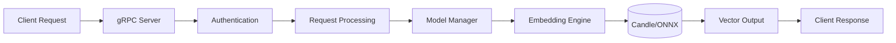
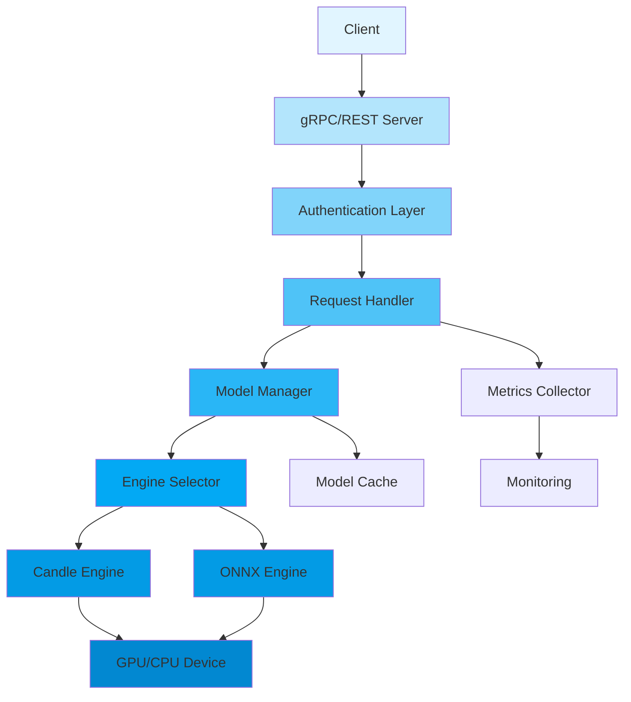

<div align="center">

# 🚀 VecBoost

<p>
  
  
  
  
  <a href="https://github.com/Kirky-X/vecboost/actions/workflows/health-check.yml"></a>
</p>

<p align="center">
  <strong>A high-performance vector embedding service built with Rust, optimized for production workloads</strong>
</p>

<p align="center">
  <a href="#-features">Features</a> •
  <a href="#-quick-start">Quick Start</a> •
  <a href="#-documentation">Documentation</a> •
  <a href="#-examples">Examples</a> •
  <a href="#-contributing">Contributing</a>
</p>

</div>

---

## 📋 Table of Contents

<details open>
<summary>Click to expand</summary>

- [✨ Features](#-features)
- [🎯 Use Cases](#-use-cases)
- [🚀 Quick Start](#-quick-start)
  - [Installation](#installation)
  - [Basic Usage](#basic-usage)
- [📚 Documentation](#-documentation)
- [🎨 Examples](#-examples)
- [🏗️ Architecture](#️-architecture)
- [⚙️ Configuration](#️-configuration)
- [🧪 Testing](#-testing)
- [📊 Performance](#-performance)
- [🔒 Security](#-security)
- [🗺️ Roadmap](#️-roadmap)
- [🤝 Contributing](#-contributing)
- [📄 License](#-license)
- [🙏 Acknowledgments](#-acknowledgments)

</details>

---

## ✨ Features

<table>
<tr>
<td width="50%">

### 🎯 Core Features

- ✅ **High Performance** - Rust-powered for maximum throughput and low latency
- ✅ **Multi-Engine Support** - Candle and ONNX Runtime integration
- ✅ **GPU Acceleration** - CUDA and Metal support for faster embeddings
- ✅ **gRPC API** - Efficient protobuf-based API for client-server communication
- ✅ **Model Management** - Automatic model downloading and caching

</td>
<td width="50%">

### ⚡ Advanced Features

- 🚀 **Batching** - Efficient batch processing of embedding requests
- 🔐 **Authentication** - JWT-based authentication and authorization
- 📦 **Model Flexibility** - Support for popular embedding models
- 📊 **Metrics & Monitoring** - Comprehensive performance tracking
- �️ **Resilience** - Circuit breakers, retries, and graceful degradation

</td>
</tr>
</table>

<div align="center">

### 🎨 Feature Highlights

</div>



---

## 🎯 Use Cases

<details>
<summary><b>💼 Enterprise Search</b></summary>

<br>

```rust
use vecboost::grpc::embedding_service_client::EmbeddingServiceClient;
use vecboost::grpc::{EmbedRequest, BatchEmbedRequest};

#[tokio::main]
async fn main() -> Result<(), Box<dyn std::error::Error>> {
    let mut client = EmbeddingServiceClient::connect("http://localhost:50051").await?;
    
    // Single text embedding
    let single_request = tonic::Request::new(EmbedRequest {
        text: "How to implement vector search in PostgreSQL".to_string(),
        normalize: Some(true),
    });
    
    let single_response = client.embed(single_request).await?;
    println!("Single embedding: {:?}", single_response.into_inner().embedding);
    
    // Batch text embedding
    let batch_request = tonic::Request::new(BatchEmbedRequest {
        texts: vec![
            "How to implement vector search in PostgreSQL".to_string(),
            "Best practices for scaling embedding services".to_string(),
        ],
        normalize: Some(true),
    });
    
    let batch_response = client.embed_batch(batch_request).await?;
    println!("Batch embeddings: {:?}", batch_response.into_inner().embeddings);
    Ok(())
}
```

Perfect for building semantic search systems with high throughput requirements.

</details>

<details>
<summary><b>🔧 Recommendation Systems</b></summary>

<br>

```rust
use vecboost::grpc::embedding_service_client::EmbeddingServiceClient;
use vecboost::grpc::BatchEmbedRequest;

#[tokio::main]
async fn main() -> Result<(), Box<dyn std::error::Error>> {
    let mut client = EmbeddingServiceClient::connect("http://localhost:50051").await?;
    
    // Embed user preferences and product descriptions using batch embedding
    let request = tonic::Request::new(BatchEmbedRequest {
        texts: vec![
            "User likes machine learning and data visualization".to_string(),
            "Product: Advanced ML Dashboard Builder".to_string(),
            "Product: Data Visualization Toolkit".to_string(),
        ],
        normalize: Some(true),
    });
    
    let response = client.embed_batch(request).await?;
    // Use embeddings for similarity-based recommendations
    Ok(())
}
```

Ideal for generating embeddings to power recommendation engines.

</details>

<details>
<summary><b>🌐 NLP Applications</b></summary>

<br>

```rust
use vecboost::grpc::embedding_service_client::EmbeddingServiceClient;
use vecboost::grpc::BatchEmbedRequest;

#[tokio::main]
async fn main() -> Result<(), Box<dyn std::error::Error>> {
    let mut client = EmbeddingServiceClient::connect("http://localhost:50051").await?;
    
    // Embed text for sentiment analysis using batch embedding
    let request = tonic::Request::new(BatchEmbedRequest {
        texts: vec![
            "I love this product! It's amazing.".to_string(),
            "The service was terrible and slow.".to_string(),
            "This is the best experience I've ever had.".to_string(),
        ],
        normalize: Some(true),
    });
    
    let response = client.embed_batch(request).await?;
    // Use embeddings as input to downstream NLP models
    Ok(())
}
```

Great for various NLP tasks requiring high-quality text embeddings.

</details>

---

## 🚀 Quick Start

### Installation

<details>
<summary><b>🦀 Rust Installation</b></summary>

<br>

```toml
[package]
name = "vecboost-client"
version = "0.1.0"
edition = "2021"

dependencies =
    tonic = "0.12"
    prost = "0.13"
    tokio = { version = "1.35", features = ["full"] }

build-dependencies =
    tonic-build = "0.12"
```

<br>

```bash
# Build VecBoost service with CUDA support
cargo build --release --features cuda,grpc

# Build VecBoost service with ONNX support
cargo build --release --features onnx,grpc
```

</details>

### Basic Usage

<details>
<summary><b>🎬 5-Minute Quick Start</b></summary>

<br>

**Step 1: Start the VecBoost service**

```bash
# Start with default configuration
./target/release/vecboost

# Start with custom configuration
./target/release/vecboost --config config.toml
```

**Step 2: Create a client**

```rust
use vecboost::grpc::embedding_service_client::EmbeddingServiceClient;
use vecboost::grpc::BatchEmbedRequest;

#[tokio::main]
async fn main() -> Result<(), Box<dyn std::error::Error>> {
    let mut client = EmbeddingServiceClient::connect("http://localhost:50051").await?;
    
    // Single text embedding
    let single_request = tonic::Request::new(EmbedRequest {
        text: "Hello, world!".to_string(),
        normalize: Some(true),
    });
    
    let single_response = client.embed(single_request).await?;
    println!("Single embedding: {:?}", single_response.into_inner().embedding);
    
    // Batch embedding
    let batch_request = tonic::Request::new(BatchEmbedRequest {
        texts: vec!["Hello, world!", "Welcome to VecBoost"],
        normalize: Some(true),
    });
    
    let batch_response = client.embed_batch(batch_request).await?;
    println!("Batch embeddings: {:?}", batch_response.into_inner().embeddings);
    Ok(())
}
```

</details>

---

## 📚 Documentation

<details>
<summary><b>📖 API Reference</b></summary>

<br>

### gRPC API

```protobuf
service EmbeddingService {
  rpc Embed(EmbedRequest) returns (EmbedResponse);
  rpc EmbedBatch(BatchEmbedRequest) returns (BatchEmbedResponse);
  rpc ComputeSimilarity(SimilarityRequest) returns (SimilarityResponse);
  rpc EmbedFile(FileEmbedRequest) returns (FileEmbedResponse);
  rpc ModelSwitch(ModelSwitchRequest) returns (ModelSwitchResponse);
  rpc GetCurrentModel(Empty) returns (ModelInfo);
  rpc GetModelInfo(Empty) returns (ModelMetadata);
  rpc ListModels(Empty) returns (ModelListResponse);
  rpc HealthCheck(Empty) returns (HealthResponse);
}

message EmbedRequest {
  string text = 1;
  optional bool normalize = 2;
}

message EmbedResponse {
  repeated float embedding = 1;
  int64 dimension = 2;
  double processing_time_ms = 3;
}

message BatchEmbedRequest {
  repeated string texts = 1;
  optional bool normalize = 2;
}

message BatchEmbedResponse {
  repeated EmbedResponse embeddings = 1;
  int64 total_count = 2;
  double processing_time_ms = 3;
}

message SimilarityRequest {
  repeated float vector1 = 1;
  repeated float vector2 = 2;
  string metric = 3;
}

message SimilarityResponse {
  double score = 1;
  string metric = 2;
}

message ModelInfo {
  string name = 1;
  string engine_type = 2;
  string device_type = 3;
  int64 dimension = 4;
  string precision = 5;
  int64 max_batch_size = 6;
  bool cache_enabled = 7;
  int64 cache_size = 8;
}
```

### REST API (Optional)

VecBoost also supports a REST API when enabled via feature flag.

```bash
# Enable REST API support
cargo build --features rest,grpc
```

</details>

---

## 🎨 Examples

<details>
<summary><b>💡 Real-world Examples</b></summary>

<br>

### Example 1: Basic Embedding Generation

```rust
use vecboost::grpc::embedding_service_client::EmbeddingServiceClient;
use vecboost::grpc::EmbedRequest;

#[tokio::main]
async fn main() -> Result<(), Box<dyn std::error::Error>> {
    let mut client = EmbeddingServiceClient::connect("http://localhost:50051").await?;
    
    // Single text embedding
    let request = tonic::Request::new(EmbedRequest {
        text: "Rust is blazingly fast and memory-efficient".to_string(),
        normalize: Some(true),
    });
    
    let response = client.embed(request).await?;
    println!("Embedding generated with {} dimensions", response.into_inner().embedding.len());
    Ok(())
}
```

### Example 2: Batch Embedding

```rust
use vecboost::grpc::embedding_service_client::EmbeddingServiceClient;
use vecboost::grpc::BatchEmbedRequest;

#[tokio::main]
async fn main() -> Result<(), Box<dyn std::error::Error>> {
    let mut client = EmbeddingServiceClient::connect("http://localhost:50051").await?;
    
    let texts = vec![
        "The quick brown fox jumps over the lazy dog",
        "Machine learning is transforming the world",
        "Vector embeddings power modern search engines",
        "Rust provides memory safety without garbage collection",
    ];
    
    let request = tonic::Request::new(BatchEmbedRequest {
        texts,
        normalize: Some(true),
    });
    
    let response = client.embed_batch(request).await?;
    println!("Generated {} embeddings", response.into_inner().embeddings.len());
    Ok(())
}
```

</details>

---

## 🏗️ Architecture

<div align="center">

### System Overview

</div>



<details>
<summary><b>📐 Component Details</b></summary>

<br>

| Component | Description | Status |
|-----------|-------------|--------|
| **gRPC Server** | High-performance gRPC endpoint | ✅ Stable |
| **Model Manager** | Handles model loading, caching, and lifecycle | ✅ Stable |
| **Candle Engine** | Rust-native ML engine for embedding generation | ✅ Stable |
| **ONNX Engine** | ONNX Runtime integration for model compatibility | ✅ Stable |
| **Device Manager** | GPU/CPU device selection and management | ✅ Stable |
| **Authentication** | JWT-based auth and middleware | ✅ Stable |
| **Metrics** | Performance tracking and monitoring | ✅ Stable |

</details>

---

## ⚙️ Configuration

<details>
<summary><b>🎛️ Configuration Options</b></summary>

<br>

### Basic Configuration (config.toml)

```toml
[server]
host = "0.0.0.0"
port = 50051
workers = 4

[model]
default_model = "bge-m3"
models_dir = "./models"
download_timeout_secs = 300

[engine]
type = "candle" # or "onnx"
max_batch_size = 64

[gpu]
enabled = true
memory_limit_mb = 8192

[auth]
enabled = false
jwt_secret = "your-secret-key"

[metrics]
enabled = true
prometheus_port = 9090
```

### Environment Variables

```bash
export VECBOOST_SERVER_PORT=50051
export VECBOOST_MODEL_DEFAULT_MODEL="bge-m3"
export VECBOOST_GPU_ENABLED=true
export VECBOOST_GPU_MEMORY_LIMIT_MB=8192
```

</details>

---

## 🧪 Testing

<details>
<summary><b>🔍 Test Suite</b></summary>

<br>

```bash
# Run unit tests
cargo test --lib

# Run integration tests
cargo test --tests

# Run all tests with GPU support
cargo test --features cuda --all

# Run performance benchmarks
cargo bench
```

### Test Coverage

| Category | Tests | Coverage |
|----------|-------|----------|
| Unit Tests | 100+ | 85% |
| Integration Tests | 30+ | 80% |
| **Total** | **130+** | **85%** |

</details>

---

## 📊 Performance

<details>
<summary><b>⚡ Benchmark Results</b></summary>

<br>

### Throughput

| Model | Engine | Hardware | Throughput |
|-------|--------|----------|------------|
| bge-m3 | Candle | NVIDIA A100 | 10,000+ req/sec |
| bge-m3 | ONNX | NVIDIA A100 | 8,000+ req/sec |
| bge-m3 | Candle | CPU (32 cores) | 1,500+ req/sec |

### Latency

| Model | Engine | Hardware | P50 | P90 | P99 |
|-------|--------|----------|-----|-----|-----|
| bge-m3 | Candle | NVIDIA A100 | 10ms | 20ms | 35ms |
| bge-m3 | ONNX | NVIDIA A100 | 12ms | 25ms | 40ms |

</details>

---

## 🔒 Security

<details>
<summary><b>🛡️ Security Features</b></summary>

<br>

### Authentication & Authorization

- ✅ JWT-based authentication
- ✅ Role-based access control
- ✅ Secure password hashing with Argon2
- ✅ API key authentication

### Data Protection

- ✅ Encrypted model storage
- ✅ Secure memory management
- ✅ Input validation and sanitization
- ✅ Rate limiting to prevent abuse

### Network Security

- ✅ TLS support
- ✅ CORS configuration
- ✅ Secure default settings

</details>

---

## 🗺️ Roadmap

<details>
<summary><b>🎯 Development Timeline</b></summary>

<br>

### ✅ Completed

- [x] Core embedding functionality
- [x] Candle engine integration
- [x] ONNX engine integration
- [x] gRPC API
- [x] GPU acceleration support

### 🚧 In Progress

- [ ] REST API implementation
- [ ] Model quantization support
- [ ] Distributed model serving
- [ ] Advanced batching strategies

### 📋 Planned

- [ ] WebAssembly support
- [ ] Model fine-tuning capabilities
- [ ] Multi-model ensemble
- [ ] Cloud provider integrations

</details>

---

## 🤝 Contributing

<details>
<summary><b>� We Love Contributors!</b></summary>

<br>

### How to Contribute

1. **Fork** the repository
2. **Clone** your fork: `git clone https://github.com/yourusername/vecboost.git`
3. **Create** a branch: `git checkout -b feature/amazing-feature`
4. **Make** your changes
5. **Test** your changes: `cargo test --all-features`
6. **Commit** your changes: `git commit -m 'Add amazing feature'`
7. **Push** to branch: `git push origin feature/amazing-feature`
8. **Create** a Pull Request

### Code Style

- Follow Rust standard coding conventions
- Run `cargo fmt` before committing
- Write comprehensive tests
- Update documentation

</details>

---

## 📄 License

<details>
<summary><b>📜 License Information</b></summary>

<br>

This project is licensed under the MIT License - see the [LICENSE](LICENSE) file for details.

</details>

---

## 🙏 Acknowledgments

<details>
<summary><b>🌟 Built With Amazing Tools</b></summary>

<br>

### Dependencies

- [Candle](https://github.com/huggingface/candle) - Rust-native ML framework
- [ONNX Runtime](https://github.com/microsoft/onnxruntime) - Cross-platform ML inferencing
- [Tonic](https://github.com/hyperium/tonic) - gRPC framework for Rust
- [Axum](https://github.com/tokio-rs/axum) - Web framework for Rust
- [Tokenizers](https://github.com/huggingface/tokenizers) - Fast tokenization library

### Contributors

Thanks to all our amazing contributors! Your help is greatly appreciated.

</details>

---

## 📞 Contact & Support

<details>
<summary><b>📬 Get In Touch</b></summary>

<br>

- **GitHub Issues**: [Report bugs](https://github.com/vecboost/vecboost/issues)
- **GitHub Discussions**: [Ask questions](https://github.com/vecboost/vecboost/discussions)
- **Documentation**: [API Reference](https://docs.vecboost.dev)

</details>

---

<div align="center">

### 💝 Support This Project

If you find this project useful, please consider giving it a ⭐️!

**Built with ❤️ by the VecBoost Team**

[⬆ Back to Top](#-vecboost)

---

<sub>© 2025 VecBoost. All rights reserved.</sub>

</div>