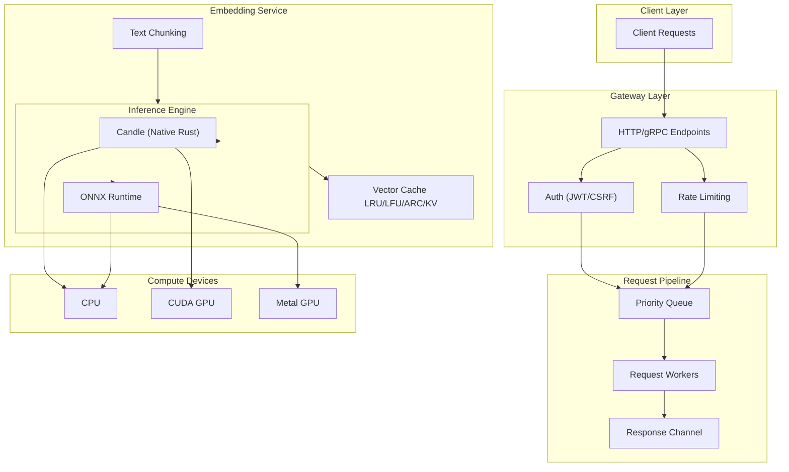

<div align="center">


[](https://www.rust-lang.org/) [](https://opensource.org/licenses/MIT) [](https://github.com/Kirky-X/vecboost) [](https://www.rust-lang.org/)

*A high-performance, production-ready embedding vector service written in Rust. VecBoost provides efficient text vectorization with support for multiple inference engines, GPU acceleration, and enterprise-grade features.*

</div>

---

## ✨ Core Features

| Category | Features |
|----------|----------|
| **🚀 Performance** | Optimized Rust codebase with batch processing and concurrent request handling |
| **🔧 Multi-Engine** | Support for Candle (native Rust) and ONNX Runtime inference engines |
| **🎮 GPU Support** | Native CUDA (NVIDIA), Metal (Apple Silicon), and ROCm (AMD) acceleration |
| **📊 Smart Caching** | Multi-tier caching with LRU, LFU, ARC, and KV cache strategies |
| **🔐 Enterprise Security** | JWT authentication, CSRF protection, role-based access control, and audit logging |
| **⚡ Rate Limiting** | Configurable rate limiting with token bucket algorithm (global/IP/user/API key) |
| **📈 Priority Queue** | Request prioritization with configurable priority weights and weighted fair queuing |
| **🌐 Dual APIs** | gRPC and HTTP/REST interfaces with OpenAPI/Swagger documentation |
| **📦 Cloud Ready** | Production deployment configurations for Kubernetes, Docker, and cloud platforms |
| **📈 Observability** | Prometheus metrics, health checks, structured logging, and Grafana dashboards |

> **💡 Quick Start**: Get up and running in 2 minutes! [See Quick Start](#-quick-start)

## 🚀 Quick Start

### 📋 Prerequisites

| Requirement | Version | Description |
|-------------|---------|-------------|
| **Rust** | 1.75+ | Edition 2024 required |
| **Cargo** | 1.75+ | Comes with Rust |
| **CUDA Toolkit** | 12.x | Optional, for NVIDIA GPU support |
| **Metal SDK** | Latest | Optional, for Apple Silicon GPU |

> **💡 Tip**: Run `rustc --version` to verify your Rust installation.

### 🔧 Installation

```bash
# 1. Clone the repository
git clone https://github.com/Kirky-X/vecboost.git
cd vecboost

# 2. Build with default features (CPU only)
cargo build --release

# 3. Build with GPU support
#    Linux (CUDA):
cargo build --release --features cuda

#    macOS (Metal):
cargo build --release --features metal

# 4. Build with all features enabled
cargo build --release --features cuda,onnx,grpc,auth,redis
```

### ⚙️ Configuration

```bash
# Copy and customize the configuration
cp config.toml config_custom.toml
# Edit config_custom.toml with your settings
```

### ▶️ Running

```bash
# Run with default configuration
./target/release/vecboost

# Run with custom configuration
./target/release/vecboost --config config_custom.toml
```

> **✅ Success**: The service will start on `http://localhost:9002` by default.

### 🐳 Docker

```bash
# Build the image
docker build -t vecboost:latest .

# Run the container
docker run -p 9002:9002 -p 50051:50051 \
  -v $(pwd)/config.toml:/app/config.toml \
  -v $(pwd)/models:/app/models \
  vecboost:latest
```

## 📖 Documentation

| Document | Description | Link |
|----------|-------------|------|
| **📋 User Guide** | Detailed usage instructions, configuration, and deployment | [USER_GUIDE.md](USER_GUIDE.md) |
| **🔌 API Reference** | Complete REST API and gRPC documentation | [API_REFERENCE.md](API_REFERENCE.md) |
| **🏗️ Architecture** | System design, components, and data flow | [ARCHITECTURE.md](ARCHITECTURE.md) |
| **🤝 Contributing** | Contribution guidelines and best practices | [docs/CONTRIBUTING.md](docs/CONTRIBUTING.md) |

## 🔌 API Usage

### 🌐 HTTP REST API

**Generate embeddings via HTTP:**

```bash
curl -X POST http://localhost:9002/api/v1/embed \
  -H "Content-Type: application/json" \
  -d '{"text": "Hello, world!"}'
```

**Response:**

```json
{
  "embedding": [0.123, 0.456, 0.789, ...],
  "dimension": 1024,
  "processing_time_ms": 15.5
}
```

### 📡 gRPC API

The service exposes a gRPC interface on port `50051` (configurable):

```protobuf
service EmbeddingService {
  // Single text embedding
  rpc Embed(EmbedRequest) returns (EmbedResponse);

  // Batch text embeddings
  rpc EmbedBatch(BatchEmbedRequest) returns (BatchEmbedResponse);

  // Compute similarity between vectors
  rpc ComputeSimilarity(SimilarityRequest) returns (SimilarityResponse);
}
```

### 📚 OpenAPI Documentation

Access interactive API documentation:

| Tool | URL |
|------|-----|
| **Swagger UI** | `http://localhost:9002/swagger-ui/` |
| **ReDoc** | `http://localhost:9002/redoc/` |

## ⚙️ Configuration

### Key Configuration Options

```toml
[server]
host = "0.0.0.0"
port = 9002

[model]
model_repo = "BAAI/bge-m3"  # HuggingFace model ID
use_gpu = true
batch_size = 32
expected_dimension = 1024

[embedding]
cache_enabled = true
cache_size = 1024

[auth]
enabled = true
jwt_secret = "your-secret-key"
```

| Section | Key | Default | Description |
|---------|-----|---------|-------------|
| **server** | `host` | `"0.0.0.0"` | Bind address |
| | `port` | `9002` | HTTP server port |
| **model** | `model_repo` | `"BAAI/bge-m3"` | HuggingFace model ID |
| | `use_gpu` | `false` | Enable GPU acceleration |
| | `batch_size` | `32` | Batch processing size |
| **embedding** | `cache_enabled` | `true` | Enable response caching |
| | `cache_size` | `1024` | Maximum cache entries |
| **auth** | `enabled` | `false` | Enable authentication |
| | `jwt_secret` | - | JWT signing secret |

> **📖 Full Configuration**: See [`config.toml`](config.toml) for all available options.

## 🏗️ Architecture



## 📦 Project Structure

```
vecboost/
├── src/                          # Core source code
│   ├── audit/          # Audit logging & compliance
│   ├── auth/           # Authentication (JWT, CSRF, RBAC)
│   ├── cache/          # Multi-tier caching (LRU, LFU, ARC, KV)
│   ├── config/         # Configuration management
│   ├── device/         # Device management (CPU, CUDA, Metal, ROCm)
│   ├── engine/         # Inference engines (Candle, ONNX Runtime)
│   ├── grpc/           # gRPC server & protocol
│   ├── metrics/        # Prometheus metrics & observability
│   ├── model/          # Model downloading, loading & recovery
│   ├── pipeline/       # Request pipeline, priority & scheduling
│   ├── rate_limit/     # Rate limiting (token bucket, sliding window)
│   ├── routes/         # HTTP routes & handlers
│   ├── security/       # Security utilities (encryption, sanitization)
│   ├── service/        # Core embedding service & business logic
│   └── text/           # Text processing (chunking, tokenization)
├── examples/           # Example programs
│   └── gpu/            # GPU-specific examples & benchmarks
├── proto/              # gRPC protocol definitions (`.proto` files)
├── deployments/        # Kubernetes & Docker deployment configs
├── tests/              # Integration & performance tests
└── config.toml         # Default configuration file
```

## 🎯 Performance Benchmarks

| Metric | CPU | GPU (CUDA) | Notes |
|--------|-----|------------|-------|
| **Embedding Dimension** | Up to 4096 | Up to 4096 | Model dependent |
| **Max Batch Size** | 64 | 256 | Memory dependent |
| **Requests/Second** | 1,000+ | 10,000+ | Throughput |
| **Latency (p50)** | < 25ms | < 5ms | Single request |
| **Latency (p99)** | < 100ms | < 50ms | Single request |
| **Cache Hit Ratio** | > 90% | > 90% | With 1024 entries |

### 🚀 Optimization Features

- **⚡ Batch Processing**: Dynamic batching with configurable wait timeout
- **💾 Memory Pool**: Pre-allocated tensor buffers to reduce allocation overhead
- **🔄 Zero-Copy**: Shared references where possible
- **📊 Adaptive Batching**: Automatic batch size adjustment based on load

## 🔒 Security Features

| Layer | Feature | Description |
|-------|---------|-------------|
| **🔐 Authentication** | JWT Tokens | Configurable expiration, refresh tokens |
| **👥 Authorization** | Role-Based Access | User tiers: free, basic, pro, enterprise |
| **📝 Audit Logging** | Request Tracking | User, action, resource, IP, timestamp |
| **⚡ Rate Limiting** | Multi-Layer | Global, per-IP, per-user, per-API key |
| **🔒 Encryption** | AES-256-GCM | Sensitive data at rest |
| **🛡️ Input Sanitization** | XSS/CSRF Protection | Request validation & sanitization |

> **⚠️ Security Best Practice**: Always use HTTPS in production and rotate JWT secrets regularly.

## 📈 Observability

| Tool | Endpoint | Description |
|------|----------|-------------|
| **Prometheus** | `/metrics` | Metrics endpoint for Prometheus scraping |
| **Health Check** | `/health` | Service liveness and readiness probe |
| **Detailed Health** | `/health/detailed` | Full health status with component checks |
| **OpenAPI Docs** | `/swagger-ui/` | Interactive Swagger UI documentation |
| **Grafana** | - | Pre-configured dashboards in `deployments/` |

### 📊 Key Metrics

- `vecboost_requests_total` - Total request count by endpoint
- `vecboost_embedding_latency_seconds` - Embedding generation latency
- `vecboost_cache_hit_ratio` - Cache hit ratio percentage
- `vecboost_batch_size` - Current batch processing size
- `vecboost_gpu_memory_bytes` - GPU memory usage

## 🚀 Deployment Options

### ☸️ Kubernetes

```bash
# Deploy to Kubernetes
kubectl apply -f deployments/kubernetes/

# Deploy with GPU support
kubectl apply -f deployments/kubernetes/gpu-deployment.yaml

# View deployment status
kubectl get pods -n vecboost
```

| Resource | Description |
|----------|-------------|
| `configmap.yaml` | Configuration as code |
| `deployment.yaml` | Main deployment manifest |
| `gpu-deployment.yaml` | GPU node selector deployment |
| `hpa.yaml` | Horizontal Pod Autoscaler |
| `model-cache.yaml` | Persistent volume for model caching |
| `service.yaml` | Cluster IP service |

> **📖 Full Guide**: See [Deployment Guide](deployments/kubernetes/README.md) for detailed instructions.

### 🐳 Docker Compose

```yaml
version: '3.8'

services:
  vecboost:
    image: vecboost:latest
    ports:
      - "9002:9002"    # HTTP API
      - "50051:50051"  # gRPC
      - "9090:9090"    # Prometheus metrics
    volumes:
      - ./config.toml:/app/config.toml
      - ./models:/app/models
      - ./logs:/app/logs
    environment:
      - VECBOOST_JWT_SECRET=${JWT_SECRET}
      - VECBOOST_LOG_LEVEL=info
    restart: unless-stopped
    deploy:
      resources:
        reservations:
          devices:
            - driver: nvidia
              count: 1
              capabilities: [gpu]
```

## 🤝 Contributing

Contributions are welcome! Please read our [Contributing Guide](docs/CONTRIBUTING.md) for details.

### 🛠️ Development Setup

```bash
# Install development dependencies
cargo install cargo-audit cargo-clippy cargo fmt

# Run tests
cargo test --all-features

# Run linter
cargo clippy --all-targets --all-features -- -D warnings

# Format code
cargo fmt --all
```

## 📄 License

This project is licensed under the **MIT License** - see the [LICENSE](LICENSE) file for details.

## 🙏 Acknowledgments

| Project | Description | Link |
|---------|-------------|------|
| **Candle** | Native Rust ML framework | [GitHub](https://github.com/huggingface/candle) |
| **ONNX Runtime** | Cross-platform ML inference runtime | [Website](https://onnxruntime.ai/) |
| **Hugging Face Hub** | Model repository and distribution | [Website](https://huggingface.co/models) |
| **Axum** | Ergonomic web framework for Rust | [GitHub](https://github.com/tokio-rs/axum) |
| **Tonic** | gRPC implementation for Rust | [GitHub](https://github.com/hyperium/tonic) |

---

<div align="center">

**⭐ Star us on GitHub if you find VecBoost useful!**

[](https://github.com/Kirky-X/vecboost)

</div>
