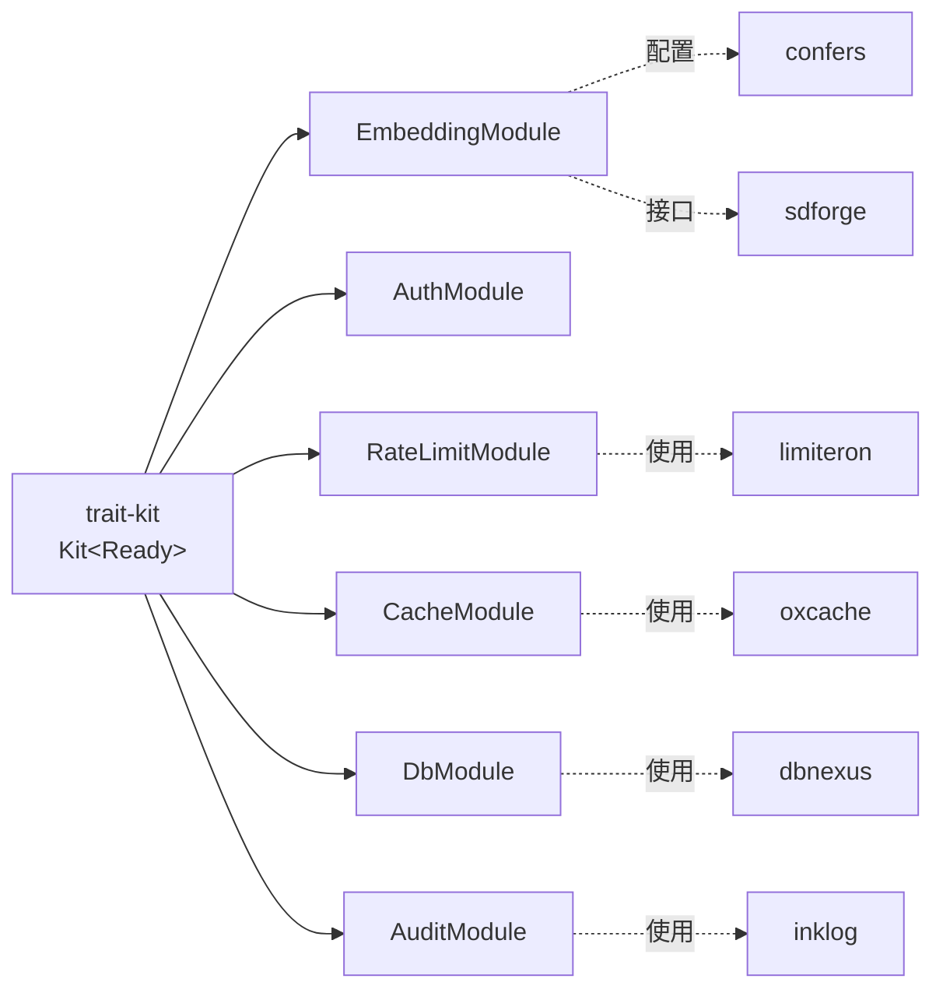
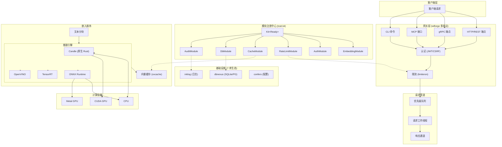

<div align="center">


[](https://www.rust-lang.org/) [](https://opensource.org/licenses/MIT) [](https://github.com/Kirky-X/vecboost) [](https://www.rust-lang.org/)

*高性能、生产级嵌入向量服务，使用 Rust 编写。VecBoost 提供高效的文本向量化服务，支持多种推理引擎、GPU 加速和企业级功能。*

</div>

---

## ✨ 核心功能

| 分类 | 功能特性 |
|------|----------|
| **🚀 高性能** | 优化的 Rust 代码库，支持批处理和并发请求处理 |
| **🔧 多引擎支持** | Candle（原生 Rust）、ONNX Runtime、TensorRT、OpenVINO 推理引擎 |
| **🎮 GPU 加速** | NVIDIA CUDA、Apple Metal 和 AMD ROCm 原生支持 |
| **🌐 多协议接口** | HTTP/REST、gRPC、MCP、CLI 四种接口由 sdforge 统一生成 |
| **🧩 7 库生态** | trait-kit/confers/inklog/oxcache/limiteron/dbnexus/sdforge 模块化生态 |
| **📊 智能缓存** | 基于 oxcache 的高性能缓存（LRU/LFU/FIFO + TTL） |
| **🔐 企业级安全** | JWT 认证、CSRF 保护、基于角色的访问控制和审计日志 |
| **⚡ 速率限制** | 基于 limiteron 的令牌桶限流（全局/IP/用户/API 密钥） |
| **📈 优先级队列** | 可配置优先级的请求队列和加权公平调度 |
| **📦 云原生部署** | 生产环境 Kubernetes、Docker 和云平台部署配置 |
| **📈 可观测性** | Prometheus 指标、健康检查、结构化日志和 Grafana 仪表板 |
| **🧊 Matryoshka 支持** | 动态维度约简，支持更小更快的嵌入向量（OpenAI 兼容） |

> **💡 快速上手**: 2 分钟内启动服务！[查看快速开始](#-快速开始)

## 🧩 7 库生态

VecBoost v0.2.0 采用模块化生态架构，由 7 个独立 Rust 库组成，通过 `trait-kit` 统一注册与依赖管理：

| 库 | 版本 | 用途 | Feature |
|----|------|------|---------|
| **trait-kit** | `0.3` | 模块注册中心与 typestate 依赖管理（`Kit<Unbuilt> → Kit<Ready>`） | 始终启用 |
| **confers** | `0.4` | 配置加载（TOML + 环境变量覆盖 + 热重载订阅） | `config` |
| **inklog** | `0.1` | 结构化日志基础设施（控制台 + 文件轮转） | `inklog` |
| **oxcache** | `0.3` | 高性能缓存后端（LRU/LFU/FIFO + TTL 驱逐） | `oxcache` |
| **limiteron** | `0.2` | 令牌桶限流器（多维度独立计数） | `limiteron` |
| **dbnexus** | `0.4` | 数据库持久化（SQLite/PostgreSQL + 权限角色） | `db` |
| **sdforge** | `0.4` | 多协议接口生成（HTTP/CLI 单一源定义） | `http`/`cli` |


```mermaid
graph LR
    Kit["trait-kit<br/>Kit&lt;Ready&gt;"] --> EmbeddingMod["EmbeddingModule"]
    Kit --> AuthMod["AuthModule"]
    Kit --> RateLimitMod["RateLimitModule"]
    Kit --> CacheMod["CacheModule"]
    Kit --> DbMod["DbModule"]
    Kit --> LoggerMod["AuditModule"]

    CacheMod -.->|使用| oxcache
    RateLimitMod -.->|使用| limiteron
    DbMod -.->|使用| dbnexus
    LoggerMod -.->|使用| inklog
    EmbeddingMod -.->|配置| confers
    EmbeddingMod -.->|接口| sdforge
```

## 🚀 快速开始

### 📋 前置条件

| 依赖项 | 版本 | 说明 |
|--------|------|------|
| **Rust** | 1.75+ | 需要 2024 版 |
| **Cargo** | 1.75+ | 随 Rust 附带 |
| **CUDA Toolkit** | 12.x | 可选，NVIDIA GPU 支持 |
| **Metal SDK** | 最新版 | 可选，Apple Silicon GPU 支持 |

> **💡 提示**: 运行 `rustc --version` 验证 Rust 安装。

### 🔧 安装

```bash
# 1. 克隆仓库
git clone https://github.com/Kirky-X/vecboost.git
cd vecboost

# 2. 默认构建（HTTP + oxcache + limiteron）
cargo build --release

# 3. 构建 GPU 支持
#    Linux (CUDA):
cargo build --release --features cuda

#    macOS (Metal):
cargo build --release --features metal

# 4. 构建多协议接口（HTTP + CLI）
cargo build --release --features http,cli

# 4b. 构建 MCP 接口（stdio 模式，--mcp 启动）
cargo build --release --features mcp

# 5. 构建完整生态（数据库 + 日志 + 认证 + 全协议）
cargo build --release --features http,cli,db,inklog,auth,oxcache,limiteron

# 6. 构建全部功能（含 GPU + ONNX + MCP）
cargo build --release --features cuda,onnx,grpc,mcp,auth,redis,db,inklog,cli
```

### ⚙️ 配置

```bash
# 复制并自定义配置
cp config.toml config_custom.toml
# 编辑 config_custom.toml
```

### ▶️ 运行

```bash
# 使用默认配置运行
./target/release/vecboost

# 使用自定义配置
./target/release/vecboost --config config_custom.toml
```

> **✅ 成功**: 服务默认在 `http://localhost:9002` 启动。

### 🐳 Docker

```bash
# 构建镜像
docker build -t vecboost:latest .

# 运行容器
docker run -p 9002:9002 -p 50051:50051 \
  -v $(pwd)/config.toml:/app/config.toml \
  -v $(pwd)/models:/app/models \
  vecboost:latest
```

## 📖 文档

| 文档 | 说明 | 链接 |
|------|------|------|
| **📋 用户指南** | 详细使用说明、配置和部署指南 | [USER_GUIDE_zh.md](USER_GUIDE_zh.md) |
| **🔌 API 参考** | 完整的 REST API 和 gRPC 文档 | [API_REFERENCE_zh.md](API_REFERENCE_zh.md) |
| **🏗️ 架构设计** | 系统设计、组件和数据流 | [ARCHITECTURE_zh.md](ARCHITECTURE_zh.md) |
| **🤝 贡献指南** | 贡献代码指南和最佳实践 | [docs/CONTRIBUTING.md](docs/CONTRIBUTING.md) |

## 🔌 API 使用

### 🌐 HTTP REST API

**通过 HTTP 生成嵌入向量：**

```bash
curl -X POST http://localhost:9002/api/v1/embed \
  -H "Content-Type: application/json" \
  -d '{"text": "Hello, world!"}'
```

**响应：**

```json
{
  "embedding": [0.123, 0.456, 0.789, ...],
  "dimension": 1024,
  "processing_time_ms": 15.5
}
```

### 📡 gRPC API

服务在 `50051` 端口（可配置）暴露 gRPC 接口。gRPC 方法由 `sdforge` 的 `#[forge(grpc_method = "...")]` 宏从 `src/api/embedding.rs` 的单一源定义生成，无需手写 proto 文件：

| gRPC 方法 | 对应处理函数 | 说明 |
|-----------|-------------|------|
| `vecboost.embed` | `grpc_embed` | 单文本嵌入 |
| `vecboost.embed_batch` | `grpc_embed_batch` | 批量文本嵌入 |
| `vecboost.compute_similarity` | `grpc_compute_similarity` | 计算向量相似度 |
| `vecboost.embed_file` | `grpc_embed_file` | 文件文本嵌入 |
| `vecboost.model_switch` | `grpc_model_switch` | 切换模型 |
| `vecboost.get_current_model` | `grpc_get_current_model` | 获取当前模型 |
| `vecboost.get_model_info` | `grpc_get_model_info` | 获取模型信息 |
| `vecboost.list_models` | `grpc_list_models` | 列出可用模型 |
| `vecboost.health_check` | `grpc_health_check` | 健康检查 |

gRPC 服务通过 `build_server_with_config` 启动，支持 JWT 认证（`grpc_require_auth`）、速率限制（`LimiteronAdapter`）、最大连接数（`grpc_max_connections`）和超时（`grpc_timeout_seconds`）等配置。

### 📚 OpenAPI 文档

访问交互式 API 文档：

| 工具 | URL | 说明 |
|------|-----|------|
| **Swagger UI** | `http://localhost:9002/api-docs` | v0.2.0 实际路径(基于 utoipa SwaggerUi) |
| **OpenAPI JSON** | `http://localhost:9002/api-docs/openapi.json` | OpenAPI 规范端点 |
| **ReDoc** | - | 推迟到 v0.3.0 |

### 🌐 OpenAI 兼容 API

VecBoost 提供 OpenAI 兼容的 embeddings API 端点：

```bash
curl -X POST http://localhost:9002/v1/embeddings \
  -H "Content-Type: application/json" \
  -d '{
    "input": "Hello, world!",
    "model": "text-embedding-ada-002"
  }'
```

**响应：**

```json
{
  "object": "list",
  "data": [{
    "object": "embedding",
    "embedding": [0.123, 0.456, 0.789, ...],
    "index": 0
  }],
  "model": "text-embedding-ada-002",
  "usage": {
    "prompt_tokens": 2,
    "total_tokens": 2
  }
}
```

### 🧊 Matryoshka 维度约简

降低嵌入向量维度以获得更小、更快的嵌入，同时保持质量：

```bash
# 请求 256 维嵌入向量
curl -X POST http://localhost:9002/v1/embeddings \
  -H "Content-Type: application/json" \
  -d '{
    "input": "Hello, world!",
    "model": "text-embedding-ada-002",
    "dimensions": 256
  }'
```

**支持的维度**（BGE-M3 模型，最大 1024）：

| 请求维度 | 返回维度 | 使用场景 |
|---------|---------|----------|
| `256` | 256 | 最大速度，最小存储 |
| `512` | 512 | 平衡性能 |
| `1024` | 1024 | 最大质量（默认） |

**批量请求带维度约简：**

```bash
curl -X POST http://localhost:9002/v1/embeddings \
  -H "Content-Type: application/json" \
  -d '{
    "input": ["文本1", "文本2", "文本3"],
    "model": "text-embedding-ada-002",
    "dimensions": 512
  }'
```

### 📡 多协议接口

VecBoost v0.2.0 通过 `sdforge` 从单一源定义生成 4 种协议接口，启用对应 feature 即可获得。所有协议的处理函数均定义在 `src/api/embedding.rs`，通过 `#[forge(...)]` 宏标注生成各协议绑定。

| 协议 | Feature | 端口 | 生成方式 | 说明 |
|------|---------|------|----------|------|
| **HTTP/REST** | `http` | `9002` | sdforge `#[forge]` | RESTful API + OpenAPI 文档 |
| **gRPC** | `grpc` | `50051` | sdforge `#[forge(grpc_method = "...")]` | 高性能二进制协议 |
| **MCP** | `mcp` | stdio | sdforge `#[forge(tool_name = "...")]` | Model Context Protocol（LLM 工具集成），`--mcp` 以 stdio 模式启动 |
| **CLI** | `cli` | - | sdforge `#[forge]` | 命令行工具（`vecboost embed --text "Hello"`） |

**CLI 使用示例：**

```bash
# 单文本嵌入
cargo run --features cli -- embed --text "Hello, world!"

# 批量嵌入（从文件读取）
cargo run --features cli -- batch --input texts.txt

# 计算相似度
cargo run --features cli -- similarity --text1 "机器学习" --text2 "人工智能"
```

**MCP 使用示例（stdio 模式）：**

```bash
# 以 stdio 模式启动 MCP 服务器（stdout 为 JSON-RPC 流，不启动 HTTP/gRPC）
cargo run --features mcp -- --mcp

# 在 MCP 客户端（如 Claude Desktop / 任意 MCP host）中配置 stdio 启动命令：
# vecboost --mcp
#
# 暴露的工具：
#   - embed        单文本向量化
#   - embed_batch  批量文本向量化
#   - similarity   两文本余弦相似度
#   - list_models  列出可用/已加载模型
```

> **💡 说明**: MCP 协议用于将 VecBoost 嵌入能力暴露为 LLM 可调用的工具，适用于 AI Agent 场景。v0.2.0 基于 `sdforge` `#[forge]` 生成，提供 `embed_text` / `embed_batch` / `compute_similarity` 三个工具（由 `src/api/embedding.rs` 的 `#[forge(tool_name=...)]` 经 `sdforge::mcp::build()` 收集），通过 `cargo run --features mcp -- --mcp` 以 stdio 模式启动（stdout 专用于 JSON-RPC 流，此时不启动 HTTP/gRPC 服务）。

### 🔧 新引擎支持

v0.2.0 新增 TensorRT 与 OpenVINO 引擎支持（当前为 stub 实现，需对应运行时库）：

| 引擎 | Feature | 说明 |
|------|---------|------|
| **Candle** | 默认 | HuggingFace 原生 Rust ML 框架（默认引擎） |
| **ONNX Runtime** | `onnx` | 跨平台 ML 推理运行时 |
| **TensorRT** | `tensorrt` | NVIDIA 高性能推理优化（需 libnvinfer.so） |
| **OpenVINO** | `openvino` | Intel 推理引擎（需 libopenvino_c.so） |

通过 `EngineFactory::create(engine_type, config)` 工厂方法创建，`EngineType` 枚举支持 `Candle`/`Onnx`/`TensorRt`/`OpenVino` 四种变体。

### 🏷️ Feature 标志

VecBoost 采用特性化构建，按需启用功能模块：

| Feature | 默认 | 说明 | 依赖库 |
|---------|------|------|--------|
| `http` | ✅ | HTTP/REST API + OpenAPI 文档 | sdforge, axum, utoipa |
| `grpc` | - | gRPC 服务器（sdforge `#[forge(grpc_method)]` 生成） | sdforge |
| `mcp` | - | MCP 协议接口（LLM 工具集成，sdforge `#[forge]` 生成） | sdforge, rmcp |
| `cli` | - | CLI 命令行工具 | sdforge, clap |
| `openapi` | - | OpenAPI/Swagger UI 文档 | utoipa, utoipa-swagger-ui |
| `db` | - | dbnexus 数据库持久化（SQLite） | dbnexus, sea-orm |
| `postgres` | - | PostgreSQL 支持（含 db） | dbnexus |
| `auth` | - | JWT 认证 + AES-256 加密 | jsonwebtoken, argon2, aes-gcm |
| `redis` | - | Redis 缓存后端 | redis |
| `cuda` | - | NVIDIA CUDA GPU 加速 | candle-core/cuda |
| `metal` | - | Apple Silicon Metal GPU | candle-core/metal |
| `onnx` | - | ONNX Runtime 引擎 | ort |

> **💡 提示**: `default = ["http"]`，最小构建用 `cargo build --no-default-features --features http`。

> **📦 内置依赖说明**: `confers`（配置）、`inklog`（日志）、`oxcache`（缓存）、`limiteron`（限流）、`trait-kit`（模块注册）、`sdforge`（接口生成，http feature 下）为必选依赖，始终启用，无需通过 feature 开启。

## ⚙️ 配置

### 主要配置选项

```toml
[server]
host = "0.0.0.0"
port = 9002

[model]
model_repo = "BAAI/bge-m3"  # HuggingFace 模型 ID
use_gpu = true
batch_size = 32
expected_dimension = 1024

[embedding]
cache_enabled = true
cache_size = 1024

[auth]
enabled = true
jwt_secret = "your-secret-key"

# v0.2.0 新增配置段（对应 7 库生态）
[database]        # dbnexus (feature: db)
url = "sqlite:vecboost.db"
max_connections = 10

[logging]         # inklog (feature: inklog)
level = "info"
console = true
file_path = "logs/vecboost.log"

[flow_control]    # limiteron (feature: limiteron)
enabled = true
token_capacity = 100
token_refill_rate = 50

[cache]           # oxcache (feature: oxcache)
enabled = true
backend = "memory"
max_entries = 10000
ttl_secs = 3600
eviction_policy = "lru"
```

| 区块 | 键名 | 默认值 | 说明 | 依赖库 |
|------|------|--------|------|--------|
| **server** | `host` | `"0.0.0.0"` | 绑定地址 | - |
| | `port` | `9002` | HTTP 服务端口 | - |
| **model** | `model_repo` | `"BAAI/bge-m3"` | HuggingFace 模型 ID | - |
| | `use_gpu` | `false` | 启用 GPU 加速 | - |
| | `batch_size` | `32` | 批处理大小 | - |
| **embedding** | `cache_enabled` | `true` | 启用响应缓存 | - |
| | `cache_size` | `1024` | 最大缓存条目数 | - |
| **auth** | `enabled` | `false` | 启用认证 | - |
| | `jwt_secret` | - | JWT 签名密钥 | - |
| **database** | `url` | `sqlite:vecboost.db` | 数据库连接 URL | dbnexus |
| | `max_connections` | `10` | 连接池大小 | dbnexus |
| **logging** | `level` | `info` | 日志级别 | inklog |
| | `file_path` | `logs/vecboost.log` | 日志文件路径 | inklog |
| **flow_control** | `token_capacity` | `100` | 令牌桶容量 | limiteron |
| | `token_refill_rate` | `50` | 令牌补充速率（每秒） | limiteron |
| **cache** | `backend` | `memory` | 缓存后端类型 | oxcache |
| | `ttl_secs` | `3600` | 缓存 TTL（秒） | oxcache |

> **📖 完整配置**: 查看 [`config.toml`](config.toml) 了解所有可用选项。

## 🏗️ 架构


```mermaid
graph TB
    subgraph Client_Layer["客户端层"]
        Client[客户端请求]
    end

    subgraph Gateway["网关层 (sdforge 多协议)"]
        HTTP["HTTP/REST 端点"]
        gRPC["gRPC 端点"]
        MCP["MCP 接口"]
        CLI["CLI 命令"]
        Auth["认证 (JWT/CSRF)"]
        RateLim["限流 (limiteron)"]
    end

    subgraph Kit_Layer["模块注册中心 (trait-kit)"]
        Kit["Kit&lt;Ready&gt;"]
        Kit --> EmbeddingMod["EmbeddingModule"]
        Kit --> AuthMod["AuthModule"]
        Kit --> RateLimitMod["RateLimitModule"]
        Kit --> CacheMod["CacheModule"]
        Kit --> DbMod["DbModule"]
        Kit --> LoggerMod["AuditModule"]
    end

    subgraph Pipeline["请求管道"]
        Queue["优先级队列"]
        Workers["请求工作线程"]
        Response["响应通道"]
    end

    subgraph Service["嵌入服务"]
        Text["文本分块"]
        Engine["推理引擎 (EngineFactory)"]
        Cache["向量缓存 (oxcache)"]
    end

    subgraph Engine["推理引擎"]
        Candle["Candle (原生 Rust)"]
        ONNX["ONNX Runtime"]
        TensorRT["TensorRT"]
        OpenVINO["OpenVINO"]
    end

    subgraph Infra["基础设施 (7 库生态)"]
        DbNexus["dbnexus (SQLite/PG)"]
        Inklog["inklog (日志)"]
        Confers["confers (配置)"]
    end

    subgraph Device["计算设备"]
        CPU["CPU"]
        CUDA["CUDA GPU"]
        Metal["Metal GPU"]
    end

    Client --> HTTP & gRPC & MCP & CLI
    HTTP & gRPC & MCP & CLI --> Auth
    Auth --> RateLim
    RateLim --> Queue

    Queue --> Workers
    Workers --> Response

    Text --> Engine
    Engine --> Cache

    Engine --> Candle & ONNX & TensorRT & OpenVINO

    Candle --> CPU & CUDA
    ONNX --> CPU & Metal

    CacheMod -.-> Cache
    DbMod -.-> DbNexus
    LoggerMod -.-> Inklog
    RateLimitMod -.-> RateLim
```

## 📦 项目结构

```
vecboost/
├── src/                          # 核心源代码
│   ├── api/            # sdforge 多协议接口定义 (HTTP/gRPC/MCP/CLI 单一源)
│   ├── audit/          # 审计日志与合规
│   ├── auth/           # 认证 (JWT, CSRF, RBAC)
│   ├── cache/          # oxcache 缓存后端
│   ├── config/         # 配置管理 (confers 集成)
│   ├── db/             # dbnexus 数据库层 (feature: db)
│   ├── device/         # 设备管理 (CPU, CUDA, Metal, ROCm)
│   ├── domain/         # 领域模型 (请求/响应类型)
│   ├── engine/         # 推理引擎 (Candle/ONNX)
│   ├── error/          # VecboostError 统一错误类型
│   ├── logger/         # inklog 日志基础设施
│   ├── metrics/        # Prometheus 指标与可观测性
│   ├── model/          # 模型下载、加载与恢复
│   ├── module_registry/# trait-kit 模块注册中心
│   ├── pipeline/       # 请求管道、优先级与调度
│   ├── rate_limit/     # limiteron 限流适配器
│   ├── security/       # 安全工具 (加密、清理、路径校验)
│   ├── service/        # 核心嵌入服务与业务逻辑
│   ├── text/           # 文本处理 (分块、分词)
│   └── utils/          # 工具函数 (向量运算、hf_hub、哈希校验)
├── examples/           # 示例程序 (download_model, batch, embed, similarity)
├── deployments/        # Kubernetes 与 Docker 部署配置
├── tests/              # 测试目录
│   ├── integration/    # 集成测试 (api_test.rs, real_engine.rs)
│   ├── perf/           # 性能测试 (Python pytest + Rust bench)
│   └── common/         # 共享测试夹具 (MockEngine, fixtures)
└── config.toml         # 默认配置文件
```

## 🎯 性能基准

| 指标 | CPU | GPU (CUDA) | 说明 |
|------|-----|------------|------|
| **嵌入维度** | 最高 4096 | 最高 4096 | 模型依赖 |
| **最大批处理** | 64 | 256 | 内存依赖 |
| **请求/秒** | 1,000+ | 10,000+ | 吞吐量 |
| **延迟 (p50)** | < 25ms | < 5ms | 单请求 |
| **延迟 (p99)** | < 100ms | < 50ms | 单请求 |
| **缓存命中率** | > 90% | > 90% | 1024 条目 |

### 🚀 优化特性

- **⚡ 批处理**: 带可配置等待超时的动态批处理
- ** 零拷贝**: 尽可能使用共享引用
- **📊 自适应批处理**: 根据负载自动调整批大小
- **🧊 Matryoshka 重归一化**: 截断维度后自动重归一化，保证余弦相似度正确

## 🔒 安全特性

| 层级 | 特性 | 说明 |
|------|------|------|
| **🔐 认证** | JWT 令牌 | 可配置过期时间、刷新令牌 |
| **👥 授权** | 基于角色 | 用户层级：free、basic、pro、enterprise |
| **📝 审计日志** | 请求跟踪 | 用户、操作、资源、IP、时间戳 |
| **⚡ 速率限制** | 多层限制 | 全局、每 IP、每用户、每 API 密钥 |
| **🔒 加密** | AES-256-GCM | 静态敏感数据加密 |
| **🛡️ 输入清理** | XSS/CSRF 防护 | 请求验证与清理 |

> **⚠️ 安全最佳实践**: 生产环境始终使用 HTTPS，并定期轮换 JWT 密钥。

## 📈 可观测性

| 工具 | 端点 | 说明 |
|------|------|------|
| **Prometheus** | `/metrics` | Prometheus 抓取指标端点 |
| **健康检查** | `/health` | 服务存活和就绪探针 |
| **详细健康** | `/health/detailed` | 完整健康状态与组件检查 |
| **OpenAPI 文档** | `/api-docs` | 交互式 Swagger UI 文档 |
| **Grafana** | - | `deployments/` 中的预配置仪表板 |

### 📊 关键指标

- `vecboost_requests_total` - 按端点统计的总请求数
- `vecboost_embedding_latency_seconds` - 嵌入生成延迟
- `vecboost_cache_hit_ratio` - 缓存命中率
- `vecboost_batch_size` - 当前批处理大小
- `vecboost_gpu_memory_bytes` - GPU 内存使用量

## 🚀 部署选项

### ☸️ Kubernetes

```bash
# 部署到 Kubernetes
kubectl apply -f deployments/kubernetes/

# 部署 GPU 支持
kubectl apply -f deployments/kubernetes/gpu-deployment.yaml

# 查看部署状态
kubectl get pods -n vecboost
```

| 资源 | 说明 |
|------|------|
| `configmap.yaml` | 配置即代码 |
| `deployment.yaml` | 主部署清单 |
| `gpu-deployment.yaml` | GPU 节点选择器部署 |
| `hpa.yaml` | 水平 Pod 自动扩缩容 |
| `model-cache.yaml` | 模型缓存持久化卷 |
| `service.yaml` | 集群 IP 服务 |

> **📖 完整指南**: 查看[部署指南](deployments/kubernetes/README.md)了解更多详情。

### 🐳 Docker Compose

```yaml
version: '3.8'

services:
  vecboost:
    image: vecboost:latest
    ports:
      - "9002:9002"    # HTTP API
      - "50051:50051"  # gRPC
      # Prometheus 指标暴露在 9002 的 /metrics 路径，无需独立端口
    volumes:
      - ./config.toml:/app/config.toml
      - ./models:/app/models
      - ./logs:/app/logs
    environment:
      - VECBOOST_JWT_SECRET=${JWT_SECRET}
      - VECBOOST_LOG_LEVEL=info
    restart: unless-stopped
    deploy:
      resources:
        reservations:
          devices:
            - driver: nvidia
              count: 1
              capabilities: [gpu]
```

## 🤝 贡献

欢迎贡献代码！请阅读[贡献指南](docs/CONTRIBUTING.md)了解更多。

### 🛠️ 开发环境设置

```bash
# 安装开发依赖
cargo install cargo-audit cargo-clippy cargo-fmt

# 运行测试
cargo test --all-features

# 运行 linter
cargo clippy --all-targets --all-features -- -D warnings

# 格式化代码
cargo fmt --all
```

## 📄 许可证

本项目采用 **MIT 许可证** - 查看 [LICENSE](LICENSE) 文件了解更多。

## 🙏 致谢

| 项目 | 说明 | 链接 |
|------|------|------|
| **trait-kit** | 模块注册中心与 typestate 依赖管理 | [crates.io](https://crates.io/crates/trait-kit) |
| **confers** | 配置加载与热重载 | [crates.io](https://crates.io/crates/confers) |
| **inklog** | 结构化日志基础设施 | [crates.io](https://crates.io/crates/inklog) |
| **oxcache** | 高性能缓存后端 | [crates.io](https://crates.io/crates/oxcache) |
| **limiteron** | 令牌桶限流器 | [crates.io](https://crates.io/crates/limiteron) |
| **dbnexus** | 数据库持久化与权限管理 | [crates.io](https://crates.io/crates/dbnexus) |
| **sdforge** | 多协议接口生成 | [crates.io](https://crates.io/crates/sdforge) |
| **Candle** | 原生 Rust ML 框架 | [GitHub](https://github.com/huggingface/candle) |
| **ONNX Runtime** | 跨平台 ML 推理运行时 | [官网](https://onnxruntime.ai/) |
| **Hugging Face Hub** | 模型仓库与分发 | [官网](https://huggingface.co/models) |
| **Axum** | Rust  ergonomic Web 框架 | [GitHub](https://github.com/tokio-rs/axum) |
| **Tonic** | Rust gRPC 实现 | [GitHub](https://github.com/hyperium/tonic) |

---

<div align="center">

**⭐ 如果 VecBoost 对您有帮助，请在 GitHub 上给我们一个星标！**

[](https://github.com/Kirky-X/vecboost)

</div>
