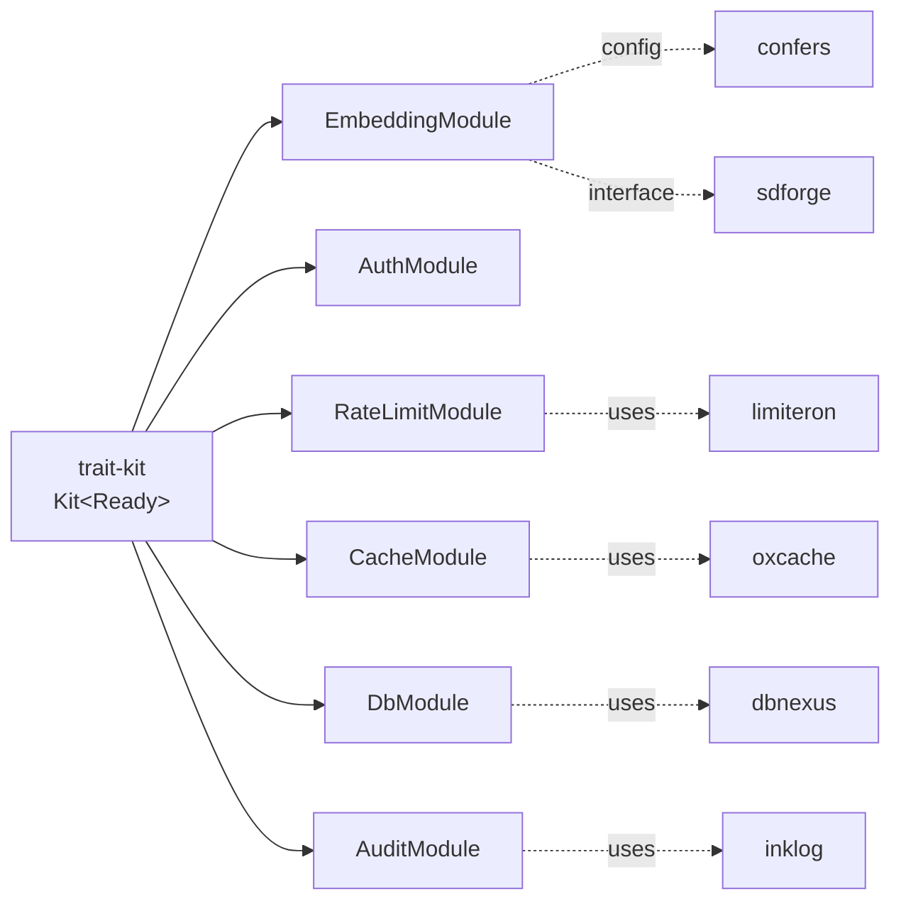
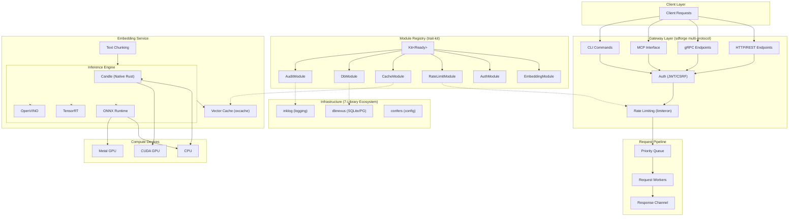

<div align="center">


[](https://www.rust-lang.org/) [](https://opensource.org/licenses/MIT) [](https://github.com/Kirky-X/vecboost) [](https://www.rust-lang.org/)

*A high-performance, production-ready embedding vector service written in Rust. VecBoost provides efficient text vectorization with support for multiple inference engines, GPU acceleration, and enterprise-grade features.*

</div>

---

## ✨ Core Features

| Category | Features |
|----------|----------|
| **🚀 Performance** | Optimized Rust codebase with batch processing and concurrent request handling |
| **🔧 Multi-Engine** | Candle (native Rust), ONNX Runtime, TensorRT, and OpenVINO inference engines |
| **🎮 GPU Support** | Native CUDA (NVIDIA), Metal (Apple Silicon), and ROCm (AMD) acceleration |
| **🌐 Multi-Protocol** | HTTP/REST, gRPC, MCP, and CLI interfaces unified via sdforge |
| **🧩 7-Library Ecosystem** | Modular ecosystem: trait-kit/confers/inklog/oxcache/limiteron/dbnexus/sdforge |
| **📊 Smart Caching** | High-performance caching via oxcache (LRU/LFU/FIFO + TTL) |
| **🔐 Enterprise Security** | JWT authentication, CSRF protection, role-based access control, and audit logging |
| **⚡ Rate Limiting** | Token bucket rate limiting via limiteron (global/IP/user/API key) |
| **📈 Priority Queue** | Request prioritization with configurable priority weights and weighted fair queuing |
| **📦 Cloud Ready** | Production deployment configurations for Kubernetes, Docker, and cloud platforms |
| **📈 Observability** | Prometheus metrics, health checks, structured logging, and Grafana dashboards |
| **🧊 Matryoshka Support** | Dynamic dimension reduction for smaller, faster embeddings (OpenAI compatible) |

> **💡 Quick Start**: Get up and running in 2 minutes! [See Quick Start](#-quick-start)

## 🧩 7-Library Ecosystem

VecBoost v0.2.0 adopts a modular ecosystem architecture composed of 7 independent Rust libraries, unified through `trait-kit` for registration and dependency management:

| Library | Version | Purpose | Feature |
|---------|---------|---------|---------|
| **trait-kit** | `0.3` | Module registry & typestate dependency management (`Kit<Unbuilt> → Kit<Ready>`) | Always enabled |
| **confers** | `0.4` | Config loading (TOML + env override + hot reload subscription) | `config` |
| **inklog** | `0.1` | Structured logging infrastructure (console + file rotation) | `inklog` |
| **oxcache** | `0.3` | High-performance cache backend (LRU/LFU/FIFO + TTL eviction) | `oxcache` |
| **limiteron** | `0.2` | Token bucket rate limiter (multi-dimension independent counting) | `limiteron` |
| **dbnexus** | `0.4` | Database persistence (SQLite/PostgreSQL + permission roles) | `db` |
| **sdforge** | `0.4` | Multi-protocol interface generation (HTTP/CLI from single source) | `http`/`cli` |



## 🚀 Quick Start

### 📋 Prerequisites

| Requirement | Version | Description |
|-------------|---------|-------------|
| **Rust** | 1.75+ | Edition 2024 required |
| **Cargo** | 1.75+ | Comes with Rust |
| **CUDA Toolkit** | 12.x | Optional, for NVIDIA GPU support |
| **Metal SDK** | Latest | Optional, for Apple Silicon GPU |

> **💡 Tip**: Run `rustc --version` to verify your Rust installation.

### 🔧 Installation

```bash
# 1. Clone the repository
git clone https://github.com/Kirky-X/vecboost.git
cd vecboost

# 2. Build with default features (HTTP + oxcache + limiteron)
cargo build --release

# 3. Build with GPU support
#    Linux (CUDA):
cargo build --release --features cuda

#    macOS (Metal):
cargo build --release --features metal

# 4. Build multi-protocol interfaces (HTTP + CLI)
cargo build --release --features http,cli

# 5. Build full ecosystem (DB + logging + auth + all protocols)
cargo build --release --features http,cli,db,inklog,auth,oxcache,limiteron

# 6. Build all features (incl. GPU + ONNX)
cargo build --release --features cuda,onnx,grpc,auth,redis,db,inklog,cli
```

### ⚙️ Configuration

```bash
# Copy and customize the configuration
cp config.toml config_custom.toml
# Edit config_custom.toml with your settings
```

### ▶️ Running

```bash
# Run with default configuration
./target/release/vecboost

# Run with custom configuration
./target/release/vecboost --config config_custom.toml
```

> **✅ Success**: The service will start on `http://localhost:9002` by default.

### 🐳 Docker

```bash
# Build the image
docker build -t vecboost:latest .

# Run the container
docker run -p 9002:9002 -p 50051:50051 \
  -v $(pwd)/config.toml:/app/config.toml \
  -v $(pwd)/models:/app/models \
  vecboost:latest
```

## 📖 Documentation

| Document | Description | Link |
|----------|-------------|------|
| **📋 User Guide** | Detailed usage instructions, configuration, and deployment | [USER_GUIDE.md](USER_GUIDE.md) |
| **🔌 API Reference** | Complete REST API and gRPC documentation | [API_REFERENCE.md](API_REFERENCE.md) |
| **🏗️ Architecture** | System design, components, and data flow | [ARCHITECTURE.md](ARCHITECTURE.md) |
| **🤝 Contributing** | Contribution guidelines and best practices | [docs/CONTRIBUTING.md](docs/CONTRIBUTING.md) |

## 🔌 API Usage

### 🌐 HTTP REST API

**Generate embeddings via HTTP:**

```bash
curl -X POST http://localhost:9002/api/v1/embed \
  -H "Content-Type: application/json" \
  -d '{"text": "Hello, world!"}'
```

**Response:**

```json
{
  "embedding": [0.123, 0.456, 0.789, ...],
  "dimension": 1024,
  "processing_time_ms": 15.5
}
```

### 📡 gRPC API

The service exposes a gRPC interface on port `50051` (configurable):

```protobuf
service EmbeddingService {
  // Single text embedding
  rpc Embed(EmbedRequest) returns (EmbedResponse);

  // Batch text embeddings
  rpc EmbedBatch(BatchEmbedRequest) returns (BatchEmbedResponse);

  // Compute similarity between vectors
  rpc ComputeSimilarity(SimilarityRequest) returns (SimilarityResponse);
}
```

### 📚 OpenAPI Documentation

Access interactive API documentation:

| Tool | URL | Notes |
|------|-----|-------|
| **Swagger UI** | `http://localhost:9002/api-docs` | v0.2.0 actual path (based on utoipa SwaggerUi) |
| **OpenAPI JSON** | `http://localhost:9002/api-docs/openapi.json` | OpenAPI spec endpoint |
| **ReDoc** | - | Deferred to v0.3.0 |

### 🌐 OpenAI-Compatible API

VecBoost provides an OpenAI-compatible embeddings API endpoint:

```bash
curl -X POST http://localhost:9002/v1/embeddings \
  -H "Content-Type: application/json" \
  -d '{
    "input": "Hello, world!",
    "model": "text-embedding-ada-002"
  }'
```

**Response:**

```json
{
  "object": "list",
  "data": [{
    "object": "embedding",
    "embedding": [0.123, 0.456, 0.789, ...],
    "index": 0
  }],
  "model": "text-embedding-ada-002",
  "usage": {
    "prompt_tokens": 2,
    "total_tokens": 2
  }
}
```

### 🧊 Matryoshka Dimension Reduction

Reduce embedding dimensions for smaller, faster embeddings while maintaining quality:

```bash
# Request 256-dimensional embeddings
curl -X POST http://localhost:9002/v1/embeddings \
  -H "Content-Type: application/json" \
  -d '{
    "input": "Hello, world!",
    "model": "text-embedding-ada-002",
    "dimensions": 256
  }'
```

**Supported dimensions** (BGE-M3 model, max 1024):

| Requested | Returned | Use Case |
|-----------|----------|----------|
| `256` | 256 | Maximum speed, smaller storage |
| `512` | 512 | Balanced performance |
| `1024` | 1024 | Maximum quality (default) |

**Batch with dimension reduction:**

```bash
curl -X POST http://localhost:9002/v1/embeddings \
  -H "Content-Type: application/json" \
  -d '{
    "input": ["text1", "text2", "text3"],
    "model": "text-embedding-ada-002",
    "dimensions": 512
  }'
```

### 📡 Multi-Protocol Interfaces

VecBoost v0.2.0 generates 4 protocol interfaces from a single source definition via `sdforge` — enable the corresponding feature to use.

> **⚠️ v0.2.0 Implementation Status**: `sdforge` macros (`#[service_api]`/`#[forge]`) are **not actually used** in v0.2.0. HTTP routes are hand-written Axum handlers in `src/routes/`, CLI is hand-written clap in `src/cli/`, and MCP protocol is not implemented. The complete sdforge macro generation mechanism is deferred to v0.3.0. See `specmark/changes/vecboost-v0.2.0-ecosystem-refactor/design.md` D5 decision.

| Protocol | Feature | Port | v0.2.0 Status | Description |
|----------|---------|------|---------------|-------------|
| **HTTP/REST** | `http` | `9002` | ✅ Implemented (hand-written Axum) | RESTful API + OpenAPI docs |
| **gRPC** | `grpc` | `50051` | ✅ Implemented (tonic) | High-performance binary protocol (see `proto/`) |
| **MCP** | `mcp` | - | ⏳ Deferred to v0.3.0 | Model Context Protocol (LLM tool integration) |
| **CLI** | `cli` | - | ✅ Implemented (hand-written clap) | Command-line tool (`vecboost embed --text "Hello"`) |

**CLI usage examples:**

```bash
# Single text embedding
cargo run --features cli -- embed --text "Hello, world!"

# Batch embedding (read from file)
cargo run --features cli -- batch --input texts.txt

# Compute similarity
cargo run --features cli -- similarity --text1 "machine learning" --text2 "artificial intelligence"
```

> **💡 Note**: MCP protocol exposes VecBoost embedding capabilities as LLM-callable tools, suitable for AI Agent scenarios. Will be implemented based on `rmcp` in v0.3.0.

### 🔧 New Engine Support

v0.2.0 adds TensorRT and OpenVINO engine support (currently stub implementations, require corresponding runtime libraries):

| Engine | Feature | Description |
|--------|---------|-------------|
| **Candle** | default | HuggingFace native Rust ML framework (default engine) |
| **ONNX Runtime** | `onnx` | Cross-platform ML inference runtime |
| **TensorRT** | `tensorrt` | NVIDIA high-performance inference optimization (requires libnvinfer.so) |
| **OpenVINO** | `openvino` | Intel inference engine (requires libopenvino_c.so) |

Created via the `EngineFactory::create(engine_type, config)` factory method; the `EngineType` enum supports `Candle`/`Onnx`/`TensorRt`/`OpenVino` variants.

### 🏷️ Feature Flags

VecBoost uses feature-gated builds to enable modules on demand:

| Feature | Default | Description | Dependency |
|---------|---------|-------------|------------|
| `http` | ✅ | HTTP/REST API + OpenAPI docs | sdforge, axum |
| `oxcache` | ✅ | oxcache cache backend | oxcache |
| `limiteron` | ✅ | limiteron rate limiter | limiteron |
| `grpc` | - | gRPC server | tonic |
| `mcp` | - | MCP protocol interface (LLM tool integration) | sdforge |
| `cli` | - | CLI command-line tool | sdforge, clap |
| `db` | - | dbnexus database persistence (SQLite) | dbnexus |
| `postgres` | - | PostgreSQL support (includes db) | dbnexus |
| `inklog` | - | inklog structured logging | inklog |
| `config` | - | confers config hot reload | confers |
| `auth` | - | JWT auth + AES-256 encryption | jsonwebtoken, argon2 |
| `redis` | - | Redis cache backend | redis |
| `cuda` | - | NVIDIA CUDA GPU acceleration | candle-core/cuda |
| `metal` | - | Apple Silicon Metal GPU | candle-core/metal |
| `onnx` | - | ONNX Runtime engine | ort |
| `tensorrt` | - | TensorRT engine (stub, requires runtime lib) | - |
| `openvino` | - | OpenVINO engine (stub, requires runtime lib) | - |

> **💡 Tip**: `default = ["http", "oxcache", "limiteron"]`; minimal build with `cargo build --no-default-features --features http`.

## ⚙️ Configuration

### Key Configuration Options

```toml
[server]
host = "0.0.0.0"
port = 9002

[model]
model_repo = "BAAI/bge-m3"  # HuggingFace model ID
use_gpu = true
batch_size = 32
expected_dimension = 1024

[embedding]
cache_enabled = true
cache_size = 1024

[auth]
enabled = true
jwt_secret = "your-secret-key"

# v0.2.0 new config sections (mapping to 7-library ecosystem)
[database]        # dbnexus (feature: db)
url = "sqlite:vecboost.db"
max_connections = 10

[logging]         # inklog (feature: inklog)
level = "info"
console = true
file_path = "logs/vecboost.log"

[flow_control]    # limiteron (feature: limiteron)
enabled = true
token_capacity = 100
token_refill_rate = 50

[cache]           # oxcache (feature: oxcache)
enabled = true
backend = "memory"
max_entries = 10000
ttl_secs = 3600
eviction_policy = "lru"
```

| Section | Key | Default | Description | Library |
|---------|-----|---------|-------------|---------|
| **server** | `host` | `"0.0.0.0"` | Bind address | - |
| | `port` | `9002` | HTTP server port | - |
| **model** | `model_repo` | `"BAAI/bge-m3"` | HuggingFace model ID | - |
| | `use_gpu` | `false` | Enable GPU acceleration | - |
| | `batch_size` | `32` | Batch processing size | - |
| **embedding** | `cache_enabled` | `true` | Enable response caching | - |
| | `cache_size` | `1024` | Maximum cache entries | - |
| **auth** | `enabled` | `false` | Enable authentication | - |
| | `jwt_secret` | - | JWT signing secret | - |
| **database** | `url` | `sqlite:vecboost.db` | Database connection URL | dbnexus |
| | `max_connections` | `10` | Connection pool size | dbnexus |
| **logging** | `level` | `info` | Log level | inklog |
| | `file_path` | `logs/vecboost.log` | Log file path | inklog |
| **flow_control** | `token_capacity` | `100` | Token bucket capacity | limiteron |
| | `token_refill_rate` | `50` | Token refill rate (per second) | limiteron |
| **cache** | `backend` | `memory` | Cache backend type | oxcache |
| | `ttl_secs` | `3600` | Cache TTL (seconds) | oxcache |

> **📖 Full Configuration**: See [`config.toml`](config.toml) for all available options.

## 🏗️ Architecture



## 📦 Project Structure

```
vecboost/
├── src/                          # Core source code
│   ├── api/            # sdforge multi-protocol interface defs (feature: http)
│   ├── audit/          # Audit logging & compliance
│   ├── auth/           # Authentication (JWT, CSRF, RBAC)
│   ├── cache/          # oxcache cache backend (feature: oxcache)
│   ├── cli/            # CLI command-line tool (feature: cli)
│   ├── config/         # Configuration management (confers integration)
│   ├── db/             # dbnexus database layer (feature: db)
│   ├── device/         # Device management (CPU, CUDA, Metal, ROCm)
│   ├── domain/         # Domain models (request/response types)
│   ├── engine/         # Inference engines (Candle/ONNX/TensorRT/OpenVINO)
│   ├── error/          # VecboostError unified error type
│   ├── grpc/           # gRPC server & protocol (feature: grpc)
│   ├── logger/         # inklog logging infrastructure (feature: inklog)
│   ├── metrics/        # Prometheus metrics & observability
│   ├── model/          # Model downloading, loading & recovery
│   ├── module_registry/# trait-kit module registry
│   ├── pipeline/       # Request pipeline, priority & scheduling
│   ├── rate_limit/     # limiteron rate limiter adapter (feature: limiteron)
│   ├── routes/         # HTTP routes & handlers
│   ├── security/       # Security utilities (encryption, sanitization)
│   ├── service/        # Core embedding service & business logic
│   └── text/           # Text processing (chunking, tokenization)
├── examples/           # Example programs
│   └── gpu/            # GPU-specific examples & benchmarks
├── proto/              # gRPC protocol definitions (`.proto` files)
├── deployments/        # Kubernetes & Docker deployment configs
├── tests/              # Test directory
│   ├── integration/    # Integration tests (api_test.rs, real_engine.rs)
│   ├── perf/           # Performance tests (Python pytest + Rust bench)
│   └── common/         # Shared test fixtures (MockEngine, fixtures)
└── config.toml         # Default configuration file
```

## 🎯 Performance Benchmarks

| Metric | CPU | GPU (CUDA) | Notes |
|--------|-----|------------|-------|
| **Embedding Dimension** | Up to 4096 | Up to 4096 | Model dependent |
| **Max Batch Size** | 64 | 256 | Memory dependent |
| **Requests/Second** | 1,000+ | 10,000+ | Throughput |
| **Latency (p50)** | < 25ms | < 5ms | Single request |
| **Latency (p99)** | < 100ms | < 50ms | Single request |
| **Cache Hit Ratio** | > 90% | > 90% | With 1024 entries |

### 🚀 Optimization Features

- **⚡ Batch Processing**: Dynamic batching with configurable wait timeout
- **💾 Memory Pool**: Pre-allocated tensor buffers to reduce allocation overhead
- **🔄 Zero-Copy**: Shared references where possible
- **📊 Adaptive Batching**: Automatic batch size adjustment based on load

## 🔒 Security Features

| Layer | Feature | Description |
|-------|---------|-------------|
| **🔐 Authentication** | JWT Tokens | Configurable expiration, refresh tokens |
| **👥 Authorization** | Role-Based Access | User tiers: free, basic, pro, enterprise |
| **📝 Audit Logging** | Request Tracking | User, action, resource, IP, timestamp |
| **⚡ Rate Limiting** | Multi-Layer | Global, per-IP, per-user, per-API key |
| **🔒 Encryption** | AES-256-GCM | Sensitive data at rest |
| **🛡️ Input Sanitization** | XSS/CSRF Protection | Request validation & sanitization |

> **⚠️ Security Best Practice**: Always use HTTPS in production and rotate JWT secrets regularly.

## 📈 Observability

| Tool | Endpoint | Description |
|------|----------|-------------|
| **Prometheus** | `/metrics` | Metrics endpoint for Prometheus scraping |
| **Health Check** | `/health` | Service liveness and readiness probe |
| **Detailed Health** | `/health/detailed` | Full health status with component checks |
| **OpenAPI Docs** | `/api-docs` | Interactive Swagger UI documentation |
| **Grafana** | - | Pre-configured dashboards in `deployments/` |

### 📊 Key Metrics

- `vecboost_requests_total` - Total request count by endpoint
- `vecboost_embedding_latency_seconds` - Embedding generation latency
- `vecboost_cache_hit_ratio` - Cache hit ratio percentage
- `vecboost_batch_size` - Current batch processing size
- `vecboost_gpu_memory_bytes` - GPU memory usage

## 🚀 Deployment Options

### ☸️ Kubernetes

```bash
# Deploy to Kubernetes
kubectl apply -f deployments/kubernetes/

# Deploy with GPU support
kubectl apply -f deployments/kubernetes/gpu-deployment.yaml

# View deployment status
kubectl get pods -n vecboost
```

| Resource | Description |
|----------|-------------|
| `configmap.yaml` | Configuration as code |
| `deployment.yaml` | Main deployment manifest |
| `gpu-deployment.yaml` | GPU node selector deployment |
| `hpa.yaml` | Horizontal Pod Autoscaler |
| `model-cache.yaml` | Persistent volume for model caching |
| `service.yaml` | Cluster IP service |

> **📖 Full Guide**: See [Deployment Guide](deployments/kubernetes/README.md) for detailed instructions.

### 🐳 Docker Compose

```yaml
version: '3.8'

services:
  vecboost:
    image: vecboost:latest
    ports:
      - "9002:9002"    # HTTP API
      - "50051:50051"  # gRPC
      # Prometheus metrics are exposed on the 9002 /metrics path, no separate port
    volumes:
      - ./config.toml:/app/config.toml
      - ./models:/app/models
      - ./logs:/app/logs
    environment:
      - VECBOOST_JWT_SECRET=${JWT_SECRET}
      - VECBOOST_LOG_LEVEL=info
    restart: unless-stopped
    deploy:
      resources:
        reservations:
          devices:
            - driver: nvidia
              count: 1
              capabilities: [gpu]
```

## 🤝 Contributing

Contributions are welcome! Please read our [Contributing Guide](docs/CONTRIBUTING.md) for details.

### 🛠️ Development Setup

```bash
# Install development dependencies
cargo install cargo-audit cargo-clippy cargo fmt

# Run tests
cargo test --all-features

# Run linter
cargo clippy --all-targets --all-features -- -D warnings

# Format code
cargo fmt --all
```

## 📄 License

This project is licensed under the **MIT License** - see the [LICENSE](LICENSE) file for details.

## 🙏 Acknowledgments

| Project | Description | Link |
|---------|-------------|------|
| **trait-kit** | Module registry & typestate dependency management | [crates.io](https://crates.io/crates/trait-kit) |
| **confers** | Config loading & hot reload | [crates.io](https://crates.io/crates/confers) |
| **inklog** | Structured logging infrastructure | [crates.io](https://crates.io/crates/inklog) |
| **oxcache** | High-performance cache backend | [crates.io](https://crates.io/crates/oxcache) |
| **limiteron** | Token bucket rate limiter | [crates.io](https://crates.io/crates/limiteron) |
| **dbnexus** | Database persistence & permission management | [crates.io](https://crates.io/crates/dbnexus) |
| **sdforge** | Multi-protocol interface generation | [crates.io](https://crates.io/crates/sdforge) |
| **Candle** | Native Rust ML framework | [GitHub](https://github.com/huggingface/candle) |
| **ONNX Runtime** | Cross-platform ML inference runtime | [Website](https://onnxruntime.ai/) |
| **Hugging Face Hub** | Model repository and distribution | [Website](https://huggingface.co/models) |
| **Axum** | Ergonomic web framework for Rust | [GitHub](https://github.com/tokio-rs/axum) |
| **Tonic** | gRPC implementation for Rust | [GitHub](https://github.com/hyperium/tonic) |

---

<div align="center">

**⭐ Star us on GitHub if you find VecBoost useful!**

[](https://github.com/Kirky-X/vecboost)

</div>
