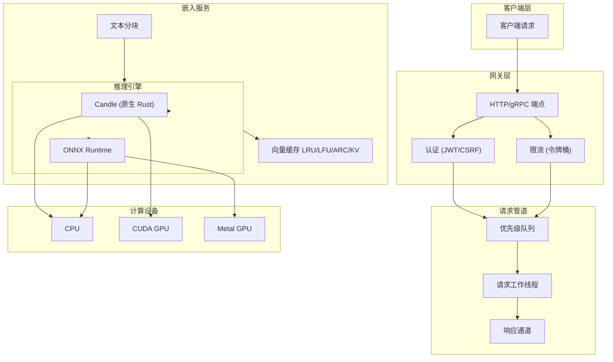

<div align="center">


[](https://www.rust-lang.org/) [](https://opensource.org/licenses/MIT) [](https://github.com/Kirky-X/vecboost) [](https://www.rust-lang.org/)

*高性能、生产级嵌入向量服务，使用 Rust 编写。VecBoost 提供高效的文本向量化服务，支持多种推理引擎、GPU 加速和企业级功能。*

</div>

---

## ✨ 核心功能

| 分类 | 功能特性 |
|------|----------|
| **🚀 高性能** | 优化的 Rust 代码库，支持批处理和并发请求处理 |
| **🔧 多引擎支持** | Candle（原生 Rust）和 ONNX Runtime 推理引擎 |
| **🎮 GPU 加速** | NVIDIA CUDA、Apple Metal 和 AMD ROCm 原生支持 |
| **📊 智能缓存** | 多层缓存策略（LRU、LFU、ARC、KV） |
| **🔐 企业级安全** | JWT 认证、CSRF 保护、基于角色的访问控制和审计日志 |
| **⚡ 速率限制** | 可配置的令牌桶算法速率限制（全局/IP/用户/API 密钥） |
| **📈 优先级队列** | 可配置优先级的请求队列和加权公平调度 |
| **🌐 双 API 接口** | gRPC 和 HTTP/REST 接口，支持 OpenAPI/Swagger 文档 |
| **📦 云原生部署** | 生产环境 Kubernetes、Docker 和云平台部署配置 |
| **📈 可观测性** | Prometheus 指标、健康检查、结构化日志和 Grafana 仪表板 |
| **🧊 Matryoshka 支持** | 动态维度约简，支持更小更快的嵌入向量（OpenAI 兼容） |

> **💡 快速上手**: 2 分钟内启动服务！[查看快速开始](#-快速开始)

## 🚀 快速开始

### 📋 前置条件

| 依赖项 | 版本 | 说明 |
|--------|------|------|
| **Rust** | 1.75+ | 需要 2024 版 |
| **Cargo** | 1.75+ | 随 Rust 附带 |
| **CUDA Toolkit** | 12.x | 可选，NVIDIA GPU 支持 |
| **Metal SDK** | 最新版 | 可选，Apple Silicon GPU 支持 |

> **💡 提示**: 运行 `rustc --version` 验证 Rust 安装。

### 🔧 安装

```bash
# 1. 克隆仓库
git clone https://github.com/Kirky-X/vecboost.git
cd vecboost

# 2. 默认构建（仅 CPU）
cargo build --release

# 3. 构建 GPU 支持
#    Linux (CUDA):
cargo build --release --features cuda

#    macOS (Metal):
cargo build --release --features metal

# 4. 构建全部功能
cargo build --release --features cuda,onnx,grpc,auth,redis
```

### ⚙️ 配置

```bash
# 复制并自定义配置
cp config.toml config_custom.toml
# 编辑 config_custom.toml
```

### ▶️ 运行

```bash
# 使用默认配置运行
./target/release/vecboost

# 使用自定义配置
./target/release/vecboost --config config_custom.toml
```

> **✅ 成功**: 服务默认在 `http://localhost:9002` 启动。

### 🐳 Docker

```bash
# 构建镜像
docker build -t vecboost:latest .

# 运行容器
docker run -p 9002:9002 -p 50051:50051 \
  -v $(pwd)/config.toml:/app/config.toml \
  -v $(pwd)/models:/app/models \
  vecboost:latest
```

## 📖 文档

| 文档 | 说明 | 链接 |
|------|------|------|
| **📋 用户指南** | 详细使用说明、配置和部署指南 | [USER_GUIDE_zh.md](USER_GUIDE_zh.md) |
| **🔌 API 参考** | 完整的 REST API 和 gRPC 文档 | [API_REFERENCE_zh.md](API_REFERENCE_zh.md) |
| **🏗️ 架构设计** | 系统设计、组件和数据流 | [ARCHITECTURE_zh.md](ARCHITECTURE_zh.md) |
| **🤝 贡献指南** | 贡献代码指南和最佳实践 | [docs/CONTRIBUTING.md](docs/CONTRIBUTING.md) |

## 🔌 API 使用

### 🌐 HTTP REST API

**通过 HTTP 生成嵌入向量：**

```bash
curl -X POST http://localhost:9002/api/v1/embed \
  -H "Content-Type: application/json" \
  -d '{"text": "Hello, world!"}'
```

**响应：**

```json
{
  "embedding": [0.123, 0.456, 0.789, ...],
  "dimension": 1024,
  "processing_time_ms": 15.5
}
```

### 📡 gRPC API

服务在 `50051` 端口（可配置）暴露 gRPC 接口：

```protobuf
service EmbeddingService {
  // 单文本嵌入
  rpc Embed(EmbedRequest) returns (EmbedResponse);

  // 批量文本嵌入
  rpc EmbedBatch(BatchEmbedRequest) returns (BatchEmbedResponse);

  // 计算向量相似度
  rpc ComputeSimilarity(SimilarityRequest) returns (SimilarityResponse);
}
```

### 📚 OpenAPI 文档

访问交互式 API 文档：

| 工具 | URL |
|------|-----|
| **Swagger UI** | `http://localhost:9002/swagger-ui/` |
| **ReDoc** | `http://localhost:9002/redoc/` |

### 🌐 OpenAI 兼容 API

VecBoost 提供 OpenAI 兼容的 embeddings API 端点：

```bash
curl -X POST http://localhost:9002/v1/embeddings \
  -H "Content-Type: application/json" \
  -d '{
    "input": "Hello, world!",
    "model": "text-embedding-ada-002"
  }'
```

**响应：**

```json
{
  "object": "list",
  "data": [{
    "object": "embedding",
    "embedding": [0.123, 0.456, 0.789, ...],
    "index": 0
  }],
  "model": "text-embedding-ada-002",
  "usage": {
    "prompt_tokens": 2,
    "total_tokens": 2
  }
}
```

### 🧊 Matryoshka 维度约简

降低嵌入向量维度以获得更小、更快的嵌入，同时保持质量：

```bash
# 请求 256 维嵌入向量
curl -X POST http://localhost:9002/v1/embeddings \
  -H "Content-Type: application/json" \
  -d '{
    "input": "Hello, world!",
    "model": "text-embedding-ada-002",
    "dimensions": 256
  }'
```

**支持的维度**（BGE-M3 模型，最大 1024）：

| 请求维度 | 返回维度 | 使用场景 |
|---------|---------|----------|
| `256` | 256 | 最大速度，最小存储 |
| `512` | 512 | 平衡性能 |
| `1024` | 1024 | 最大质量（默认） |

**批量请求带维度约简：**

```bash
curl -X POST http://localhost:9002/v1/embeddings \
  -H "Content-Type: application/json" \
  -d '{
    "input": ["文本1", "文本2", "文本3"],
    "model": "text-embedding-ada-002",
    "dimensions": 512
  }'
```

## ⚙️ 配置

### 主要配置选项

```toml
[server]
host = "0.0.0.0"
port = 9002

[model]
model_repo = "BAAI/bge-m3"  # HuggingFace 模型 ID
use_gpu = true
batch_size = 32
expected_dimension = 1024

[embedding]
cache_enabled = true
cache_size = 1024

[auth]
enabled = true
jwt_secret = "your-secret-key"
```

| 区块 | 键名 | 默认值 | 说明 |
|------|------|--------|------|
| **server** | `host` | `"0.0.0.0"` | 绑定地址 |
| | `port` | `9002` | HTTP 服务端口 |
| **model** | `model_repo` | `"BAAI/bge-m3"` | HuggingFace 模型 ID |
| | `use_gpu` | `false` | 启用 GPU 加速 |
| | `batch_size` | `32` | 批处理大小 |
| **embedding** | `cache_enabled` | `true` | 启用响应缓存 |
| | `cache_size` | `1024` | 最大缓存条目数 |
| **auth** | `enabled` | `false` | 启用认证 |
| | `jwt_secret` | - | JWT 签名密钥 |

> **📖 完整配置**: 查看 [`config.toml`](config.toml) 了解所有可用选项。

## 🏗️ 架构



## 📦 项目结构

```
vecboost/
├── src/                          # 核心源代码
│   ├── audit/          # 审计日志与合规
│   ├── auth/           # 认证 (JWT, CSRF, RBAC)
│   ├── cache/          # 多层缓存 (LRU, LFU, ARC, KV)
│   ├── config/         # 配置管理
│   ├── device/         # 设备管理 (CPU, CUDA, Metal, ROCm)
│   ├── engine/         # 推理引擎 (Candle, ONNX Runtime)
│   ├── grpc/           # gRPC 服务器与协议
│   ├── metrics/        # Prometheus 指标与可观测性
│   ├── model/          # 模型下载、加载与恢复
│   ├── pipeline/       # 请求管道、优先级与调度
│   ├── rate_limit/     # 速率限制 (令牌桶、滑窗)
│   ├── routes/         # HTTP 路由与处理器
│   ├── security/       # 安全工具 (加密、清理)
│   ├── service/        # 核心嵌入服务与业务逻辑
│   └── text/           # 文本处理 (分块、分词)
├── examples/           # 示例程序
│   └── gpu/            # GPU 相关示例与基准测试
├── proto/              # gRPC 协议定义 (`.proto` 文件)
├── deployments/        # Kubernetes 与 Docker 部署配置
├── tests/              # 集成与性能测试
└── config.toml         # 默认配置文件
```

## 🎯 性能基准

| 指标 | CPU | GPU (CUDA) | 说明 |
|------|-----|------------|------|
| **嵌入维度** | 最高 4096 | 最高 4096 | 模型依赖 |
| **最大批处理** | 64 | 256 | 内存依赖 |
| **请求/秒** | 1,000+ | 10,000+ | 吞吐量 |
| **延迟 (p50)** | < 25ms | < 5ms | 单请求 |
| **延迟 (p99)** | < 100ms | < 50ms | 单请求 |
| **缓存命中率** | > 90% | > 90% | 1024 条目 |

### 🚀 优化特性

- **⚡ 批处理**: 带可配置等待超时的动态批处理
- **💾 内存池**: 预分配张量缓冲区，减少分配开销
- **🔄 零拷贝**: 尽可能使用共享引用
- **📊 自适应批处理**: 根据负载自动调整批大小

## 🔒 安全特性

| 层级 | 特性 | 说明 |
|------|------|------|
| **🔐 认证** | JWT 令牌 | 可配置过期时间、刷新令牌 |
| **👥 授权** | 基于角色 | 用户层级：free、basic、pro、enterprise |
| **📝 审计日志** | 请求跟踪 | 用户、操作、资源、IP、时间戳 |
| **⚡ 速率限制** | 多层限制 | 全局、每 IP、每用户、每 API 密钥 |
| **🔒 加密** | AES-256-GCM | 静态敏感数据加密 |
| **🛡️ 输入清理** | XSS/CSRF 防护 | 请求验证与清理 |

> **⚠️ 安全最佳实践**: 生产环境始终使用 HTTPS，并定期轮换 JWT 密钥。

## 📈 可观测性

| 工具 | 端点 | 说明 |
|------|------|------|
| **Prometheus** | `/metrics` | Prometheus 抓取指标端点 |
| **健康检查** | `/health` | 服务存活和就绪探针 |
| **详细健康** | `/health/detailed` | 完整健康状态与组件检查 |
| **OpenAPI 文档** | `/swagger-ui/` | 交互式 Swagger UI 文档 |
| **Grafana** | - | `deployments/` 中的预配置仪表板 |

### 📊 关键指标

- `vecboost_requests_total` - 按端点统计的总请求数
- `vecboost_embedding_latency_seconds` - 嵌入生成延迟
- `vecboost_cache_hit_ratio` - 缓存命中率
- `vecboost_batch_size` - 当前批处理大小
- `vecboost_gpu_memory_bytes` - GPU 内存使用量

## 🚀 部署选项

### ☸️ Kubernetes

```bash
# 部署到 Kubernetes
kubectl apply -f deployments/kubernetes/

# 部署 GPU 支持
kubectl apply -f deployments/kubernetes/gpu-deployment.yaml

# 查看部署状态
kubectl get pods -n vecboost
```

| 资源 | 说明 |
|------|------|
| `configmap.yaml` | 配置即代码 |
| `deployment.yaml` | 主部署清单 |
| `gpu-deployment.yaml` | GPU 节点选择器部署 |
| `hpa.yaml` | 水平 Pod 自动扩缩容 |
| `model-cache.yaml` | 模型缓存持久化卷 |
| `service.yaml` | 集群 IP 服务 |

> **📖 完整指南**: 查看[部署指南](deployments/kubernetes/README.md)了解更多详情。

### 🐳 Docker Compose

```yaml
version: '3.8'

services:
  vecboost:
    image: vecboost:latest
    ports:
      - "9002:9002"    # HTTP API
      - "50051:50051"  # gRPC
      - "9090:9090"    # Prometheus 指标
    volumes:
      - ./config.toml:/app/config.toml
      - ./models:/app/models
      - ./logs:/app/logs
    environment:
      - VECBOOST_JWT_SECRET=${JWT_SECRET}
      - VECBOOST_LOG_LEVEL=info
    restart: unless-stopped
    deploy:
      resources:
        reservations:
          devices:
            - driver: nvidia
              count: 1
              capabilities: [gpu]
```

## 🤝 贡献

欢迎贡献代码！请阅读[贡献指南](docs/CONTRIBUTING.md)了解更多。

### 🛠️ 开发环境设置

```bash
# 安装开发依赖
cargo install cargo-audit cargo-clippy cargo-fmt

# 运行测试
cargo test --all-features

# 运行 linter
cargo clippy --all-targets --all-features -- -D warnings

# 格式化代码
cargo fmt --all
```

## 📄 许可证

本项目采用 **MIT 许可证** - 查看 [LICENSE](LICENSE) 文件了解更多。

## 🙏 致谢

| 项目 | 说明 | 链接 |
|------|------|------|
| **Candle** | 原生 Rust ML 框架 | [GitHub](https://github.com/huggingface/candle) |
| **ONNX Runtime** | 跨平台 ML 推理运行时 | [官网](https://onnxruntime.ai/) |
| **Hugging Face Hub** | 模型仓库与分发 | [官网](https://huggingface.co/models) |
| **Axum** | Rust  ergonomic Web 框架 | [GitHub](https://github.com/tokio-rs/axum) |
| **Tonic** | Rust gRPC 实现 | [GitHub](https://github.com/hyperium/tonic) |

---

<div align="center">

**⭐ 如果 VecBoost 对您有帮助，请在 GitHub 上给我们一个星标！**

[](https://github.com/Kirky-X/vecboost)

</div>
