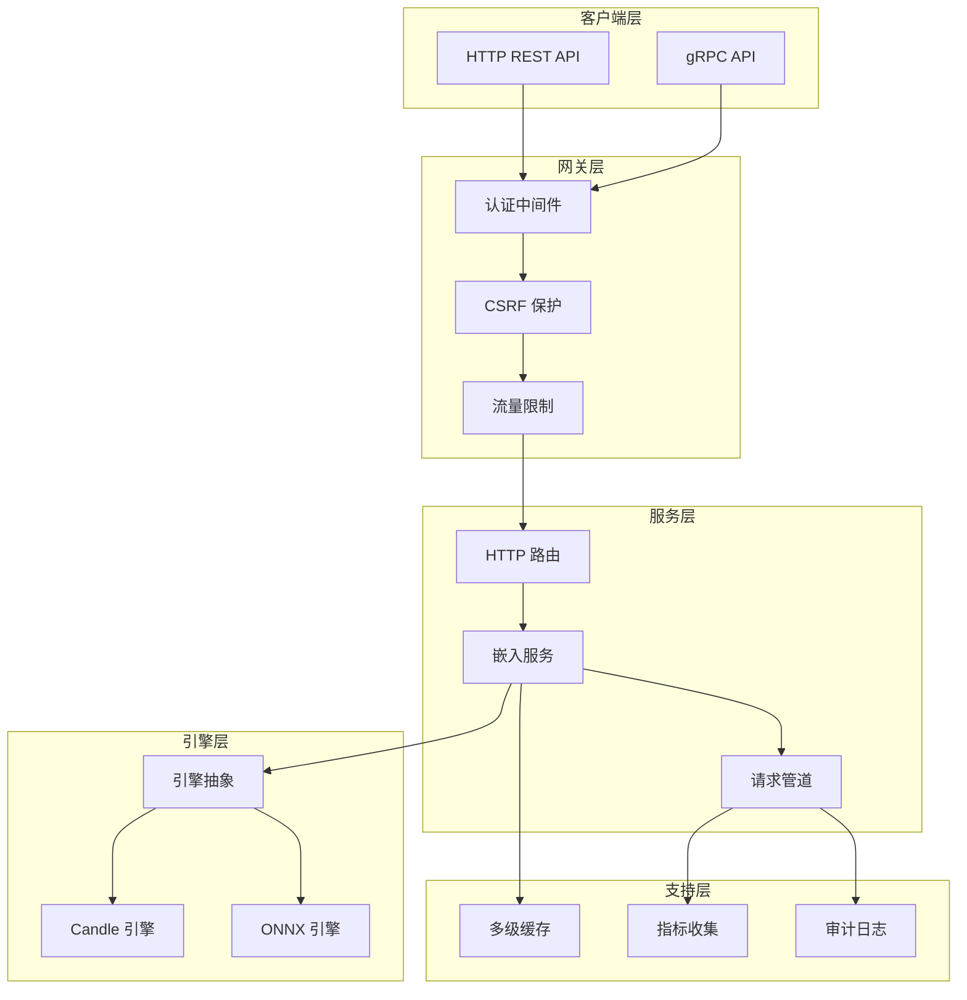
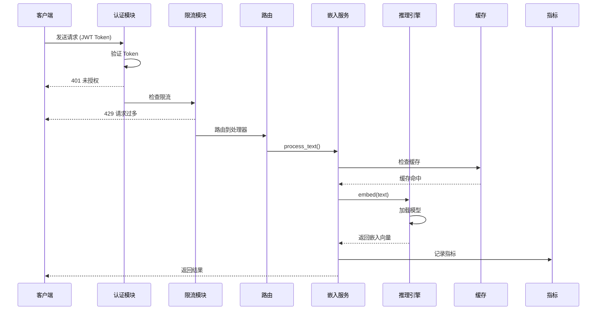
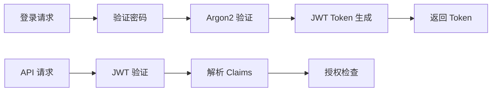
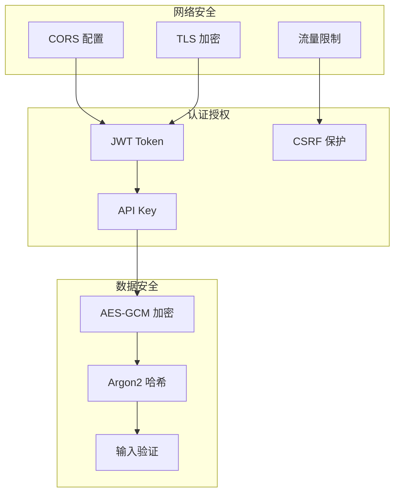

<div align="center">

# 🏗️ VecBoost 架构设计文档

本文档详细介绍 VecBoost 的系统架构、设计决策和核心组件。

</div>

---

## 📋 目录

- [📌 概述](#概述)
- [🎯 核心组件](#核心组件)
- [🔄 数据流](#数据流)
- [🏗️ 模块详解](#模块详解)
- [🔐 安全架构](#安全架构)
- [📊 监控与指标](#监控与指标)
- [⚡ 性能优化](#性能优化)

---

## 📌 概述

### 设计目标

| 目标 | 描述 |
|------|------|
| **高性能** | 低延迟、高吞吐，支持大规模并发请求 |
| **可扩展** | 模块化设计，支持多种推理引擎和硬件加速 |
| **可观测** | 完整的监控、审计、日志体系 |
| **安全可靠** | 多层安全防护，完善的认证授权机制 |

### 技术栈

- **语言**: Rust 2024 Edition
- **Web 框架**: Axum 0.7 + Tokio 1.35
- **gRPC**: Tonic 0.12 + Prost
- **ML 推理**: Candle 0.9.2 (默认), ONNX Runtime 2.0
- **配置**: TOML + config crate
- **监控**: Prometheus + tracing

---

## 🎯 核心组件



---

## 🔄 数据流

### 请求处理流程



---

## 🏗️ 模块详解

### 1. HTTP/gRPC 服务层

#### HTTP 路由 (`src/routes/`)

| 端点 | 方法 | 描述 |
|------|------|------|
| `/embed` | POST | 生成文本嵌入 |
| `/similarity` | POST | 计算相似度 |
| `/search` | POST | 语义搜索 |
| `/health` | GET | 健康检查 |
| `/metrics` | GET | Prometheus 指标 |

#### gRPC 服务 (`src/grpc/`)

```protobuf
service EmbeddingService {
    rpc Embed(EmbedRequest) returns (EmbedResponse);
    rpc EmbedBatch(BatchEmbedRequest) returns (BatchEmbedResponse);
    rpc ComputeSimilarity(SimilarityRequest) returns (SimilarityResponse);
    rpc Search(SearchRequest) returns (SearchResponse);
    rpc HealthCheck(Empty) returns (HealthResponse);
}
```

### 2. 认证模块 (`src/auth/`)

```
auth/
├── jwt.rs           # JWT Token 管理
├── middleware.rs    # Axum 认证中间件
├── handlers.rs      # 登录/注册处理器
├── user_store.rs    # 用户存储
├── csrf.rs          # CSRF 保护
├── types.rs         # 类型定义
└── mod.rs           # 模块导出
```

#### 认证流程



### 3. 推理引擎 (`src/engine/`)

```
engine/
├── mod.rs           # 引擎抽象和 AnyEngine
├── candle_engine.rs # Candle 引擎实现
└── onnx_engine.rs   # ONNX Runtime 引擎
```

#### 引擎抽象

```rust
/// 推理引擎 trait
#[async_trait::async_trait]
pub trait InferenceEngine: Send + Sync {
    fn embed(&self, text: &str) -> Result<Vec<f32>, AppError>;
    fn embed_batch(&self, texts: &[String]) -> Result<Vec<Vec<f32>>, AppError>;
    fn precision(&self) -> &Precision;
    fn supports_mixed_precision(&self) -> bool;
}
```

### 4. 设备管理 (`src/device/`)

```
device/
├── mod.rs              # 设备抽象
├── cuda.rs             # CUDA GPU 管理
├── manager.rs          # 设备选择器
├── batch_scheduler.rs  # 批处理调度
├── memory_optimizer.rs # 内存优化
└── memory_pool/        # 内存池管理
    ├── tensor_pool.rs
    ├── model_pool.rs
    ├── buffer_pool.rs
    └── pool_manager.rs
```

### 5. 缓存模块 (`src/cache/`)

```
cache/
├── mod.rs          # 缓存抽象和类型
├── kv_cache.rs     # KV 缓存实现
├── lru_cache.rs    # LRU 缓存
├── lfu_cache.rs    # LFU 缓存
├── arc_cache.rs    # ARC 自适应缓存
└── tiered_cache.rs # 分层缓存
```

#### 缓存策略

| 类型 | 特点 | 适用场景 |
|------|------|---------|
| LRU | 最近最少使用 | 标准缓存场景 |
| LFU | 最不经常使用 | 访问频率差异大 |
| ARC | 自适应调整 | 未知访问模式 |
| Tiered | 多级组合 | 内存敏感场景 |

### 6. 流量限制 (`src/rate_limit/`)

```
rate_limit/
├── mod.rs          # 模块导出
├── limiter.rs      # 限流器
├── store.rs        # 存储接口
├── token_bucket.rs # 令牌桶实现
└── redis_store.rs  # Redis 分布式存储
```

#### 限流维度

- **全局限流**: 限制整体请求速率
- **IP 限流**: 基于 IP 地址的限流
- **用户限流**: 基于用户 ID 的限流
- **API Key 限流**: 基于 API Key 的限流

### 7. 请求管道 (`src/pipeline/`)

```
pipeline/
├── mod.rs              # 模块导出
├── queue.rs            # 优先级请求队列
├── priority.rs         # 优先级计算
├── scheduler.rs        # 批处理调度器
├── worker.rs           # 工作线程
├── config.rs           # 配置
└── response_channel.rs # 响应通道
```

#### 优先级计算

```rust
pub fn calculate(&self, input: PriorityInput) -> Priority {
    let mut score = input.base_priority.as_i32();
    
    // 基于超时时间提升
    score *= self.calculate_timeout_factor(input.time_until_timeout);
    
    // 基于用户等级调整
    if let Some(tier) = input.user_tier {
        score *= self.user_tier_weights.get(&tier).clamp(1.0, 3.0);
    }
    
    // 基于来源权重
    score *= self.get_source_weight(&input.source).clamp(1.0, 2.0);
    
    score.clamp(0, 150)
}
```

### 8. 监控指标 (`src/metrics/`)

```
metrics/
├── mod.rs              # 模块导出
├── inference.rs        # 推理指标收集器
├── prometheus_exporter.rs # Prometheus 导出器
└── performance/
    └── mod.rs          # 性能测试
```

#### 核心指标

| 指标 | 类型 | 描述 |
|------|------|------|
| `vecboost_requests_total` | Counter | 总请求数 |
| `vecboost_request_duration_seconds` | Histogram | 请求延迟 |
| `vecboost_embedding_duration_seconds` | Histogram | 嵌入生成时间 |
| `vecboost_batch_size` | Histogram | 批处理大小 |
| `vecboost_cache_hits_total` | Counter | 缓存命中数 |
| `vecboost_cache_misses_total` | Counter | 缓存未命中数 |

### 9. 审计日志 (`src/audit/`)

记录所有重要操作的审计日志：

- 用户登录/登出
- API 请求详情
- 权限变更
- 配置修改
- 异常事件

---

## 🔐 安全架构

### 多层安全防护



### 安全配置要求

| 配置项 | 要求 |
|--------|------|
| JWT Secret | 至少 32 个字符 |
| 密码复杂度 | 至少 12 字符，包含大小写、数字、特殊字符 |
| Token 过期 | 建议 1 小时 |
| Rate Limit | 根据实际负载设置 |

---

## 📊 监控与指标

### Prometheus 配置

```yaml
scrape_configs:
  - job_name: 'vecboost'
    scrape_interval: 15s
    metrics_path: /metrics
    static_configs:
      - targets: ['localhost:9090']
```

### Grafana 仪表板

项目包含预配置的 Grafana 仪表板 (`deployments/grafana-dashboard.json`)：

- **Overview**: 系统整体状态
- **Request Metrics**: 请求量和延迟
- **Engine Performance**: 推理引擎性能
- **Resource Usage**: CPU、内存、GPU 使用率

---

## ⚡ 性能优化

### 批处理优化

```rust
pub async fn process_batch(&self, texts: &[String]) -> Vec<Vec<f32>> {
    // 动态批处理：根据延迟和吞吐量自动调整
    let batch_size = self.batch_scheduler.calculate_optimal_size();
    
    // 分批处理
    texts.chunks(batch_size)
        .map(|chunk| self.engine.embed_batch(chunk))
        .collect()
}
```

### 内存优化

- **内存池**: 预分配 Tensor、模型、缓冲区内存
- **零拷贝**: 使用 Arc/RwLock 共享数据
- **自适应缓存**: ARC 缓存自动调整策略

### GPU 优化

- **CUDA 内存管理**: 防止 OOM，预留显存
- **混合精度**: FP16 推理（可选）
- **模型量化**: ONNX Runtime 支持 INT8 量化

---

## 📈 扩展指南

### 添加新推理引擎

1. 实现 `InferenceEngine` trait
2. 添加引擎类型到 `EngineType` 枚举
3. 在 `AnyEngine::new()` 中添加引擎初始化
4. 更新配置文档

### 添加新限流算法

1. 实现 `RateLimitStore` trait
2. 在 `RateLimiter` 中注册新算法
3. 更新配置选项

---

## 📖 相关文档

- [📘 API 参考](API_REFERENCE.md)
- [📝 用户指南](../USER_GUIDE.md)
- [🤝 贡献指南](CONTRIBUTING.md)
- [⚙️ 配置说明](../config.toml)

---

<div align="center">

**文档版本**: 1.0.0  
**最后更新**: 2026-01-08

</div>
