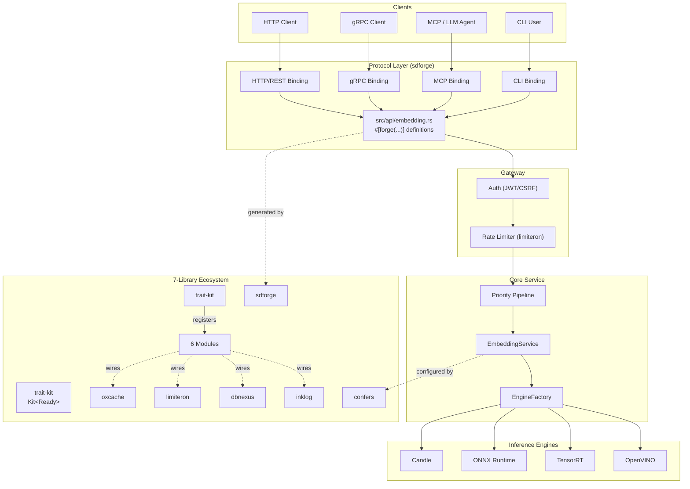
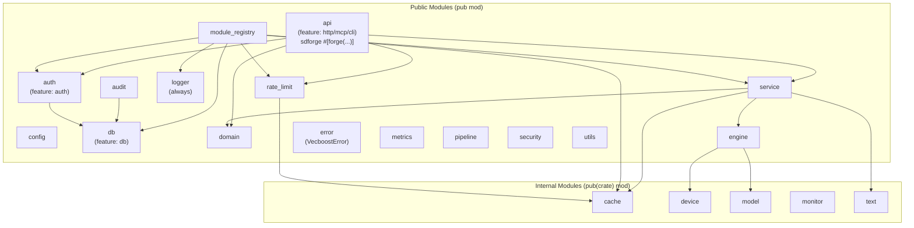
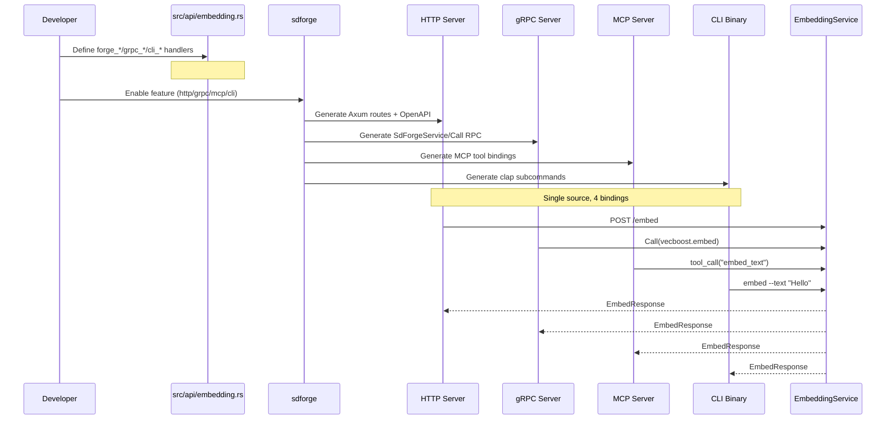
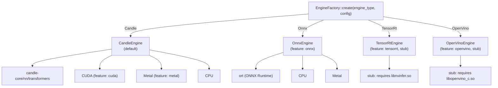
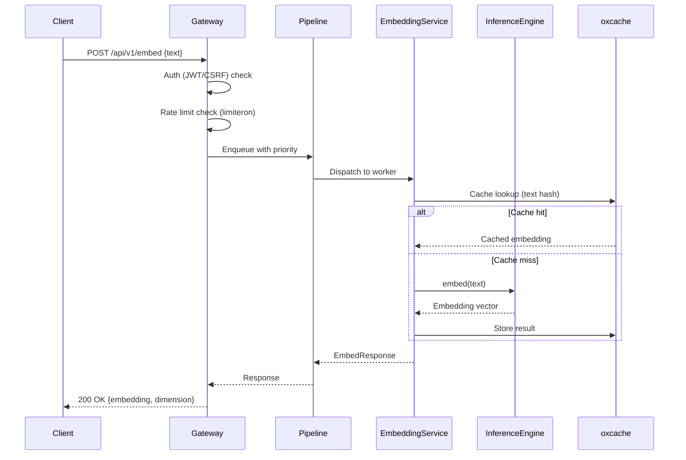
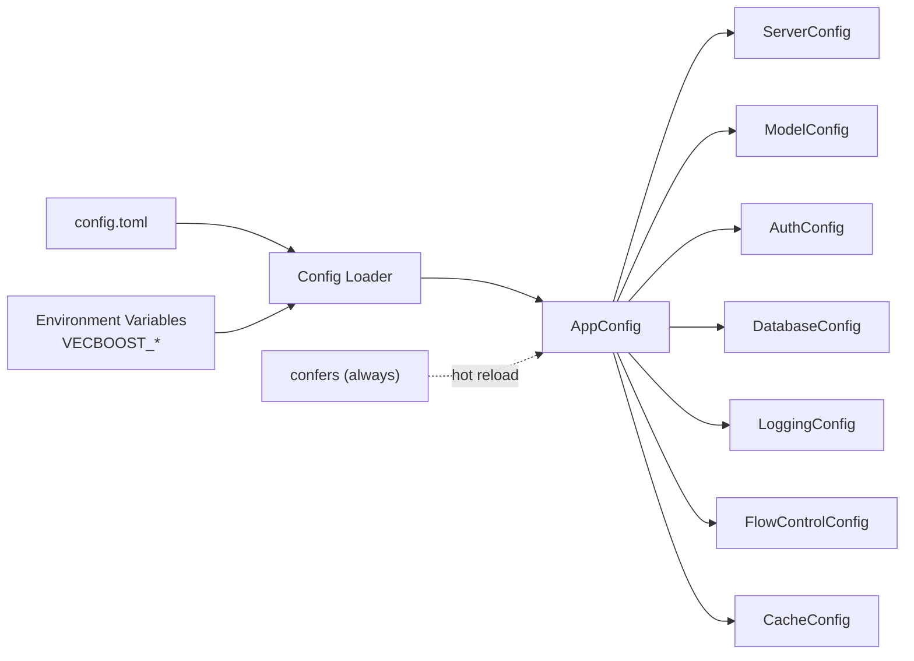

# VecBoost Architecture

> Version 0.2.0 — Ecosystem Refactor with 7-Library Integration

This document describes the VecBoost v0.2.0 architecture, built on a modular 7-library ecosystem unified through `trait-kit`.

## 1. High-Level Architecture

VecBoost is a high-performance Rust vector embedding service. The v0.2.0 architecture decomposes the monolith into 7 independent libraries, registered and wired through the `trait-kit` typestate module registry.


```mermaid
graph TB
    subgraph Clients["Clients"]
        HTTPClient["HTTP Client"]
        gRPCClient["gRPC Client"]
        MCPClient["MCP / LLM Agent"]
        CLIUser["CLI User"]
    end

    subgraph ProtocolLayer["Protocol Layer (sdforge)"]
        API["src/api/embedding.rs<br/>#[forge(...)] definitions"]
        HTTPBinding["HTTP/REST Binding"]
        gRPCBinding["gRPC Binding"]
        MCPBinding["MCP Binding"]
        CLIBinding["CLI Binding"]
    end

    subgraph Gateway["Gateway"]
        Auth["Auth (JWT/CSRF)"]
        RateLim["Rate Limiter (limiteron)"]
    end

    subgraph Core["Core Service"]
        Pipeline["Priority Pipeline"]
        EmbeddingService["EmbeddingService"]
        EngineFactory["EngineFactory"]
    end

    subgraph Engines["Inference Engines"]
        Candle["Candle"]
        ONNX["ONNX Runtime"]
        TensorRT["TensorRT"]
        OpenVINO["OpenVINO"]
    end

    subgraph Ecosystem["7-Library Ecosystem"]
        Kit["trait-kit<br/>Kit&lt;Ready&gt;"]
        trait-kit -->|registers| Modules["6 Modules"]
        oxcache["oxcache"]
        limiteron["limiteron"]
        dbnexus["dbnexus"]
        inklog["inklog"]
        confers["confers"]
        sdforge["sdforge"]
    end

    HTTPClient --> HTTPBinding
    gRPCClient --> gRPCBinding
    MCPClient --> MCPBinding
    CLIUser --> CLIBinding

    HTTPBinding & gRPCBinding & MCPBinding & CLIBinding --> API
    API --> Auth --> RateLim --> Pipeline --> EmbeddingService
    EmbeddingService --> EngineFactory
    EngineFactory --> Candle & ONNX & TensorRT & OpenVINO

    Modules -.->|wires| oxcache & limiteron & dbnexus & inklog
    API -.->|generated by| sdforge
    EmbeddingService -.->|configured by| confers
```

## 2. 7-Library Ecosystem

The ecosystem is composed of 7 Rust libraries. 6 of them (`trait-kit`, `confers`, `inklog`, `oxcache`, `limiteron`, `sdforge`) are always-enabled mandatory dependencies; only `dbnexus` is feature-gated.

| Library | Version | Feature | Role | Module |
|---------|---------|---------|------|--------|
| **trait-kit** | `0.3` | always | Module registry & typestate dependency management | (registry host) |
| **confers** | `0.4` | always | Config loading (TOML + env override + hot reload) | EmbeddingModule |
| **inklog** | `0.1` | always | Structured logging (console + file rotation) | AuditModule |
| **oxcache** | `0.3` | always | Cache backend (LRU/LFU/FIFO + TTL eviction) | CacheModule |
| **limiteron** | `0.2` | always | Token bucket rate limiter (multi-dimension) | RateLimitModule |
| **dbnexus** | `0.4` | `db` | Database persistence (SQLite/PostgreSQL + roles) | DbModule |
| **sdforge** | `0.4` | always | Multi-protocol interface generation (HTTP/gRPC/MCP/CLI) | (API layer) |

### 2.1 trait-kit Module Registry

`trait-kit` provides a typestate-pattern module registry: `Kit<Unbuilt>` accumulates module registrations, then `.build()` transitions to `Kit<Ready>` with all dependencies resolved and cycle detection performed.

```mermaid
graph LR
    New["Kit::new()"] --> UB["Kit&lt;Unbuilt&gt;"]
    UB -->|register::&lt;EmbeddingModule&gt;| UB2["Kit&lt;Unbuilt&gt;"]
    UB2 -->|register::&lt;AuthModule&gt;| UB3["Kit&lt;Unbuilt&gt;"]
    UB3 -->|register::&lt;RateLimitModule&gt;| UB4["Kit&lt;Unbuilt&gt;"]
    UB4 -->|register::&lt;CacheModule&gt;| UB5["Kit&lt;Unbuilt&gt;"]
    UB5 -->|register::&lt;DbModule&gt;| UB6["Kit&lt;Unbuilt&gt;"]
    UB6 -->|register::&lt;AuditModule&gt;| UB7["Kit&lt;Unbuilt&gt;"]
    UB7 -->|build()| Ready["Kit&lt;Ready&gt;"]
    Ready -->|require::&lt;T&gt;| Arc["Arc&lt;T&gt;"]
```

The 6 registered modules:

| Module | Trait Bound | Backing Library | Provides |
|--------|-------------|-----------------|----------|
| `EmbeddingModule` | `ModuleMeta + AutoBuilder` | confers, sdforge | `EmbeddingService` |
| `AuthModule` | `ModuleMeta + AutoBuilder` | jsonwebtoken, argon2 | `JwtManager`, `UserStore` |
| `RateLimitModule` | `ModuleMeta + AutoBuilder` | limiteron | `LimiteronAdapter` |
| `CacheModule` | `ModuleMeta + AutoBuilder` | oxcache | `Cache` backend |
| `DbModule` | `ModuleMeta + AutoBuilder` | dbnexus | `DbPool` |
| `AuditModule` | `ModuleMeta + AutoBuilder` | inklog | `AuditLogger` |

## 3. Module Dependency Graph

The internal `src/` module structure follows a layered dependency discipline. Public modules are the library's API surface; `pub(crate)` modules are internal implementation details.


```mermaid
graph TB
    subgraph Public["Public Modules (pub mod)"]
        api["api<br/>(feature: http/mcp/cli)<br/>sdforge #[forge(...)]"]
        audit["audit"]
        auth["auth<br/>(feature: auth)"]
        config["config"]
        db["db<br/>(feature: db)"]
        domain["domain"]
        engine["engine"]
        error["error<br/>(VecboostError)"]
        logger["logger<br/>(always)"]
        metrics["metrics"]
        module_registry["module_registry"]
        pipeline["pipeline"]
        rate_limit["rate_limit"]
        security["security"]
        service["service"]
        utils["utils"]
    end

    subgraph Internal["Internal Modules (pub(crate) mod)"]
        cache["cache"]
        device["device"]
        model["model"]
        monitor["monitor"]
        text["text"]
    end

    api --> service
    api --> domain
    api --> auth
    api --> rate_limit
    service --> engine
    service --> cache
    service --> text
    service --> domain
    engine --> model
    engine --> device
    module_registry --> service
    module_registry --> auth
    module_registry --> rate_limit
    module_registry --> cache
    module_registry --> db
    module_registry --> logger
    audit --> db
    auth --> db
    rate_limit --> cache
```

### 3.1 Module Visibility Boundary

| Visibility | Modules | Rationale |
|------------|---------|-----------|
| `pub mod` (always) | `audit`, `config`, `domain`, `engine`, `error`, `logger`, `metrics`, `module_registry`, `pipeline`, `rate_limit`, `security`, `service`, `utils` | Used by `main.rs` or as public library API |
| `pub mod` (feature-gated) | `api` (http/mcp/cli — contains sdforge `#[forge(...)]` definitions), `auth` (auth), `db` (db) | Conditionally compiled; only present when feature enabled |
| `pub(crate) mod` | `cache`, `device`, `model`, `monitor`, `text` | Internal implementation; not part of public API |

> **Note**: `error` is exposed as `pub mod error` so integration tests can assert on `VecboostError` variants. The unified error type is `VecboostError` (defined in `src/error.rs`).

## 4. Multi-Protocol Interface Flow

VecBoost v0.2.0 uses `sdforge` to generate all four protocol bindings (HTTP/gRPC/MCP/CLI) from a single API definition source in `src/api/embedding.rs`. Hand-written Axum handlers, tonic gRPC services, clap CLI parsers, and proto files are eliminated — all protocol handlers are annotated with `#[forge(...)]` macros and collected via sdforge inventory.


```mermaid
sequenceDiagram
    participant Dev as Developer
    participant API as src/api/embedding.rs<br/>#[forge(...)]
    participant sdforge as sdforge
    participant HTTP as HTTP Server
    participant gRPC as gRPC Server
    participant MCP as MCP Server
    participant CLI as CLI Binary
    participant Service as EmbeddingService

    Dev->>API: Define forge_*/grpc_*/cli_* handlers
    Note over API: #[forge(path, method, tool_name)]<br/>#[forge(grpc_method)]<br/>#[forge(cli)]

    Dev->>sdforge: Enable feature (http/grpc/mcp/cli)
    sdforge->>HTTP: Generate Axum routes + OpenAPI
    sdforge->>gRPC: Generate SdForgeService/Call RPC
    sdforge->>MCP: Generate MCP tool bindings
    sdforge->>CLI: Generate clap subcommands

    Note over HTTP,CLI: Single source, 4 bindings

    HTTP->>Service: POST /embed
    gRPC->>Service: Call(vecboost.embed)
    MCP->>Service: tool_call("embed_text")
    CLI->>Service: embed --text "Hello"
    Service-->>HTTP: EmbedResponse
    Service-->>gRPC: EmbedResponse
    Service-->>MCP: EmbedResponse
    Service-->>CLI: EmbedResponse
```

### 4.1 Protocol Activation Matrix

| Protocol | Feature Flag | Default | v0.2.0 Status | Entry Point | Use Case |
|----------|-------------|---------|---------------|-------------|----------|
| HTTP/REST | `http` | ✅ | ✅ Implemented (sdforge `#[forge]`) | `src/api/embedding.rs` `forge_*` | Web/API integration, OpenAPI docs |
| gRPC | `grpc` | - | ✅ Implemented (sdforge `#[forge(grpc_method)]` + `build_server_with_config`) | `src/api/embedding.rs` `grpc_*` | High-performance binary RPC |
| MCP | `mcp` | - | ✅ Implemented (sdforge `#[forge(tool_name)]` → `sdforge::mcp`, stdio) | `src/api/embedding.rs` `forge_*` (reused) | LLM tool integration (AI Agents) |
| CLI | `cli` | - | ✅ Implemented (sdforge `#[forge(cli)]`) | `src/api/embedding.rs` `cli_*` | Command-line usage, scripting |

### 4.2 API Definition Pattern

API functions are defined once in `src/api/embedding.rs` using `#[forge(...)]` macros. sdforge reads these definitions and generates protocol-specific bindings at compile time based on enabled features:

```rust
// src/api/embedding.rs — single source of truth for all 4 protocols

// HTTP + MCP (tool_name reused)
#[cfg(feature = "http")]
#[forge(
    name = "embed", version = "v1",
    path = "/embed", method = "POST",
    tool_name = "embed_text",
    description = "Generate embedding vector for input text"
)]
pub async fn forge_embed(req: EmbedRequest) -> Result<EmbedResponse, ApiError> {
    embed_handler(req).await
}

// gRPC — registered as vecboost.embed on SdForgeService/Call RPC
#[cfg(feature = "grpc")]
#[forge(
    name = "vecboost_embed", version = "v1",
    grpc_method = "vecboost.embed",
    description = "Generate embedding vector for input text"
)]
pub async fn grpc_embed(req: EmbedRequest) -> Result<EmbedResponse, ApiError> {
    embed_handler(req).await
}

// CLI
#[cfg(feature = "cli")]
#[forge(
    name = "embed", version = "v1",
    cli = true,
    description = "Generate embedding vector for input text"
)]
pub async fn cli_embed(req: EmbedRequest) -> Result<EmbedResponse, ApiError> {
    embed_handler(req).await
}
```

**Key design**: Protocol-specific `forge_*` / `grpc_*` / `cli_*` functions are thin wrappers annotated with `#[forge(...)]`; the actual business logic lives in protocol-agnostic `*_handler` functions (e.g., `embed_handler`, `embed_batch_handler`). This eliminates duplicated state-fetch / validation / dispatch code across protocols.

**gRPC startup**: gRPC server is started via `sdforge::grpc::build_server_with_config(&addr, config)`, using the unified `SdForgeService/Call` RPC protocol. Requests/responses pass JSON-serialized domain types via `CallRequest.data` / `CallResponse.data`.

### 4.3 gRPC Methods

9 gRPC methods are registered via `#[forge(grpc_method = "...")]` and exposed through `SdForgeService/Call`:

| gRPC Method | Handler | Description |
|-------------|---------|-------------|
| `vecboost.embed` | `grpc_embed` | Single-text embedding |
| `vecboost.embed_batch` | `grpc_embed_batch` | Batch embedding |
| `vecboost.compute_similarity` | `grpc_compute_similarity` | Cosine similarity |
| `vecboost.embed_file` | `grpc_embed_file` | Embed text from file |
| `vecboost.model_switch` | `grpc_model_switch` | Switch loaded model |
| `vecboost.get_current_model` | `grpc_get_current_model` | Get current model info |
| `vecboost.get_model_info` | `grpc_get_model_info` | Get model metadata |
| `vecboost.list_models` | `grpc_list_models` | List available models |
| `vecboost.health_check` | `grpc_health_check` | Service health check |

## 5. Engine Abstraction

The `InferenceEngine` trait abstracts over multiple ML backends. `EngineFactory::create()` dispatches to the correct implementation based on `EngineType`.


```mermaid
graph TB
    Factory["EngineFactory::create(engine_type, config)"]
    Factory -->|Candle| CandleEngine["CandleEngine<br/>(default)"]
    Factory -->|Onnx| OnnxEngine["OnnxEngine<br/>(feature: onnx)"]
    Factory -->|TensorRt| TensorRtEngine["TensorRtEngine<br/>(feature: tensorrt, stub)"]
    Factory -->|OpenVino| OpenVinoEngine["OpenVinoEngine<br/>(feature: openvino, stub)"]

    CandleEngine --> CandleLib["candle-core/nn/transformers"]
    OnnxEngine --> OnnxLib["ort (ONNX Runtime)"]
    TensorRtEngine --> TensorRtNote["stub: requires libnvinfer.so"]
    OpenVinoEngine --> OpenVinoNote["stub: requires libopenvino_c.so"]

    CandleEngine --> DeviceCuda["CUDA (feature: cuda)"]
    CandleEngine --> DeviceMetal["Metal (feature: metal)"]
    CandleEngine --> DeviceCPU["CPU"]
    OnnxEngine --> DeviceCPU2["CPU"]
    OnnxEngine --> DeviceMetal2["Metal"]
```

### 5.1 Engine Status

| Engine | Feature | Status | Notes |
|--------|---------|--------|-------|
| Candle | default | ✅ Production | Native Rust, supports CUDA/Metal |
| ONNX Runtime | `onnx` | ✅ Production | Cross-platform via `ort` crate |
| TensorRT | `tensorrt` | 🔧 Stub | Returns runtime error; requires `libnvinfer.so` |
| OpenVINO | `openvino` | 🔧 Stub | Returns runtime error; requires `libopenvino_c.so` |

### 5.2 Candle Model Architecture

`CandleEngine` (`src/engine/candle_engine.rs`) distinguishes two supported model architectures via the `ModelArchitecture` enum, auto-detected at runtime from the `model_type` field in `config.json`:

```rust
pub enum ModelArchitecture {
    Bert,         // BERT family (e.g., BAAI/bge-*)
    XlmRoberta,   // XLM-RoBERTa family (multilingual models)
}
```

| Architecture | Backing Implementation | Param Scale | Typical Models |
|--------------|------------------------|-------------|----------------|
| **Bert** | `candle_transformers::models::bert::BertModel` | ~110M | BAAI/bge-small, bert-base-uncased |
| **XlmRoberta** | `candle_transformers::models::xlm_roberta::XLMRobertaModel` | ~270M | BAAI/bge-m3, xlm-roberta-base |

### 5.3 Matryoshka Embedding Truncation

When the model is configured with `matryoshka_dimensions` (e.g., BAAI/bge-m3 supports 1024/768/512/256/128/64 truncation), `EmbeddingService` truncates the embedding in `process_text` and `process_batch`, then **re-invokes `normalize_l2` after truncation** to ensure the truncated vector remains a unit vector:

```rust
// src/service/embedding.rs — Matryoshka truncation + re-normalization
if let Some(target_dim) = matryoshka_target {
    embedding = truncate_vector(&embedding, target_dim);
    normalize_l2(&mut embedding);  // ⚠️ must re-normalize after truncation
}
```

> 🔒 **Correctness fix**: v0.2.0 fixes a bug where truncation was not followed by re-normalization, leaving the vector norm < 1 and breaking cosine similarity accuracy.

> ⚠️ **Note**: The `CandleEngine.tensor_pool` field was removed in v0.2.0 (the original tensor pool had a mask-all-zero bug); tensor buffers are now managed internally by Candle. The device-level GPU memory pool (`src/device/memory_pool.rs`) is retained.

## 6. Request Lifecycle

A typical embedding request flows through the following stages:


```mermaid
sequenceDiagram
    participant C as Client
    participant G as Gateway
    participant P as Pipeline
    participant S as EmbeddingService
    participant E as InferenceEngine
    participant Cache as oxcache

    C->>G: POST /api/v1/embed {text}
    G->>G: Auth (JWT/CSRF) check
    G->>G: Rate limit check (limiteron)
    G->>P: Enqueue with priority
    P->>S: Dispatch to worker
    S->>Cache: Cache lookup (text hash)
    alt Cache hit
        Cache-->>S: Cached embedding
    else Cache miss
        S->>E: embed(text)
        E-->>S: Embedding vector
        S->>Cache: Store result
    end
    S-->>P: EmbedResponse
    P-->>G: Response
    G-->>C: 200 OK {embedding, dimension}
```

## 7. Configuration Architecture

Configuration is layered: base TOML files + environment variable overrides + optional hot reload via `confers`.


```mermaid
graph LR
    TOML["config.toml"] --> Loader["Config Loader"]
    Env["Environment Variables<br/>VECBOOST_*"] --> Loader
    Loader --> AppConfig["AppConfig"]
    confers["confers (always)"] -.->|hot reload| AppConfig

    AppConfig --> Server["ServerConfig"]
    AppConfig --> Model["ModelConfig"]
    AppConfig --> Auth["AuthConfig"]
    AppConfig --> Database["DatabaseConfig"]
    AppConfig --> Logging["LoggingConfig"]
    AppConfig --> FlowControl["FlowControlConfig"]
    AppConfig --> Cache["CacheConfig"]
```

### 7.1 Configuration Sections

| Section | Library | Feature | Purpose |
|---------|---------|---------|---------|
| `[server]` | - | - | HTTP bind address, port, timeout, gRPC config (max_connections, timeout, require_auth, allowed_roots) |
| `[model]` | - | - | HuggingFace model repo, GPU, batch size |
| `[embedding]` | - | - | Aggregation, similarity metric, cache |
| `[auth]` | - | `auth` | JWT, CSRF, admin credentials |
| `[database]` | dbnexus | `db` | Connection URL, pool size |
| `[logging]` | inklog | always | Log level, console/file output |
| `[flow_control]` | limiteron | always | Token bucket, circuit breaker |
| `[cache]` | oxcache | always | Backend, TTL, eviction policy |
| `[rate_limit]` | limiteron | always | Per-dimension rate limits |
| `[audit]` | - | - | Audit log file, rotation |

### 7.2 gRPC Server Configuration

The gRPC server is started by sdforge via `build_server_with_config`. The following options are defined on `ServerConfig` (`src/config/app.rs`):

| Key | Type | Default | Description |
|-----|------|---------|-------------|
| `grpc_max_connections` | `Option<usize>` | `1000` | Max concurrent gRPC connections |
| `grpc_timeout_seconds` | `Option<u64>` | `30` | gRPC request timeout (seconds) |
| `grpc_require_auth` | `Option<bool>` | `true` | Require gRPC auth (must be explicitly disabled) |
| `grpc_allowed_roots` | `Option<Vec<String>>` | `None` | Whitelist of root directories for gRPC file operations |

> 🔒 **Secure defaults**: `grpc_require_auth` defaults to `true`; callers must explicitly set `grpc_require_auth = false` in `config.toml` to disable auth. When `grpc_allowed_roots` is `None`, it falls back to the current working directory but rejects sensitive paths (`/`, `/etc`, `/root`) to prevent full filesystem exposure.

## 8. Test Architecture

The `tests/` directory is organized into three subdirectories with shared fixtures:

```
tests/
├── integration.rs       # Entry point: cargo test --test integration
├── perf.rs              # Entry point: cargo test --test perf
├── common/
│   └── mod.rs           # Shared fixtures: MockEngine, create_test_engine()
├── integration/
│   ├── api_test.rs      # API integration tests (merged)
│   └── real_engine.rs   # RealTestEngine + TestMode (mock/light/full)
└── perf/
    ├── performance_test.rs  # Rust performance benchmarks
    ├── conftest.py          # pytest fixtures
    ├── test_api.py          # Python API tests
    └── ...                  # Python perf tooling
```

> **⚠️ v0.2.0 已知偏离(D8)**: `tests/integration.rs` 与 `tests/integration/` 子目录并存,`tests/perf.rs` 与 `tests/perf/` 子目录并存,会导致 Rust 模块系统警告。同时 `tests/integration/mod.rs`、`tests/integration/grpc_test.rs`、`tests/common/fixtures.rs` 缺失。修复方式(删除顶层 .rs 文件或删除对应目录)推迟到 v0.3.0。详见 `specmark/changes/vecboost-v0.2.0-ecosystem-refactor/design.md` D8 偏离记录。

### 8.1 Test Modes

The `TEST_MODE` environment variable controls test engine behavior:

| Mode | Behavior |
|------|----------|
| `mock` (default) | Uses `MockEngine` (FNV-1a hash + LCG) — deterministic, no model required |
| `light` | Attempts real inference, falls back to mock on failure |
| `full` | Forces real inference engine (requires model download) |

> **Note**: Tests asserting semantic similarity (e.g., similar texts > different texts) are marked `#[ignore]` because the mock engine generates semantically random vectors. Run them with `cargo test --test integration -- --ignored` under `TEST_MODE=light` or `full`.
