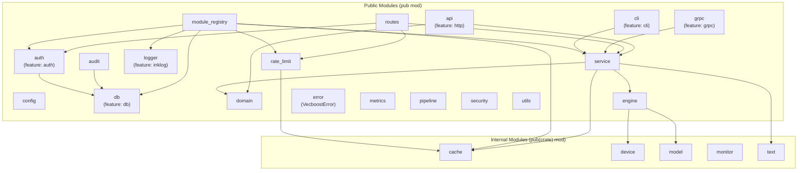
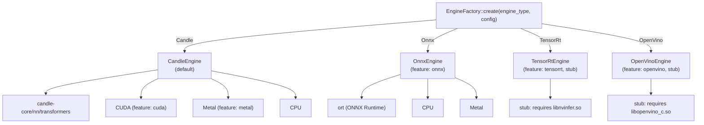
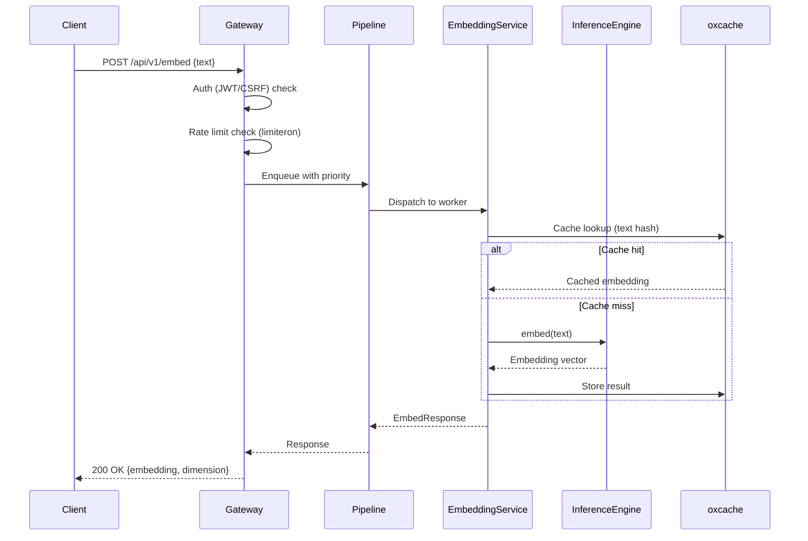
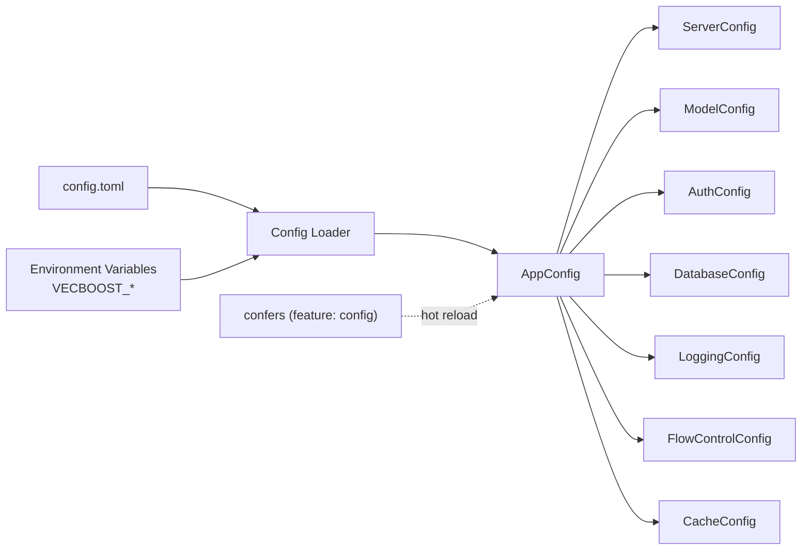

# VecBoost Architecture

> Version 0.2.0 — Ecosystem Refactor with 7-Library Integration

This document describes the VecBoost v0.2.0 architecture, built on a modular 7-library ecosystem unified through `trait-kit`.

## 1. High-Level Architecture

VecBoost is a high-performance Rust vector embedding service. The v0.2.0 architecture decomposes the monolith into 7 independent libraries, registered and wired through the `trait-kit` typestate module registry.


```mermaid
graph TB
    subgraph Clients["Clients"]
        HTTPClient["HTTP Client"]
        gRPCClient["gRPC Client"]
        MCPClient["MCP / LLM Agent"]
        CLIUser["CLI User"]
    end

    subgraph ProtocolLayer["Protocol Layer (sdforge)"]
        API["src/api/<br/>#[service_api] definitions"]
        HTTPBinding["HTTP/REST Binding"]
        gRPCBinding["gRPC Binding"]
        MCPBinding["MCP Binding"]
        CLIBinding["CLI Binding"]
    end

    subgraph Gateway["Gateway"]
        Auth["Auth (JWT/CSRF)"]
        RateLim["Rate Limiter (limiteron)"]
    end

    subgraph Core["Core Service"]
        Pipeline["Priority Pipeline"]
        EmbeddingService["EmbeddingService"]
        EngineFactory["EngineFactory"]
    end

    subgraph Engines["Inference Engines"]
        Candle["Candle"]
        ONNX["ONNX Runtime"]
        TensorRT["TensorRT"]
        OpenVINO["OpenVINO"]
    end

    subgraph Ecosystem["7-Library Ecosystem"]
        Kit["trait-kit<br/>Kit&lt;Ready&gt;"]
        trait-kit -->|registers| Modules["6 Modules"]
        oxcache["oxcache"]
        limiteron["limiteron"]
        dbnexus["dbnexus"]
        inklog["inklog"]
        confers["confers"]
        sdforge["sdforge"]
    end

    HTTPClient --> HTTPBinding
    gRPCClient --> gRPCBinding
    MCPClient --> MCPBinding
    CLIUser --> CLIBinding

    HTTPBinding & gRPCBinding & MCPBinding & CLIBinding --> API
    API --> Auth --> RateLim --> Pipeline --> EmbeddingService
    EmbeddingService --> EngineFactory
    EngineFactory --> Candle & ONNX & TensorRT & OpenVINO

    Modules -.->|wires| oxcache & limiteron & dbnexus & inklog
    API -.->|generated by| sdforge
    EmbeddingService -.->|configured by| confers
```

## 2. 7-Library Ecosystem

The ecosystem is composed of 7 Rust libraries. `trait-kit` is the always-enabled core; the rest are optional, feature-gated dependencies.

| Library | Version | Feature | Role | Module |
|---------|---------|---------|------|--------|
| **trait-kit** | `0.3` | always | Module registry & typestate dependency management | (registry host) |
| **confers** | `0.4` | `config` | Config loading (TOML + env override + hot reload) | EmbeddingModule |
| **inklog** | `0.1` | `inklog` | Structured logging (console + file rotation) | AuditModule |
| **oxcache** | `0.3` | `oxcache` | Cache backend (LRU/LFU/FIFO + TTL eviction) | CacheModule |
| **limiteron** | `0.2` | `limiteron` | Token bucket rate limiter (multi-dimension) | RateLimitModule |
| **dbnexus** | `0.4` | `db` | Database persistence (SQLite/PostgreSQL + roles) | DbModule |
| **sdforge** | `0.4` | `http`/`cli` | Multi-protocol interface generation | (API layer) |

### 2.1 trait-kit Module Registry

`trait-kit` provides a typestate-pattern module registry: `Kit<Unbuilt>` accumulates module registrations, then `.build()` transitions to `Kit<Ready>` with all dependencies resolved and cycle detection performed.

```mermaid
graph LR
    New["Kit::new()"] --> UB["Kit&lt;Unbuilt&gt;"]
    UB -->|register::&lt;EmbeddingModule&gt;| UB2["Kit&lt;Unbuilt&gt;"]
    UB2 -->|register::&lt;AuthModule&gt;| UB3["Kit&lt;Unbuilt&gt;"]
    UB3 -->|register::&lt;RateLimitModule&gt;| UB4["Kit&lt;Unbuilt&gt;"]
    UB4 -->|register::&lt;CacheModule&gt;| UB5["Kit&lt;Unbuilt&gt;"]
    UB5 -->|register::&lt;DbModule&gt;| UB6["Kit&lt;Unbuilt&gt;"]
    UB6 -->|register::&lt;AuditModule&gt;| UB7["Kit&lt;Unbuilt&gt;"]
    UB7 -->|build()| Ready["Kit&lt;Ready&gt;"]
    Ready -->|require::&lt;T&gt;| Arc["Arc&lt;T&gt;"]
```

The 6 registered modules:

| Module | Trait Bound | Backing Library | Provides |
|--------|-------------|-----------------|----------|
| `EmbeddingModule` | `ModuleMeta + AutoBuilder` | confers, sdforge | `EmbeddingService` |
| `AuthModule` | `ModuleMeta + AutoBuilder` | jsonwebtoken, argon2 | `JwtManager`, `UserStore` |
| `RateLimitModule` | `ModuleMeta + AutoBuilder` | limiteron | `LimiteronAdapter` |
| `CacheModule` | `ModuleMeta + AutoBuilder` | oxcache | `Cache` backend |
| `DbModule` | `ModuleMeta + AutoBuilder` | dbnexus | `DbPool` |
| `AuditModule` | `ModuleMeta + AutoBuilder` | inklog | `AuditLogger` |

## 3. Module Dependency Graph

The internal `src/` module structure follows a layered dependency discipline. Public modules are the library's API surface; `pub(crate)` modules are internal implementation details.


```mermaid
graph TB
    subgraph Public["Public Modules (pub mod)"]
        api["api<br/>(feature: http)"]
        audit["audit"]
        auth["auth<br/>(feature: auth)"]
        cli["cli<br/>(feature: cli)"]
        config["config"]
        db["db<br/>(feature: db)"]
        domain["domain"]
        engine["engine"]
        error["error<br/>(VecboostError)"]
        grpc["grpc<br/>(feature: grpc)"]
        logger["logger<br/>(feature: inklog)"]
        metrics["metrics"]
        module_registry["module_registry"]
        pipeline["pipeline"]
        rate_limit["rate_limit"]
        routes["routes"]
        security["security"]
        service["service"]
        utils["utils"]
    end

    subgraph Internal["Internal Modules (pub(crate) mod)"]
        cache["cache"]
        device["device"]
        model["model"]
        monitor["monitor"]
        text["text"]
    end

    api --> service
    api --> domain
    routes --> service
    routes --> auth
    routes --> rate_limit
    grpc --> service
    cli --> service
    service --> engine
    service --> cache
    service --> text
    service --> domain
    engine --> model
    engine --> device
    module_registry --> service
    module_registry --> auth
    module_registry --> rate_limit
    module_registry --> cache
    module_registry --> db
    module_registry --> logger
    audit --> db
    auth --> db
    rate_limit --> cache
```

### 3.1 Module Visibility Boundary

| Visibility | Modules | Rationale |
|------------|---------|-----------|
| `pub mod` (always) | `audit`, `config`, `domain`, `engine`, `error`, `metrics`, `module_registry`, `pipeline`, `rate_limit`, `routes`, `security`, `service`, `utils` | Used by `main.rs` or as public library API |
| `pub mod` (feature-gated) | `api` (http), `auth` (auth), `cli` (cli), `db` (db), `grpc` (grpc), `logger` (inklog) | Conditionally compiled; only present when feature enabled |
| `pub(crate) mod` | `cache`, `device`, `model`, `monitor`, `text` | Internal implementation; not part of public API |

> **Note**: `error` is exposed as `pub mod error` so integration tests can assert on `VecboostError` variants. The unified error type is `VecboostError` (defined in `src/error.rs`).

## 4. Multi-Protocol Interface Flow

VecBoost v0.2.0 uses `sdforge` to generate multiple protocol bindings from a single API definition source. This eliminates duplicated interface code across HTTP, MCP, and CLI.

> **⚠️ v0.2.0 实际实施状态(Converge 阶段偏离)**:
> - `sdforge` 宏注解(`#[forge]`)**未在 HTTP/CLI 生成中使用**——HTTP 路由由 `src/routes/embedding.rs` 手写 Axum handler,CLI 由 `src/cli/mod.rs` 手写 clap `#[derive(Parser)]`
> - **但 MCP 协议已用 sdforge 宏生成**:`src/api/mod.rs` 的 3 个 `#[forge(tool_name=...)]` 函数(embed/embed_batch/compute_similarity)在 `mcp` feature 下经 `sdforge::mcp::build()` 收集为 MCP 工具并走 stdio;工具逻辑复用 `src/api/mod.rs` 的 `forge_*` 函数,通过全局 `SERVICE` 单例访问 `EmbeddingService`
> - `mcp` feature 透传 `sdforge/mcp`,后者依赖 `rmcp ~2.1`(本 crate 声明同版本 `rmcp = { version = "2.1", optional = true }` 以复用 sdforge 内部的 rmcp,避免版本冲突);HTTP/CLI 的 sdforge 宏生成机制仍推迟到 **v0.3.0**
> - 详见 `specmark/changes/vecboost-v0.2.0-ecosystem-refactor/design.md` D5 决策 + "实施偏离记录"

```mermaid
sequenceDiagram
    participant Dev as Developer
    participant API as src/api/<br/>#[service_api]
    participant sdforge as sdforge
    participant HTTP as HTTP Server
    participant MCP as MCP Server
    participant CLI as CLI Binary
    participant Service as EmbeddingService

    Dev->>API: Define embed/embed_batch/compute_similarity
    Note over API: #[service_api] macro<br/>annotates function signatures

    Dev->>sdforge: Enable feature (http/cli)
    sdforge->>HTTP: Generate Axum routes + OpenAPI
    sdforge->>MCP: Generate MCP tool bindings
    sdforge->>CLI: Generate clap subcommands

    Note over HTTP,MCP,CLI: Single source, 3 bindings

    HTTP->>Service: POST /api/v1/embed
    MCP->>Service: tool_call("embed")
    CLI->>Service: embed --text "Hello"
    Service-->>HTTP: EmbedResponse
    Service-->>MCP: EmbedResponse
    Service-->>CLI: EmbedResponse
```

### 4.1 Protocol Activation Matrix

| Protocol | Feature Flag | Default | v0.2.0 Status | Entry Point | Use Case |
|----------|-------------|---------|---------------|-------------|----------|
| HTTP/REST | `http` | ✅ | ✅ Implemented (hand-written Axum) | `src/routes/` + Axum | Web/API integration, OpenAPI docs |
| gRPC | `grpc` | - | ✅ Implemented (tonic) | `src/grpc/` + tonic | High-performance binary RPC |
| MCP | `mcp` | - | ✅ Implemented (sdforge `#[forge]` → `sdforge::mcp`, stdio) | `src/api/mod.rs` `#[forge(tool_name=...)]` | LLM tool integration (AI Agents) |
| CLI | `cli` | - | ✅ Implemented (hand-written clap) | `src/cli/` + clap | Command-line usage, scripting |

### 4.2 API Definition Pattern

API functions are defined once in `src/api/` using the `#[service_api]` macro. sdforge reads these definitions and generates protocol-specific bindings at compile time based on enabled features:

```rust
// src/api/mod.rs — single source of truth (target design, v0.3.0)
#[service_api]
pub async fn embed(text: String) -> Result<EmbedResponse, VecboostError> {
    // shared implementation
}

#[service_api]
pub async fn embed_batch(texts: Vec<String>) -> Result<BatchEmbedResponse, VecboostError> { ... }

#[service_api]
pub async fn compute_similarity(source: String, target: String) -> Result<SimilarityResponse, VecboostError> { ... }
```

> **⚠️ v0.2.0 实际实施状态**: `#[service_api]` 宏注解 **未在 HTTP/CLI 中使用**;`src/api/mod.rs` 的 3 个 `#[forge]` 函数(embed/embed_batch/compute_similarity)为普通 `async fn`,签名接收 `service: &EmbeddingService`。HTTP 路由由 `src/routes/embedding.rs` 手写,CLI 由 `src/cli/mod.rs` 手写 clap。但 **MCP 协议已用 sdforge `#[forge]` 宏生成**(`src/api/mod.rs` 在 `mcp` feature 下经 `sdforge::mcp::build()` 收集工具),不再走独立手写 `rmcp`。完整 HTTP/CLI 的 sdforge 宏生成机制推迟到 v0.3.0。

## 5. Engine Abstraction

The `InferenceEngine` trait abstracts over multiple ML backends. `EngineFactory::create()` dispatches to the correct implementation based on `EngineType`.


```mermaid
graph TB
    Factory["EngineFactory::create(engine_type, config)"]
    Factory -->|Candle| CandleEngine["CandleEngine<br/>(default)"]
    Factory -->|Onnx| OnnxEngine["OnnxEngine<br/>(feature: onnx)"]
    Factory -->|TensorRt| TensorRtEngine["TensorRtEngine<br/>(feature: tensorrt, stub)"]
    Factory -->|OpenVino| OpenVinoEngine["OpenVinoEngine<br/>(feature: openvino, stub)"]

    CandleEngine --> CandleLib["candle-core/nn/transformers"]
    OnnxEngine --> OnnxLib["ort (ONNX Runtime)"]
    TensorRtEngine --> TensorRtNote["stub: requires libnvinfer.so"]
    OpenVinoEngine --> OpenVinoNote["stub: requires libopenvino_c.so"]

    CandleEngine --> DeviceCuda["CUDA (feature: cuda)"]
    CandleEngine --> DeviceMetal["Metal (feature: metal)"]
    CandleEngine --> DeviceCPU["CPU"]
    OnnxEngine --> DeviceCPU2["CPU"]
    OnnxEngine --> DeviceMetal2["Metal"]
```

### 5.1 Engine Status

| Engine | Feature | Status | Notes |
|--------|---------|--------|-------|
| Candle | default | ✅ Production | Native Rust, supports CUDA/Metal |
| ONNX Runtime | `onnx` | ✅ Production | Cross-platform via `ort` crate |
| TensorRT | `tensorrt` | 🔧 Stub | Returns runtime error; requires `libnvinfer.so` |
| OpenVINO | `openvino` | 🔧 Stub | Returns runtime error; requires `libopenvino_c.so` |

## 6. Request Lifecycle

A typical embedding request flows through the following stages:


```mermaid
sequenceDiagram
    participant C as Client
    participant G as Gateway
    participant P as Pipeline
    participant S as EmbeddingService
    participant E as InferenceEngine
    participant Cache as oxcache

    C->>G: POST /api/v1/embed {text}
    G->>G: Auth (JWT/CSRF) check
    G->>G: Rate limit check (limiteron)
    G->>P: Enqueue with priority
    P->>S: Dispatch to worker
    S->>Cache: Cache lookup (text hash)
    alt Cache hit
        Cache-->>S: Cached embedding
    else Cache miss
        S->>E: embed(text)
        E-->>S: Embedding vector
        S->>Cache: Store result
    end
    S-->>P: EmbedResponse
    P-->>G: Response
    G-->>C: 200 OK {embedding, dimension}
```

## 7. Configuration Architecture

Configuration is layered: base TOML files + environment variable overrides + optional hot reload via `confers`.


```mermaid
graph LR
    TOML["config.toml"] --> Loader["Config Loader"]
    Env["Environment Variables<br/>VECBOOST_*"] --> Loader
    Loader --> AppConfig["AppConfig"]
    confers["confers (feature: config)"] -.->|hot reload| AppConfig

    AppConfig --> Server["ServerConfig"]
    AppConfig --> Model["ModelConfig"]
    AppConfig --> Auth["AuthConfig"]
    AppConfig --> Database["DatabaseConfig"]
    AppConfig --> Logging["LoggingConfig"]
    AppConfig --> FlowControl["FlowControlConfig"]
    AppConfig --> Cache["CacheConfig"]
```

### 7.1 Configuration Sections

| Section | Library | Feature | Purpose |
|---------|---------|---------|---------|
| `[server]` | - | - | HTTP bind address, port, timeout |
| `[model]` | - | - | HuggingFace model repo, GPU, batch size |
| `[embedding]` | - | - | Aggregation, similarity metric, cache |
| `[auth]` | - | `auth` | JWT, CSRF, admin credentials |
| `[database]` | dbnexus | `db` | Connection URL, pool size |
| `[logging]` | inklog | `inklog` | Log level, console/file output |
| `[flow_control]` | limiteron | `limiteron` | Token bucket, circuit breaker |
| `[cache]` | oxcache | `oxcache` | Backend, TTL, eviction policy |
| `[rate_limit]` | limiteron | `limiteron` | Per-dimension rate limits |
| `[audit]` | - | - | Audit log file, rotation |

## 8. Test Architecture

The `tests/` directory is organized into three subdirectories with shared fixtures:

```
tests/
├── integration.rs       # Entry point: cargo test --test integration
├── perf.rs              # Entry point: cargo test --test perf
├── common/
│   └── mod.rs           # Shared fixtures: MockEngine, create_test_engine()
├── integration/
│   ├── api_test.rs      # API integration tests (merged)
│   └── real_engine.rs   # RealTestEngine + TestMode (mock/light/full)
└── perf/
    ├── performance_test.rs  # Rust performance benchmarks
    ├── conftest.py          # pytest fixtures
    ├── test_api.py          # Python API tests
    └── ...                  # Python perf tooling
```

> **⚠️ v0.2.0 已知偏离(D8)**: `tests/integration.rs` 与 `tests/integration/` 子目录并存,`tests/perf.rs` 与 `tests/perf/` 子目录并存,会导致 Rust 模块系统警告。同时 `tests/integration/mod.rs`、`tests/integration/grpc_test.rs`、`tests/common/fixtures.rs` 缺失。修复方式(删除顶层 .rs 文件或删除对应目录)推迟到 v0.3.0。详见 `specmark/changes/vecboost-v0.2.0-ecosystem-refactor/design.md` D8 偏离记录。

### 8.1 Test Modes

The `TEST_MODE` environment variable controls test engine behavior:

| Mode | Behavior |
|------|----------|
| `mock` (default) | Uses `MockEngine` (FNV-1a hash + LCG) — deterministic, no model required |
| `light` | Attempts real inference, falls back to mock on failure |
| `full` | Forces real inference engine (requires model download) |

> **Note**: Tests asserting semantic similarity (e.g., similar texts > different texts) are marked `#[ignore]` because the mock engine generates semantically random vectors. Run them with `cargo test --test integration -- --ignored` under `TEST_MODE=light` or `full`.
