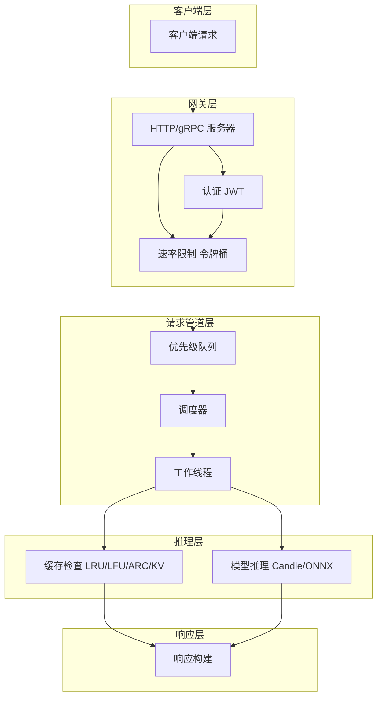
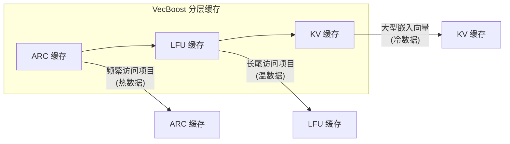
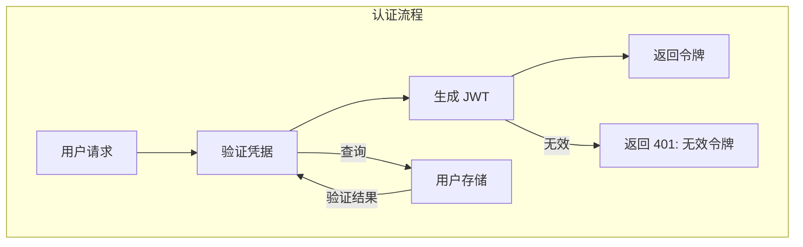
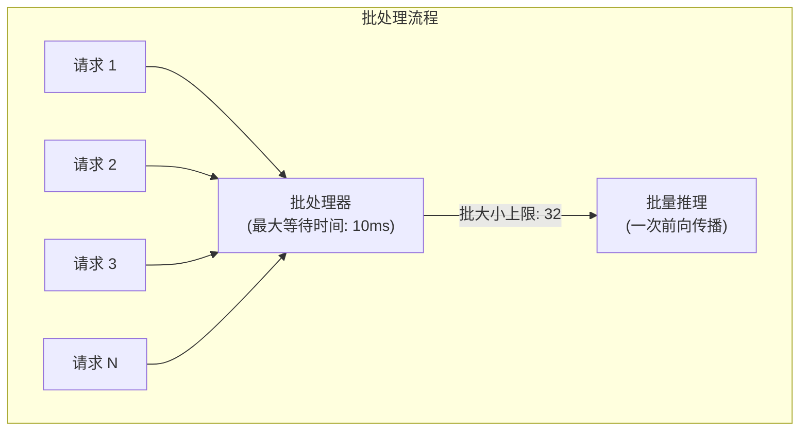
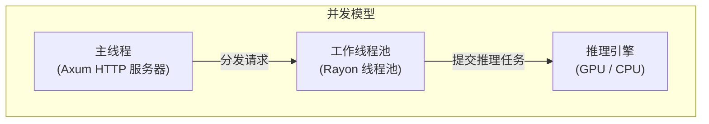
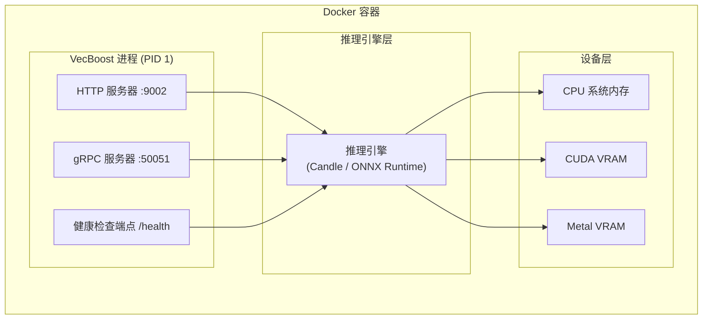

<div align="center">

# 🏗️ VecBoost 架构文档

**内部架构、关键组件、数据流和设计决策详解**

[](https://github.com/Kirky-X/vecboost) [](https://www.rust-lang.org/) [](https://opensource.org/licenses/MIT)

*VecBoost 的内部架构，解释关键组件、数据流和设计决策。*

</div>

---

## 📋 目录

| 章节 | 说明 |
|------|------|
| [概述](#概述) | 设计目标和技术栈 |
| [核心组件](#核心组件) | 主要模块和它们的作用 |
| [数据流](#数据流) | 请求处理流程 |
| [请求管道](#请求管道) | 优先级队列和工作线程 |
| [缓存架构](#缓存架构) | 多层缓存策略 |
| [安全架构](#安全架构) | 认证、授权和审计 |
| [配置系统](#配置系统) | 配置加载和优先级 |
| [性能优化](#性能优化) | 批处理、内存管理和 GPU 优化 |
| [部署架构](#部署架构) | Kubernetes 和 Docker 部署 |
| [扩展点](#扩展点) | 如何添加新引擎和缓存 |

---

---

## 📌 概述

VecBoost 是一个使用 Rust 构建的**高性能嵌入向量服务**。它为文本向量化提供可扩展、生产就绪的解决方案，包含企业级功能。

### 🎯 设计目标

| 目标 | 说明 | 实现方式 |
|------|------|----------|
| **高性能** | 最小化延迟 | 批处理、并发执行、高效内存管理 |
| **可扩展性** | 水平扩展 | Kubernetes 原生支持 |
| **可靠性** | 稳定运行 | 熔断器、重试机制、健康检查 |
| **安全性** | 企业级安全 | 认证、授权、审计日志 |
| **灵活性** | 多引擎支持 | Candle、ONNX Runtime 抽象 |

---

### 🛠️ 技术栈

| 层级 | 技术选型 | 作用 |
|------|----------|------|
| **编程语言** | Rust 2024 Edition | 高性能、内存安全 |
| **Web 框架** | Axum 0.7 | HTTP/REST 服务 |
| **gRPC** | Tonic 0.12 | 高性能 RPC 服务 |
| **ML 推理** | Candle 0.9.2 | 原生 Rust 引擎 |
| | | ONNX Runtime 2.0 | 跨平台推理 |
| **GPU 加速** | CUDA 12.x | NVIDIA GPU |
| | | Metal | Apple Silicon |
| **配置管理** | TOML + config crate | 配置解析 |
| **可观测性** | Prometheus + tracing | 指标和日志 |

---

---

## 🧩 核心组件

### 应用状态

`AppState` 结构体（定义在 `src/lib.rs`）保存路由处理程序使用的所有共享状态：

```rust
pub struct AppState {
    // 核心服务
    pub service: Arc<RwLock<EmbeddingService>>,
    
    // 认证相关
    pub jwt_manager: Option<Arc<JwtManager>>,
    pub user_store: Option<Arc<UserStore>>,
    pub auth_enabled: bool,
    pub csrf_config: Option<Arc<CsrfConfig>>,
    pub csrf_token_store: Option<Arc<CsrfTokenStore>>,
    
    // 可观测性
    pub metrics_collector: Option<Arc<InferenceCollector>>,
    pub prometheus_collector: Option<Arc<PrometheusCollector>>,
    pub audit_logger: Option<Arc<AuditLogger>>,
    
    // 流量控制
    pub rate_limiter: Arc<RateLimiter>,
    pub rate_limit_enabled: bool,
    pub ip_whitelist: Vec<String>,
    
    // 请求管道
    pub pipeline_enabled: bool,
    pub pipeline_queue: Arc<PriorityRequestQueue>,
    pub response_channel: Arc<ResponseChannel>,
    pub priority_calculator: Arc<PriorityCalculator>,
}
```

---

### 🔧 嵌入服务

`EmbeddingService`（`src/service/embedding.rs`）是核心服务，负责协调：

| 功能 | 模块 | 说明 |
|------|------|------|
| **文本处理** | `src/text/` | 分块、分词、聚合 |
| **推理执行** | `src/engine/` | 引擎抽象和实现 |
| **结果缓存** | `src/cache/` | 多层缓存策略 |

```rust
pub struct EmbeddingService {
    engine: Arc<RwLock<AnyEngine>>,    // 推理引擎
    model_config: Option<ModelConfig>, // 模型配置
    cache: Option<Arc<dyn Cache>>,     // 缓存接口
    cache_size: usize,                  // 缓存大小
}
```

---

### ⚡ 推理引擎

引擎抽象（`src/engine/mod.rs`）为不同的 ML 运行时提供统一接口：

```rust
pub trait Engine: Send + Sync {
    fn embed(&self, text: &str) -> Result<Vec<f32>, Error>;
    fn embed_batch(&self, texts: &[String]) -> Result<Vec<Vec<f32>>, Error>;
    fn get_dimension(&self) -> usize;
    fn health_check(&self) -> bool;
}
```

---

#### 支持的引擎对比

| 引擎 | 类型 | 优势 | 劣势 | 适用场景 |
|------|------|------|------|----------|
| **Candle** | 原生 Rust | 无外部依赖、启动快、WASM 支持 | 生态系统较小 | CPU 推理、边缘计算 |
| **ONNX Runtime** | 跨平台 | 成熟稳定、优化良好、硬件支持广 | 需要导出模型 | 通用推理、生产环境 |

---

### 🎮 设备管理

设备模块（`src/device/`）管理计算设备选择和内存分配：

```
src/device/
├── mod.rs              # 设备抽象和公共接口
├── cuda.rs             # NVIDIA CUDA GPU 支持
├── amd.rs              # AMD GPU 支持 (ROCm)
├── manager.rs          # 设备生命周期管理
├── memory_pool.rs      # GPU 内存池
├── memory_limit.rs     # 内存限制和 OOM 处理
├── batch_scheduler.rs  # 批处理优化调度
└── memory_pool/        # 内存池子模块
    ├── buffer_pool.rs  # 缓冲区池
    ├── cuda_pool.rs    # CUDA 内存池
    └── pool_manager.rs # 池管理
```

| 设备类型 | 支持状态 | 内存管理 |
|----------|----------|----------|
| **CPU** | ✅ 完全支持 | 系统分配 |
| **CUDA** | ✅ 完全支持 | 内存池优化 |
| **Metal** | ✅ 完全支持 | 内存池优化 |
| **ROCm** | 🚧 开发中 | 基础支持 |

---

---

## 🔄 数据流

### 请求处理流程



---

### 📝 逐步处理流程

| 步骤 | 组件 | 说明 | 可选 |
|------|------|------|------|
| **1. 请求接收** | HTTP/gRPC 服务器 | 接收并解析请求 | ❌ |
| **2. 认证** | JWT 中间件 | 验证令牌有效性 | ✅ (可禁用) |
| **3. 速率限制** | Rate Limiter | 令牌桶算法检查 | ✅ (可禁用) |
| **4. 请求管道** | Pipeline | 优先级队列处理 | ✅ (可启用) |
| **5. 缓存查找** | Cache Layer | 检查缓存命中 | ✅ |
| **6. 模型推理** | Engine | 执行嵌入计算 | ❌ |
| **7. 缓存更新** | Cache Layer | 存储新结果 | ✅ |
| **8. 返回响应** | Response Builder | 格式化并返回 | ❌ |

---

### ⏱️ 性能关键路径

```
延迟组成（缓存命中）:  认证 + 速率限制 + 缓存查找 ≈ 1-5ms

延迟组成（缓存未命中）: 认证 + 速率限制 + 排队等待 + 模型推理 ≈ 10-100ms
                                                              │
                                            ┌─────────────────┘
                                            ▼
                              GPU: 10-50ms | CPU: 50-200ms
```

---

---

## 📬 请求管道

管道模块（`src/pipeline/`）实现基于优先级的请求队列：

```
src/pipeline/
├── mod.rs              # 模块导出
├── config.rs           # 优先级配置
├── priority.rs         # 优先级计算逻辑
├── queue.rs            # 线程安全优先级队列
├── scheduler.rs        # 请求调度器
├── worker.rs           # 工作线程池
└── response_channel.rs # 异步响应通道
```

---

### 🔢 优先级计算

请求优先级由多个因素综合决定：

```rust
pub struct PriorityCalculator {
    base_priority: u32,              // 基础优先级
    timeout_boost_factor: f32,       // 超时提升因子
    user_tier_weights: HashMap<UserTier, f32>,   // 用户层级权重
    source_weights: HashMap<RequestSource, f32>, // 请求来源权重
}

impl PriorityCalculator {
    pub fn calculate(&self, request: &PriorityRequest) -> u32 {
        let mut priority = self.base_priority;
        priority += (request.timeout_remaining_secs * self.timeout_boost_factor) as u32;
        priority += (self.user_tier_weights[&request.user_tier] * 100.0) as u32;
        priority += (self.source_weights[&request.source] * 50.0) as u32;
        priority
    }
}
```

---

### 👤 用户层级权重

| 层级 | 权重系数 | 优先级倍率 | 适用场景 |
|------|----------|------------|----------|
| **free** | 1.0 | 1x | 免费用户 |
| **basic** | 1.5 | 1.5x | 基础付费用户 |
| **pro** | 2.0 | 2x | 专业用户 |
| **enterprise** | 3.0 | 3x | 企业客户 |

---

### 📡 请求来源权重

| 来源 | 权重系数 | 说明 |
|------|----------|------|
| **api** | 1.0 | 标准 HTTP API 请求 |
| **grpc** | 1.2 | gRPC 请求（已优化批处理） |
| **internal** | 0.5 | 内部服务调用 |

---

---

## 💾 缓存架构

VecBoost 实现**多层缓存系统**，以最大化缓存命中率：

```
src/cache/
├── mod.rs              # 模块导出和公共接口
├── lru_cache.rs        # LRU (最近最少使用) 缓存
├── lfu_cache.rs        # LFU (最不经常使用) 缓存
├── kv_cache.rs         # KV 键值缓存
├── arc_cache.rs        # ARC (自适应替换) 缓存
└── tiered_cache.rs     # 多层缓存组合
```

---

### 🗂️ 缓存层次结构



---

### 📊 缓存策略对比

| 策略 | 最佳场景 | 淘汰策略 | 内存效率 |
|------|----------|----------|----------|
| **ARC** | 混合访问模式 | 自适应 LRU/LFU | ⭐⭐⭐⭐⭐ |
| **LFU** | 一致访问模式 | 淘汰最少使用 | ⭐⭐⭐⭐ |
| **LRU** | 时间局部性 | 淘汰最近最少使用 | ⭐⭐⭐ |
| **KV** | 大型向量存储 | O(1) 键值操作 | ⭐⭐⭐ |

---

### ⚙️ 缓存配置

```toml
[embedding]
cache_enabled = true           # 启用缓存
cache_size = 1024              # 最大缓存条目数

[advanced.cache]
# ARC 缓存特定配置
arc_size_fraction = 0.5        # ARC 占总缓存比例
# LFU 缓存特定配置
lfu_access_window = 3600       # 访问频率统计窗口（秒）
```

---

---

## 🔒 安全架构

### 🔐 认证流程



---

### 🪪 JWT 认证

```rust
pub struct JwtManager {
    key_store: Arc<dyn KeyStore>,  // 密钥存储
    secret_name: String,           // 密钥名称
    expiration: Duration,          // 过期时间
}

impl JwtManager {
    pub fn generate_token(&self, user_id: &str, roles: &[Role]) -> Result<String, Error> {
        let claims = Claims {
            sub: user_id.to_string(),
            roles: roles.iter().map(|r| r.to_string()).collect(),
            exp: Utc::now() + self.expiration,
            iat: Utc::now(),
        }
        .encode(&self.encoding_key)
    }
}
```

---

### 🛡️ CSRF 保护

```
src/auth/
├── csrf.rs           # CSRF 令牌生成和验证
├── handlers.rs       # 认证 HTTP 处理程序
├── jwt.rs            # JWT 管理
├── middleware.rs     # Axum 认证中间件
├── mod.rs            # 模块导出
├── types.rs          # 认证类型
└── user_store.rs     # 用户存储
```

---

### 📝 审计日志

```rust
pub struct AuditLogger {
    log_file: File,        // 日志文件
    config: AuditConfig,   // 审计配置
}

impl AuditLogger {
    pub async fn log(&self, event: AuditEvent) {
        let entry = AuditEntry {
            timestamp: Utc::now(),
            user_id: event.user_id,
            action: event.action,
            resource: event.resource,
            ip_address: event.ip_address,
            success: event.success,
        };
        // 异步写入日志
        self.write_entry(&entry).await;
    }
}
```

| 审计字段 | 说明 |
|----------|------|
| `timestamp` | 事件时间戳 |
| `user_id` | 用户标识 |
| `action` | 操作类型 |
| `resource` | 资源路径 |
| `ip_address` | 客户端 IP |
| `success` | 是否成功 |

---

---

## ⚙️ 配置系统

```
src/config/
├── app.rs            # 应用程序配置
├── model.rs          # 模型配置
└── mod.rs            # 模块导出
```

---

### 📊 配置层次（优先级从低到高）

| 优先级 | 来源 | 说明 |
|--------|------|------|
| 1 | **默认值** | 代码中的内置默认值 |
| 2 | **配置文件** | `config.toml` 或 `config_custom.toml` |
| 3 | **环境变量** | 以 `VECBOOST_` 为前缀的环境变量 |
| 4 | **CLI 参数** | 命令行参数（最高优先级） |

---

### 🔄 环境变量映射

| 配置键 | 环境变量 | 示例值 |
|--------|----------|--------|
| `server.port` | `VECBOOST_SERVER_PORT` | `9002` |
| `model.model_repo` | `VECBOOST_MODEL_REPO` | `BAAI/bge-m3` |
| `auth.jwt_secret` | `VECBOOST_JWT_SECRET` | `your-secret-key` |
| `embedding.cache_size` | `VECBOOST_CACHE_SIZE` | `1024` |
| `model.use_gpu` | `VECBOOST_USE_GPU` | `true` |

---

### 📦 配置加载流程

```rust
impl AppConfig {
    pub fn load() -> Result<Self, ConfigError> {
        let mut builder = ConfigBuilder::default();
        
        // 1. 加载配置文件
        builder = builder.add_source(ConfigFile::with_name("config.toml"));
        
        // 2. 添加环境变量覆盖
        builder = builder.add_source(EnvironmentVariables::with_prefix("VECBOOST"));
        
        // 3. 解析并返回配置
        builder.build()
    }
}
```

---

---

## 🚀 性能优化

### 📦 批处理优化



| 参数 | 默认值 | 可配置范围 | 影响 |
|------|--------|------------|------|
| `batch_size` | 32 | 1-256 | 吞吐量 |
| `max_wait_ms` | 10 | 1-100 | 延迟 |

---

### 🧠 内存管理

| 优化技术 | 说明 | 收益 |
|----------|------|------|
| **内存池** | 预分配张量缓冲区 | 减少分配开销 |
| **自适应缓存** | ARC 缓存策略 | 最小化内存碎片 |
| **零拷贝** | 尽可能使用共享引用 | 减少内存复制 |

---

### 🎮 GPU 内存优化

```rust
pub struct MemoryPool {
    buffers: Vec<CudaBuffer>,  // 缓冲区列表
    free_list: Vec<usize>,     // 空闲缓冲区索引
    max_size: usize,           // 最大池大小
}

impl MemoryPool {
    pub fn allocate(&mut self, size: usize) -> Result<CudaBuffer, Error> {
        // 1. 尝试从空闲列表重用
        if let Some(idx) = self.find_free_buffer(size) {
            return Ok(self.buffers[idx].take().unwrap());
        }
        
        // 2. 分配新缓冲区
        self.allocate_new(size)
    }
}
```

---

### 🧵 并发模型



---

---

## 🚢 部署架构

### ☸️ Kubernetes 部署

```
deployments/kubernetes/
├── configmap.yaml         # 配置即代码
├── deployment.yaml        # 主部署配置
├── gpu-deployment.yaml    # GPU 节点选择器配置
├── hpa.yaml               # 水平 Pod 自动扩缩容
├── model-cache.yaml       # 模型存储 PVC
├── service.yaml           # 集群 IP 服务
└── SCALING_BEST_PRACTICES.md
```

---

### 📦 容器架构



---

### 📈 扩展策略

| 策略 | 描述 | 适用场景 |
|------|------|----------|
| **HPA** | 基于 CPU/内存自动扩缩容 | 高请求量、波动流量 |
| **GPU 节点池** | 专用 GPU 节点 | 推理密集型工作负载 |
| **模型缓存** | 持久化存储模型 | 多区域部署、冷启动 |
| **速率限制** | 防止过载 | 公共 API、保护下游 |

---

---

## 🔌 扩展点

### ⚡ 添加新推理引擎

1. 在 `src/engine/` 实现 `Engine` trait
2. 将引擎类型添加到 `EngineType` 枚举
3. 更新 `AnyEngine::new()` 工厂方法
4. 添加配置解析支持

```rust
pub trait Engine: Send + Sync {
    /// 生成单个嵌入向量
    fn embed(&self, text: &str) -> Result<Vec<f32>, Error>;
    
    /// 批量生成嵌入向量
    fn embed_batch(&self, texts: &[String]) -> Result<Vec<Vec<f32>>, Error>;
    
    /// 获取嵌入向量维度
    fn get_dimension(&self) -> usize;
    
    /// 健康检查
    fn health_check(&self) -> bool;
}
```

---

### 💾 添加新缓存策略

1. 在 `src/cache/` 实现 `Cache` trait
2. 将缓存类型添加到 `CacheType` 枚举
3. 更新 `EmbeddingService` 中的缓存工厂

---

### 🔐 自定义认证提供商

1. 实现 `AuthProvider` trait
2. 在认证模块注册
3. 在 `config.toml` 中配置

---

> **📝 最后更新**: 2026-01-16 | **版本**: 0.1.2 | **问题反馈**: [GitHub Issues](https://github.com/Kirky-X/vecboost/issues)

---

---

## 错误处理

```
src/error.rs
```

### 错误类型

| 错误 | 描述 | 恢复策略 |
|------|------|----------|
| `InferenceError` | 模型推理失败 | 指数退避重试 |
| `CacheMiss` | 缓存条目未找到 | 回退到推理 |
| `RateLimitExceeded` | 触发速率限制 | 等待后重试 |
| `CircuitBreakerOpen` | 熔断器打开 | 快速失败，等待恢复 |
| `GPUOutOfMemory` | GPU 内存耗尽 | 回退到 CPU |
| `ModelNotFound` | 模型不可用 | 下载或切换模型 |
