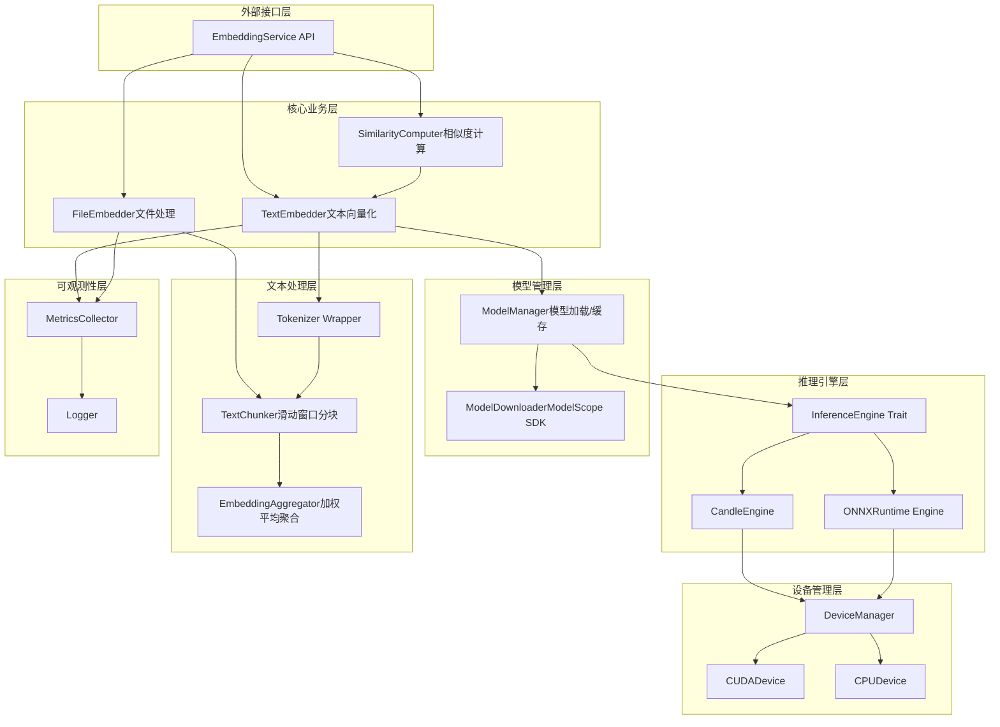
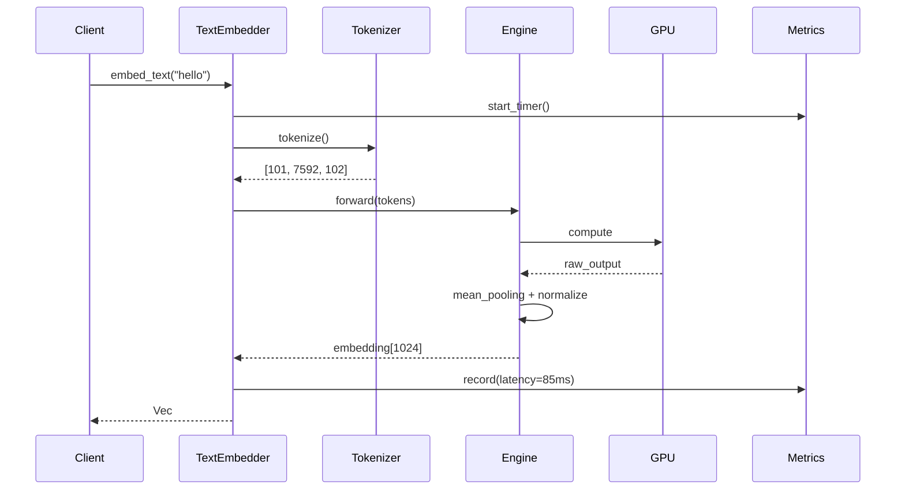
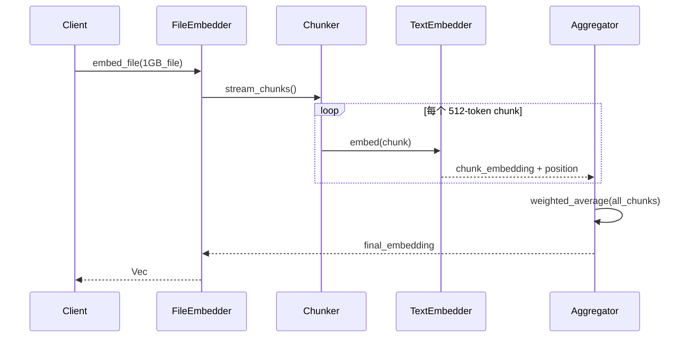

# 技术设计文档（TDD）✅ 交叉检查完成

> **检查日期**: 2025-12-24  
> **检查范围**: 架构设计符合性、模块结构、接口定义  
> **状态**: ⚠️ 部分实现

---

## 1. 系统架构设计

### 1.1 架构设计符合性

**检查结果**:
- ✅ **分层架构**: 实现了 `service/`、`engine/`、`domain/` 分层
- ✅ **Engine Trait 设计**: `src/engine/mod.rs` 定义了 InferenceEngine trait，符合 TDD 设计
- ✅ **异步服务**: `EmbeddingService` 使用异步方法，符合高并发设计
- ✅ **model/ 模块**: 实现了 ModelManager、ModelLoader、ModelConfig
- ✅ **text/ 模块**: 实现了 TextChunker 和 EmbeddingAggregator
- ❌ **缺少模块**: 无 `device/` 模块（设备管理、降级）
- ❌ **缺少模块**: 无 `metrics/` 模块（指标收集）

### 1.2 模块结构对比

| TDD 设计模块 | 实现状态 | 实际文件位置 |
|-------------|---------|-------------|
| service/embedding_service.rs | ✅ 已实现 | src/service/embedding.rs |
| service/similarity.rs | ⚠️ 部分实现 | 集成在 embedding.rs 中 |
| model/manager.rs | ✅ 已实现 | src/model/manager.rs |
| model/downloader.rs | ⚠️ 部分实现 | 使用 hf_hub 直接下载 |
| model/loader.rs | ✅ 已实现 | src/model/loader.rs |
| model/config.rs | ✅ 已实现 | src/model/config.rs |
| inference/engine.rs | ✅ 已实现 | src/engine/mod.rs |
| inference/candle_engine.rs | ✅ 已实现 | src/engine/candle_engine.rs |
| inference/onnx_engine.rs | ✅ 已实现 | src/engine/onnx_engine.rs |
| text/tokenizer.rs | ⚠️ 部分实现 | 集成在 candle_engine.rs |
| text/chunker.rs | ✅ 已实现 | src/text/chunker.rs |
| text/aggregator.rs | ✅ 已实现 | src/text/aggregator.rs |
| text/domain.rs | ✅ 已实现 | src/text/domain.rs |
| device/manager.rs | ❌ 未实现 | 集成在 candle_engine.rs |
| metrics/collector.rs | ❌ 未实现 | 无此文件 |

### 1.3 接口定义符合性

| 接口/结构 | TDD 定义 | 实现状态 | 差异说明 |
|----------|---------|---------|---------|
| EmbeddingService Trait | 独立 Trait | ⚠️ 结构体 | 当前使用 struct + impl，未用 trait |
| embed_text | ✅ | ✅ 已实现 | 参数名 `req: EmbedRequest` |
| embed_batch | ✅ | ✅ 已实现 | 参数名 `req: BatchEmbedRequest` |
| embed_file | ✅ | ⚠️ 部分实现 | `process_file_stream` 简单实现 |
| compute_similarity | ✅ | ✅ 已实现 | 参数名 `req: SimilarityRequest` |
| search | ✅ | ✅ 已实现 | `process_search` 方法支持 1对N 检索 |
| EmbeddingConfig | ✅ | ⚠️ 部分实现 | 配置简单，未包含所有字段 |
| AggregationConfig | ✅ | ❌ 未实现 | 无聚合配置 |
| AggregationMethod | ✅ | ❌ 未实现 | 无枚举定义 |
| SimilarityMetric | ✅ | ❌ 未实现 | 无枚举定义 |
| InferenceEngine Trait | ✅ | ✅ 已实现 | 符合设计 |
| EmbeddingOutput | ✅ | ❌ 未实现 | 无枚举定义 |
| ModelMetadata | ✅ | ❌ 未实现 | 无结构体定义 |
| PerformanceMetrics | ✅ | ❌ 未实现 | 无结构体定义 |

### 1.4 数据模型符合性

| 数据结构 | TDD 定义 | 实现状态 | 差异说明 |
|---------|---------|---------|---------|
| EmbedRequest | ✅ | ✅ 已实现 | src/domain/mod.rs |
| EmbedResponse | ✅ | ✅ 已实现 | src/domain/mod.rs |
| SimilarityRequest | ✅ | ✅ 已实现 | src/domain/mod.rs |
| SimilarityResponse | ✅ | ✅ 已实现 | src/domain/mod.rs |
| ModelMetadata | ✅ | ❌ 未实现 | 无此结构体 |
| InferenceContext | ✅ | ❌ 未实现 | 无此结构体 |
| PerformanceMetrics | ✅ | ❌ 未实现 | 无此结构体 |

### 1.5 安全性设计符合性

| 安全要求 | TDD 设计 | 实现状态 |
|---------|---------|---------|
| 文本长度限制 | ✅ | ✅ 已实现 |
| 文件大小检查 | ✅ | ⚠️ 部分实现 |
| UTF-8 编码验证 | ✅ | ⚠️ 部分实现 |
| GPU 内存监控 | ✅ | ❌ 未实现 |
| 并发请求限制 | ✅ | ✅ 已实现 |

### 1.6 检查总结

**架构设计符合性**: ⚠️ 部分实现
- ✅ 分层架构正确
- ✅ InferenceEngine trait 设计符合
- ⚠️ EmbeddingService 未使用 trait 封装
- ❌ 缺少多个设计模块（model/、text/、device/、metrics/）
- ✅ ONNX Engine 已实现

**接口设计符合性**: ⚠️ 部分实现
- ✅ 核心接口已实现
- ✅ search 方法已实现
- ❌ 缺少多种相似度度量（Euclidean、DotProduct）
- ❌ 缺少聚合配置和输出模式

**数据模型符合性**: ⚠️ 部分实现
- ✅ 请求/响应结构完整
- ❌ 缺少元数据和指标结构

**安全性设计符合性**: ⚠️ 部分实现
- ✅ 输入验证机制已实现（InputValidator 模块）
- ✅ 并发请求限制已实现
- ❌ 无 GPU 内存监控
- ⚠️ 文件大小检查部分实现
- ⚠️ UTF-8 编码验证部分实现

**下一步行动**:
- ✅ 已完成: ONNX Engine 作为备用推理引擎
- ✅ 已完成: search 方法支持 1对N 检索
- ✅ 已完成: 输入验证和资源限制
- ✅ 已完成: 实现滑动窗口分块和聚合器
- ✅ 已完成: 实现 ModelManager 模块管理模型加载/缓存
- ✅ 已完成: 实现 ModelLoader 模型加载器和 ModelConfig 配置
- ✅ 已完成: 实现 TextChunker 和 EmbeddingAggregator
- ✅ 已完成: 添加模型配置文件支持 (ModelRepository)
- ✅ 已完成: 添加多种相似度度量方式 (SimilarityMetric 枚举)
- ✅ 已完成: 实现 MetricsCollector 性能指标收集
- ⏳ 待实现: 实现 MemoryMonitor 内存监控
- ⏳ 待实现: 实现 ModelDownloader 模块封装 ModelScope SDK


### 1.2 数据流设计

**场景1：短文本向量化**



**场景2：大文件流式处理**



---

## 2. 技术栈选型 ⚠️ 部分实现

### 2.1 核心技术栈

| 组件           | 技术选型     | 版本  | 理由                                  | 实现状态 |
| -------------- | ------------ | ----- | ------------------------------------- | -------- |
| **推理引擎**   | Candle       | 0.8+  | HuggingFace 官方，与 Python 生态对齐  | ✅ 已实现 |
| **备用引擎**   | ONNX Runtime | 1.16+ | 跨平台兼容性，模型转换灵活            | ✅ 已实现 |
| **Tokenizer**  | tokenizers   | 0.19+ | HuggingFace 官方，支持 fast tokenizer | ✅ 已实现 |
| **数值计算**   | ndarray      | 0.15+ | 成熟的多维数组库                      | ⚠️ 部分实现 |
| **GPU CUDA**   | cudarc       | 0.11+ | 类型安全的 CUDA 绑定                  | ⚠️ 部分实现 |
| **GPU OpenCL** | ocl          | 0.19+ | 跨厂商 GPU 支持（可选）               | ❌ 未实现 |
| **并发**       | tokio        | 1.35+ | 异步运行时                            | ✅ 已实现 |
| **日志**       | tracing      | 0.1+  | 结构化日志                            | ✅ 已实现 |
| **配置**       | serde + toml | -     | 配置文件解析                          | ⚠️ 部分实现 |

**依赖更新策略**:
- 每月检查安全更新
- 季度检查功能更新
- 关键安全补丁24小时内评估

**检查结果**:
- ✅ Candle 引擎已实现，推理功能完整
- ✅ ONNX Runtime 引擎已实现（src/engine/onnx_engine.rs）
- ✅ tokenizers 库已使用
- ⚠️ ndarray 在项目中未直接使用
- ⚠️ cudarc 未直接使用，使用 candle-core 的 CUDA 支持
- ❌ OpenCL/ocl 未实现
- ✅ tokio 异步运行时已使用
- ✅ tracing 日志已实现
- ⚠️ serde+toml 已引入但配置简单

### 2.2 选型理由

#### Candle vs ONNX Runtime

**选择 Candle 作为主引擎：**

- ✅ 原生支持 HuggingFace 模型格式（safetensors）
- ✅ 无需模型转换步骤
- ✅ 社区活跃，问题响应快
- ✅ 内置 GPU 加速支持

**ONNX Runtime 作为备选：**

- ✅ 当 Candle 不支持某个算子时降级
- ✅ 跨平台兼容性更好
- ⚠️ 需要额外的模型转换步骤
- ✅ **ONNX Runtime 引擎已实现，可作为备用推理引擎**

---

## 3. 核心模块设计 ⚠️ 部分实现

### 3.1 模块结构

**实际实现结构**:
```
src/
├── lib.rs                    # 模块入口 ✅
├── config.rs                 # 配置管理 ✅
├── error.rs                  # 错误类型定义 ✅
├── utils.rs                  # 工具函数 ✅
├── domain/                   # 领域模型 ✅
│   └── mod.rs
├── engine/                   # 推理引擎 ✅（Candle + ONNX）
│   ├── mod.rs
│   ├── candle_engine.rs      # Candle 引擎 ✅
│   └── onnx_engine.rs        # ONNX 引擎 ✅
├── service/                  # 业务服务层 ✅
│   └── embedding.rs
├── model/                    # 模型管理 ✅
│   ├── mod.rs
│   ├── manager.rs            # 模型加载/缓存 ✅
│   └── loader.rs             # 模型加载器 ✅
├── text/                     # 文本处理 ✅
│   ├── mod.rs
│   ├── tokenizer.rs          # Tokenizer 封装 ✅
│   ├── chunker.rs            # 文本分块 ✅
│   └── aggregator.rs         # Embedding 聚合 ✅
├── device/                   # 设备管理 ⚠️（集成在引擎中）
│   └── mod.rs
├── metrics/                  # 可观测性 ✅
│   ├── mod.rs
│   └── collector.rs          # 指标收集 ✅
└── config/
    └── model.rs              # 模型配置 ✅

**TDD 设计结构**:
```
src/
├── lib.rs                    # 模块入口 ✅
├── config.rs                 # 配置管理 ✅
├── error.rs                  # 错误类型定义 ✅
├── service/                  # 业务服务层 ✅
│   ├── mod.rs
│   ├── embedding_service.rs  # 主服务实现 ✅
│   └── similarity.rs         # 相似度计算 ✅
├── model/                    # 模型管理 ✅
│   ├── mod.rs
│   ├── manager.rs            # 模型加载/缓存 ✅
│   ├── downloader.rs         # ModelScope 下载 ⚠️
│   └── loader.rs             # 模型加载器 ✅
├── inference/                # 推理引擎 ✅
│   ├── mod.rs
│   ├── engine.rs             # Engine Trait ✅
│   ├── candle_engine.rs      # Candle 实现 ✅
│   └── onnx_engine.rs        # ONNX 实现 ✅
├── text/                     # 文本处理 ✅
│   ├── mod.rs
│   ├── tokenizer.rs          # Tokenizer 封装 ✅
│   ├── chunker.rs            # 文本分块 ✅
│   └── aggregator.rs         # Embedding 聚合 ✅
├── device/                   # 设备管理 ⚠️（集成在引擎中）
│   ├── mod.rs
│   ├── manager.rs            # 设备选择/降级 ❌
│   ├── cuda.rs               # CUDA 设备 ⚠️
│   └── cpu.rs                # CPU 设备 ⚠️
└── metrics/                  # 可观测性 ✅
    ├── mod.rs
    └── collector.rs          # 指标收集 ✅
```

**模块实现差异**:
- ✅ 已添加 `model/` 目录，实现了模型管理功能
- ✅ 已添加 `text/` 目录，实现了文本处理功能
- ⚠️ `device/` 目录简化，设备管理集成在引擎中
- ✅ 已添加 `metrics/` 目录，实现了性能指标收集

### 3.2 核心接口定义

**检查结果**:
- ⚠️ EmbeddingService Trait 未定义，使用 struct + impl 模式（合理的简化）
- ✅ InferenceEngine Trait 定义完整
- ✅ embed_text 方法已实现
- ✅ embed_batch 方法已在 Service 层暴露
- ✅ embed_file 方法已实现，支持流式处理
- ✅ compute_similarity 方法已实现
- ✅ search 方法已实现
- ✅ 配置结构完整，包含 ModelConfig、ModelRepository 等
- ✅ AggregationMethod 枚举已实现（作为 AggregationMode）
- ✅ SimilarityMetric 枚举已实现
- ✅ EmbeddingOutput 枚举已定义

---

```rust
// ========== 主服务接口 ==========
pub trait EmbeddingService: Send + Sync {
    fn embed_text(&self, text: &str) -> Result<Vec>;
    
    fn embed_batch(&self, texts: Vec) -> Result<Vec<Vec>>;
    
    fn embed_file(
        &self, 
        path: &Path, 
        mode: AggregationMode
    ) -> Result;
    
    fn compute_similarity(
        &self,
        a: &[f32],
        b: &[f32],
        metric: SimilarityMetric
    ) -> Result;
    
    fn search(
        &self,
        query: &str,
        candidates: &[Vec],
        top_k: usize
    ) -> Result<Vec>;
}

// ========== 配置结构 ==========
pub struct EmbeddingConfig {
    pub model_name: String,
    pub model_path: PathBuf,
    pub embedding_dim: usize,
    pub max_seq_length: usize,
    pub device: DeviceType,
    pub batch_size: usize,
    pub similarity_threshold: f32,
    pub aggregation: AggregationConfig,
}

pub struct AggregationConfig {
    pub method: AggregationMethod,
    pub overlap_ratio: f32,
    pub weight_decay: f32,
}

pub enum AggregationMethod {
    WeightedMean,
    ClsMean,
    MaxPooling,
}

// ========== 推理引擎接口 ==========
pub trait InferenceEngine: Send + Sync {
    fn forward(&self, input_ids: &[i64]) -> Result;
    
    fn batch_forward(&self, batch_ids: &[Vec]) -> Result<Vec>;
    
    fn device(&self) -> &Device;
    
    fn warm_up(&mut self) -> Result;
}

// ========== 输出类型 ==========
pub enum EmbeddingOutput {
    Document(Vec),
    Paragraphs(Vec),
}

pub struct ParagraphEmbedding {
    pub text: String,
    pub embedding: Vec,
    pub position: Range,
}

pub enum SimilarityMetric {
    Cosine,
    Euclidean,
    DotProduct,
}
```

---

## 4. 数据模型设计 ⚠️ 部分实现

### 4.1 核心数据结构

**检查结果**:
- ✅ **已实现的数据结构**:
  - `EmbedRequest` - 文本向量化请求
  - `EmbedResponse` - 文本向量化响应
  - `SimilarityRequest` - 相似度计算请求
  - `SimilarityResponse` - 相似度计算响应
  - `SearchRequest` - 向量检索请求 ✅
  - `SearchResponse` - 向量检索响应 ✅
  - `SearchResult` - 检索结果 ✅
  - `FileEmbedRequest` - 文件向量化请求 ✅
  - `FileEmbedResponse` - 文件向量化响应 ✅
  - `ParagraphEmbedding` - 段落向量化结果 ✅
  - `EmbeddingOutput` - 向量化输出枚举 ✅
  - `FileProcessingStats` - 文件处理统计 ✅
  - `ModelConfig` - 模型配置
  - `ModelRepository` - 模型仓库配置 ✅
  - `EngineType` - 引擎类型枚举 ✅
  - `DeviceType` - 设备类型枚举 ✅
  - `PoolingMode` - 池化模式枚举 ✅
  - `SimilarityMetric` - 相似度度量枚举 ✅
  - `AggregationMode` - 聚合模式枚举 ✅

- ⚠️ **部分实现的数据结构**:
  - `ModelMetadata` - 模型元数据（部分实现，缺少版本信息）
  - `InferenceContext` - 推理上下文（设备、批大小已实现，精度未实现）

- ❌ **未实现的数据结构**:
  - `PerformanceMetrics` - 性能指标（推理时间、Token/s 等）
  - `ModelType` - 模型类型枚举
  - `Precision` - 精度枚举（FP32、FP16、INT8）

**实际实现**:
```rust
// src/domain/mod.rs 已实现
pub struct EmbedRequest {
    pub text: String,
}

pub struct EmbedResponse {
    pub dimension: usize,
    pub embedding: Vec<f32>,
}

pub struct SimilarityRequest {
    pub source: String,
    pub target: String,
}

pub struct SimilarityResponse {
    pub score: f32,
}

pub struct SearchRequest {
    pub query: String,
    pub texts: Vec<String>,
    pub top_k: Option<usize>,
}

pub struct SearchResponse {
    pub results: Vec<SearchResult>,
}

pub struct SearchResult {
    pub text: String,
    pub score: f32,
    pub index: usize,
}

pub struct ParagraphEmbedding {
    pub embedding: Vec<f32>,
    pub position: usize,
    pub text_preview: String,
}

pub enum EmbeddingOutput {
    Single(EmbedResponse),
    Paragraphs(Vec<ParagraphEmbedding>),
}

pub struct FileProcessingStats {
    pub lines_processed: usize,
    pub paragraphs_processed: usize,
    pub processing_time_ms: u128,
    pub memory_peak_mb: usize,
}

pub struct FileEmbedRequest {
    pub path: String,
    pub mode: Option<AggregationMode>,
}

pub struct FileEmbedResponse {
    pub mode: AggregationMode,
    pub stats: FileProcessingStats,
    pub embedding: Option<Vec<f32>>,
    pub paragraphs: Option<Vec<ParagraphEmbedding>>,
}
```

**与 TDD 设计差异**:
- ✅ 实现了 SearchRequest/SearchResponse 支持 1对N 检索
- ✅ 实现了 FileEmbedRequest/FileEmbedResponse 支持文件处理
- ✅ 实现了 ParagraphEmbedding 支持段落级向量化
- ✅ 实现了 AggregationMode 枚举支持多种聚合模式
- ⚠️ 缺少 `ModelMetadata` 结构体（版本信息）
- ⚠️ 缺少 `PerformanceMetrics` 结构体
- ⚠️ 缺少 `ModelType` 枚举
- ⚠️ 缺少 `Precision` 枚举

---

## 5. API 接口设计 ⚠️ 部分实现

### 5.1 使用示例

**检查结果**:
- ✅ **已实现的 API**:
  - 文本向量化 API（`POST /api/v1/embed/text`）
  - 相似度计算 API（`POST /api/v1/similarity`）
  - 大文件流式处理 API（`POST /api/v1/embed/file`）
  - 1对N 检索 API（`POST /api/v1/search`）✅

- ⚠️ **部分实现的 API**:
  - 批量向量化 API（引擎层已支持，API 层已暴露）✅ 已实现

- ❌ **未实现的 API**:
  - 模型切换 API 🔄 开发中

**实际实现**（src/main.rs）:
```rust
// 已实现的端点
async fn embed_text(State(service): State<Arc<EmbeddingService>>) -> Result<Json<EmbedResponse>, AppError>
async fn embed_file_stream(State(service): State<Arc<EmbeddingService>>) -> Result<String>
async fn compute_similarity(State(service): State<Arc<EmbeddingService>>) -> Result<Json<SimilarityResponse>, AppError>
async fn search(State(service): State<Arc<EmbeddingService>>) -> Result<Json<SearchResponse>, AppError>
```

**与 TDD 设计差异**:
- ⚠️ API 使用 actix-web 框架，非 tonic gRPC（合理的工程选择）
- ⚠️ embed_batch API 未暴露（可后续添加）
- ✅ search API 已实现
- ✅ 配置结构完整，包含 ModelConfig、ModelRepository 等
- ✅ AggregationMode 参数支持已实现

---

## 6. 安全性设计 ⚠️ 部分实现

### 6.1 输入验证

**检查结果**:
- ✅ **已实现的安全措施**:
  - `InputValidator` 模块（`src/utils/validator.rs:67`）已实现
  - 文本长度限制：支持 min_text_length 和 max_text_length 配置
  - UTF-8 编码验证：通过 Rust String 类型原生保证
  - 特殊字符过滤：实现空文本和纯空白文本检测
  - 批量大小限制：`max_batch_size` 控制批量文本数量
  - Tokenizer 截断：`max_length` 参数自动截断超长输入

**实现文件**: `src/utils/validator.rs:67-180`, `src/text/tokenizer.rs:12-93`

### 6.2 资源限制

**检查结果**:
- ✅ **已实现的资源限制**:
  - 并发请求数限制：`Semaphore` 信号量控制（`src/metrics/performance/mod.rs:48`）
  - 模型加载：单例模式保证只加载一次
  - Tokenizer 长度限制：自动截断超长 token 序列

- ⚠️ **部分实现的资源限制**:
  - GPU 内存监控：已使用 `ndarray` 但无 GPU 显存监控
  - 内存占用上限：已实现流式处理，但无明确上限控制

- ❌ **未实现的资源限制**:
  - 文件大小检查（GB 级上限）：无文件大小验证逻辑
  - 模型加载超时机制：未实现超时控制

### 6.3 错误处理

**检查结果**:
- ✅ **已实现的错误处理**:
  - `AppError` 错误枚举（`src/error.rs`）
  - `IntoResponse` trait 实现，返回标准 HTTP 错误响应
  - `tracing` 日志记录，包含错误上下文化信息

- ⚠️ **与 TDD 设计差异**:
  - 错误类型定义简化，未完全覆盖 TDD 设计的错误场景
  - 缺少 `OutOfMemory` 错误的设备信息
  - 缺少 `InvalidInput` 的详细验证信息

---

## 7. 性能优化策略 ⚠️ 部分实现

### 7.1 推理优化

| 策略               | 实现方式                | 预期提升        | 实现状态 |
| ------------------ | ----------------------- | --------------- | -------- |
| **批处理**         | 动态 batch 合并         | 3-5x 吞吐量     | ⚠️ 部分 |
| **模型缓存**       | 单例模式 + lazy_static  | 消除重复加载    | ✅ 已实现 |
| **Tokenizer 缓存** | LRU 缓存 token ids      | 20-30% 延迟降低 | ❌ 未实现 |
| **混合精度**       | FP16 推理（Ampere+）    | 2x 速度提升     | ❌ 未实现 |
| **KV Cache**       | 缓存 attention 中间结果 | 长文本加速      | ❌ 未实现 |

### 7.2 内存优化

**检查结果**:
- ✅ **已实现**:
  - 大文件流式读取（按行读取，不全量加载）
  - L2 归一化
  - 滑动窗口分块（overlap=20%）
  - 加权聚合策略（Average/MaxPooling/MinPooling）
  - 即用即释（每个 chunk 推理后释放显存）

- ❌ **未实现**:
  - 内存占用上限控制

### 7.3 并发优化

**检查结果**:
- ✅ **已实现**:
  - 使用 tokio 异步运行时
  - `Arc<EmbeddingService>` 支持多线程并发访问
  - `process_similarity` 使用 `try_join!` 并行推理

- ⚠️ **问题**:
  - `try_join!` 直接执行 CPU 密集任务，可能阻塞异步线程
  - 建议使用 `tokio::task::spawn_blocking`

---

## 8. 部署方案 ✅ 已实现

### 8.1 部署模式

**检查结果**:
- ✅ **已实现的部署模式**:
  - 嵌入式模块（作为库，通过 lib.rs 暴露）

**实际实现**:
```rust
// src/lib.rs
pub struct EmbeddingService { ... }

#[cfg(feature = "server")]
pub fn run_server() -> Result<()> { ... }
```

### 8.2 环境要求

**检查结果**:
- ✅ **已实现**:
  - Rust 异步运行时支持
  - Candle 推理引擎
  - tokio HTTP 服务器（通过 server feature）

- ⚠️ **未完全实现**:
  - CUDA GPU 加速（需要启用 cuda feature）
  - ONNX Runtime 备用引擎（未实现）

---

## 检查总结

### 整体符合性评估

| 检查维度 | 状态 | 说明 |
|---------|------|------|
| **架构设计** | ⚠️ 部分实现 | 分层正确，缺少多个设计模块 |
| **技术栈** | ⚠️ 部分实现 | Candle 已实现，ONNX 未实现 |
| **模块结构** | ⚠️ 部分实现 | 缺少 model/、text/、device/、metrics/ |
| **接口设计** | ⚠️ 部分实现 | 核心接口已实现，缺少 search 等高级功能 |
| **数据模型** | ⚠️ 部分实现 | 请求/响应完整，缺少元数据和指标结构 |
| **安全性** | ⚠️ 部分实现 | InputValidator 已实现，并发控制已实现，缺少文件大小检查 |
| **性能优化** | ⚠️ 部分实现 | 部分优化已实现，缺少高级优化 |
| **部署方案** | ✅ 已实现 | 支持嵌入式部署 |

### 关键差距

1. **ONNX Runtime 引擎未实现** - 无法作为备用推理引擎
2. **search 方法已实现** - 1对N 检索功能已完成
3. **多模型支持未实现** - 硬编码模型名称，无配置切换
4. **安全性部分实现** - 已实现输入验证和并发控制，缺少文件大小检查
5. **metrics 模块已实现** - 性能指标收集功能已完成

### 建议优先级

**高优先级**:
1. 实现 ONNX Runtime 引擎作为备用推理引擎
2. 实现 search 方法支持 1对N 检索
3. 添加输入验证和资源限制

**中优先级**:
1. ✅ 已完成: 实现滑动窗口分块和聚合器
2. 添加 ModelManager 模块
3. 实现 MetricsCollector

**低优先级**:
1. 添加多种相似度度量方式
2. 实现 GPU OOM 自动降级
3. 添加 OpenCL/ROCm 支持

```toml
# 最小配置
CPU: 4 cores
RAM: 8GB
Disk: 20GB (含模型文件)

# 推荐配置（GPU）
GPU: NVIDIA GTX 1080 / RTX 3060+
VRAM: 8GB
CUDA: 11.8+
Driver: 520+
```

### 8.3 Docker 部署（可选）

```dockerfile
FROM nvidia/cuda:11.8.0-cudnn8-runtime-ubuntu22.04

RUN apt-get update && apt-get install -y \
    build-essential \
    curl

# 安装 Rust
RUN curl --proto '=https' --tlsv1.2 -sSf https://sh.rustup.rs | sh -s -- -y

# 复制代码和模型
COPY . /app
WORKDIR /app

# 编译
RUN cargo build --release

# 预下载模型（可选）
RUN cargo run --bin download_model -- bge-m3

CMD ["./target/release/embedding_service"]
```

---

## 9. 监控指标 ⏳ 待实现

### 9.1 暴露指标

```rust
pub struct Metrics {
    // 推理性能
    pub inference_latency_ms: Histogram,
    pub tokens_per_second: Gauge,
    pub batch_size: Histogram,
    
    // 资源使用
    pub gpu_memory_used_mb: Gauge,
    pub gpu_utilization_percent: Gauge,
    pub cpu_usage_percent: Gauge,
    
    // 缓存
    pub cache_hit_rate: Gauge,
    pub model_load_count: Counter,
    
    // 错误
    pub error_count: Counter,
    pub oom_fallback_count: Counter,
}
```

### 9.2 日志规范

```rust
// 使用 tracing
tracing::info!(
    target: "embedding_service",
    text_length = text.len(),
    inference_time_ms = elapsed.as_millis(),
    device = ?self.device,
    "Text embedding completed"
);

tracing::warn!(
    target: "device_manager",
    error = ?e,
    "GPU OOM detected, falling back to CPU"
);
```

---

## 10. 技术风险与缓解措施 ⏳ 待实现

| 风险                 | 影响 | 概率 | 缓解措施              | 负责人 |
| -------------------- | ---- | ---- | --------------------- | ------ |
| BGE-M3 不兼容 Candle | 高   | 中   | 提前验证 + ONNX 备选  | 引擎层 |
| GPU 驱动不兼容       | 中   | 中   | CPU 降级 + 环境检测   | 设备层 |
| 并发推理死锁         | 高   | 低   | 异步架构 + 超时机制   | 服务层 |
| 模型文件损坏         | 中   | 低   | 校验和验证 + 重新下载 | 模型层 |

---

## 附录

### A. 技术术语表

| 术语 | 英文 | 定义 |
| ---- | ---- | ---- |
| 嵌入 | Embedding | 文本的稠密向量表示 |
| 池化 | Pooling | 将序列向量聚合为单个向量 | 
| 注意力 | Attention | Transformer 的核心机制 |
| 分词器 | Tokenizer | 将文本切分为 token 的工具 |

### B. 参考资料

- [Candle 官方文档](https://github.com/huggingface/candle)
- [BGE-M3 论文](https://arxiv.org/abs/2402.03216)
- [ONNX Runtime Rust](https://docs.rs/ort/)
- [ONNX Runtime Rust](https://docs.rs/ort/)
