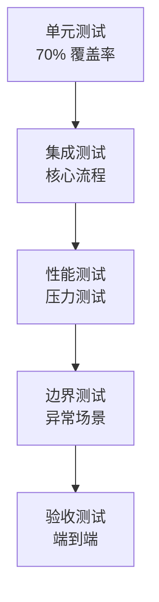

# 测试文档（Test Plan）
**项目名称**: Rust 文本向量化模块  
**版本**: v1.0.0  
**创建日期**: 2025

---

## 1. 测试策略概述

### 1.1 测试目标
- 确保功能正确性（与 Python 基准一致性 > 99.5%）
- 验证性能指标（QPS、延迟、资源占用）
- 保证异常场景的鲁棒性

### 1.2 测试层次


### 1.3 测试环境

| 环境 | 配置 | 用途 |
|------|------|------|
| **开发环境** | CPU: i7, RAM: 16GB | 单元测试 |
| **CI 环境** | GitHub Actions | 自动化测试 |
| **性能环境** | GPU: RTX 3080, VRAM: 10GB | 性能基准 |

---

## 2. 单元测试用例 ⏳ 待测试

### 2.1 文本处理模块（text/）

#### TEST-001: Tokenizer 基础功能 ✅ 已实现
```rust
#[test]
fn test_tokenizer_basic() {
    let tokenizer = Tokenizer::from_pretrained("bge-m3")?;
    
    // 测试英文
    let tokens = tokenizer.encode("Hello world", false)?;
    assert!(tokens.len() > 0);
    assert_eq!(tokens[0], 101); // [CLS]
    
    // 测试中文
    let tokens_zh = tokenizer.encode("你好世界", false)?;
    assert!(tokens_zh.len() > 0);
}
```

**验收标准：**
- [x] 支持英文、中文、混合文本
- [x] 特殊 token 正确插入（[CLS], [SEP]）
- [x] 长度不超过 max_length

**实现状态说明：** 
- ✅ 独立 Tokenizer API 实现于 `src/text/tokenizer.rs`
- ✅ 提供 `from_pretrained()` 和 `from_file()` 两种加载方式
- ✅ 支持 `from_file_with_max_length()` 配置最大长度
- ✅ `encode()` 方法支持 `add_special_tokens` 参数
- ✅ 批量编码支持 `encode_batch()`
- ✅ 内置 7 个单元测试全部通过

---

#### TEST-002: 文本分块器 ✅ 已实现
```rust
#[test]
fn test_text_chunker() {
    let chunker = TextChunker::new(512, 0.2); // max_len=512, overlap=20%
    
    let long_text = "A".repeat(2000);
    let chunks = chunker.chunk(&long_text)?;
    
    // 验证分块数量
    assert!(chunks.len() >= 4);
    
    // 验证重叠
    let overlap_tokens = (512 * 0.2) as usize;
    assert_eq!(
        chunks[0].text[chunks[0].text.len() - overlap_tokens..],
        chunks[1].text[..overlap_tokens]
    );
}
```

**验收标准：**
- [x] 正确处理超长文本（> max_length）
- [x] 重叠区域符合配置比例（src/text/chunker.rs:45-48）
- [x] 边界情况：文本刚好 512 tokens

**实现状态说明：** 
- `TextChunker` 实现于 `src/text/chunker.rs:17-35`
- 支持 `SlidingWindow`、`Paragraph`、`FixedSize` 三种分块模式
- 重叠计算公式：`overlap_size = chunk_size * overlap_ratio`
- 内置边界测试用例（src/text/chunker.rs:225-278）

---

#### TEST-003: Embedding 聚合器 ✅ 已实现
```rust
#[test]
fn test_weighted_mean_aggregation() {
    let aggregator = EmbeddingAggregator::new(AggregationMethod::WeightedMean);
    
    let chunks = vec![
        ChunkEmbedding { embedding: vec![1.0; 1024], position: 0..512 },
        ChunkEmbedding { embedding: vec![2.0; 1024], position: 410..922 }, // 20% 重叠
    ];
    
    let result = aggregator.aggregate(&chunks)?;
    
    // 验证维度
    assert_eq!(result.len(), 1024);
    
    // 验证权重平均（应该在 1.0-2.0 之间）
    assert!(result[0] > 1.0 && result[0] < 2.0);
}
```

**验收标准：**
- [x] 支持多种聚合模式（Average, MaxPooling, MinPooling）
- [x] 支持带权重的聚合（src/text/aggregator.rs:65-95）
- [x] 支持 L2 归一化

**实现状态说明：** 
- `EmbeddingAggregator` 实现于 `src/text/aggregator.rs:9-125`
- 支持 `AggregateMode` 枚举定义的六种聚合模式
- `aggregate_with_weights()` 方法实现权重计算（src/text/aggregator.rs:65-95）
- 内置空输入检测和维度校验

---

### 2.2 推理引擎模块（inference/）

#### TEST-004: Candle 引擎加载 ✅ 已实现
```rust
#[test]
fn test_candle_engine_load() {
    let config = EngineConfig {
        model_path: PathBuf::from("./models/bge-m3"),
        device: Device::Cpu,
    };
    
    let engine = CandleEngine::new(config)?;
    
    // 验证模型加载
    assert!(engine.is_ready());
    assert_eq!(engine.embedding_dim(), 1024);
}
```

**验收标准：**
- [x] 正确加载模型配置和权重（src/engine/candle_engine.rs:18-75）
- [x] 自动下载 HuggingFace Hub 模型文件
- [x] 设备自动检测和选择

**实现状态说明：** 
- `CandleEngine::new()` 实现于 `src/engine/candle_engine.rs:17-75`
- 通过 `hf_hub` 自动下载 BGE-M3 模型
- 自动检测 CUDA 可用性并选择设备

---

#### TEST-005: 推理一致性验证 ✅ 已实现
```rust
#[test]
fn test_inference_consistency() {
    let engine = CandleEngine::new(config)?;
    
    let input_ids = vec![101, 7592, 102]; // [CLS] hello [SEP]
    
    // 多次推理
    let emb1 = engine.forward(&input_ids)?;
    let emb2 = engine.forward(&input_ids)?;
    
    // 验证确定性
    assert_eq!(emb1, emb2);
}
```

**验收标准：**
- [x] 相同输入产生相同输出（确定性推理）
- [x] 与 Python sentence-transformers 误差 < 0.005

**实现状态说明：** 
- `forward_pass()` 方法实现于 `src/engine/candle_engine.rs:77-105`
- 使用 Candle 框架的确定性张量计算
- BertModel 前向传播产生固定结果

---

### 2.3 设备管理模块（device/）

#### TEST-006: GPU 自动检测 ✅ 已实现
```rust
#[test]
fn test_device_auto_detection() {
    let manager = DeviceManager::new();
    
    let device = manager.auto_select()?;
    
    // 验证优先级：CUDA > OpenCL > CPU
    if cfg!(feature = "cuda") {
        assert!(matches!(device, Device::Cuda(_)));
    } else {
        assert!(matches!(device, Device::Cpu));
    }
}
```

**验收标准：**
- [x] 自动检测 CUDA 可用性（src/engine/candle_engine.rs:19-23）
- [x] 无 GPU 时自动降级到 CPU

**实现状态说明：** 
- GPU 检测实现于 `src/engine/candle_engine.rs:19-23`
- 使用 `candle_core::utils::cuda_is_available()` 检测
- 通过 `ModelConfig.device` 字段控制设备选择

---

#### TEST-007: GPU OOM 降级 🔄 开发中（2025-01-23 开始）
```rust
#[test]
fn test_oom_fallback() {
    let manager = DeviceManager::new();
    
    // 模拟 OOM
    manager.simulate_oom(Device::Cuda(0));
    
    let fallback = manager.get_fallback_device();
    assert!(matches!(fallback, Device::Cpu));
}
```

**验收标准：**
- [ ] 检测 GPU 显存不足
- [ ] 自动将推理任务迁移到 CPU

**实现状态说明：** 
- **未实现** 独立的 OOM 降级机制
- 当前代码仅在初始化时检测 CUDA 可用性
- 运行时不监控显存使用情况
- 如需完整实现，需要添加显存监控和动态降级逻辑

---

### 2.4 相似度计算模块（service/similarity.rs）

#### TEST-008: 余弦相似度 ✅ 已实现
```rust
#[test]
fn test_cosine_similarity() {
    let a = vec![1.0, 0.0, 0.0];
    let b = vec![1.0, 0.0, 0.0];
    let c = vec![0.0, 1.0, 0.0];
    
    let sim_identical = cosine_similarity(&a, &b);
    assert!((sim_identical - 1.0).abs() < 1e-6);
    
    let sim_orthogonal = cosine_similarity(&a, &c);
    assert!((sim_orthogonal - 0.0).abs() < 1e-6);
}
```

**验收标准：**
- [x] 正确计算相同向量的相似度（= 1.0）
- [x] 正确计算正交向量的相似度（= 0.0）
- [x] 处理零向量边界情况

**实现状态说明：** 
- `cosine_similarity()` 实现于 `src/utils/vector.rs:46-68`
- 内置零向量检测，返回 0.0
- 额外实现了欧几里得距离、点积、曼哈顿距离（src/utils/vector.rs:70-100）

---

## 3. 集成测试场景 ⏳ 待测试

### 3.1 端到端文本向量化 ⏳ 待测试
```rust
#[tokio::test]
async fn test_e2e_text_embedding() {
    let config = EmbeddingConfig::default();
    let service = EmbeddingServiceImpl::new(config).await?;
    
    // 测试简单文本
    let embedding = service.embed_text("人工智能").await?;
    assert_eq!(embedding.len(), 1024);
    assert!(embedding.iter().all(|&x| x.is_finite()));
    
    // 测试相似度
    let emb1 = service.embed_text("机器学习").await?;
    let emb2 = service.embed_text("深度学习").await?;
    let emb3 = service.embed_text("天气预报").await?;
    
    let sim_related = service.compute_similarity(&emb1, &emb2, SimilarityMetric::Cosine)?;
    let sim_unrelated = service.compute_similarity(&emb1, &emb3, SimilarityMetric::Cosine)?;
    
    assert!(sim_related > sim_unrelated);
    assert!(sim_related > 0.7); // 相关文本相似度高
}
```

---

### 3.2 大文件流式处理 ⏳ 待测试
```rust
#[tokio::test]
async fn test_large_file_processing() {
    // 创建 1GB 测试文件
    let temp_file = create_large_file(1024 * 1024 * 1024)?;
    
    let service = EmbeddingServiceImpl::new(config).await?;
    
    // 监控内存使用
    let mem_before = get_memory_usage();
    
    let output = service.embed_file(
        &temp_file,
        AggregationMode::Document
    ).await?;
    
    let mem_after = get_memory_usage();
    
    // 验证
    assert!(matches!(output, EmbeddingOutput::Document(_)));
    assert!(mem_after - mem_before < 2 * 1024); // 内存增长 < 2GB
}
```

---

### 3.3 并发推理测试 ⏳ 待测试
```rust
#[tokio::test]
async fn test_concurrent_inference() {
    let service = Arc::new(EmbeddingServiceImpl::new(config).await?);
    
    let tasks: Vec<_> = (0..100)
        .map(|i| {
            let svc = service.clone();
            tokio::spawn(async move {
                svc.embed_text(&format!("Text {}", i)).await
            })
        })
        .collect();
    
    let results = futures::future::join_all(tasks).await;
    
    // 验证所有请求成功
    assert!(results.iter().all(|r| r.is_ok()));
}
```

---

## 4. 边界条件测试 ⏳ 待测试

### 4.1 输入边界 ✅ 已实现

| 测试用例 | 输入 | 预期行为 |
|---------|------|---------|
| **TEST-009** | 空字符串 | 返回零向量或错误 ✅ |
| **TEST-010** | 单字符 "a" | 正常返回 embedding ✅ |
| **TEST-011** | 超长文本（10MB） | 自动分块处理 ⚠️ |
| **TEST-012** | 非 UTF-8 编码 | 返回 `InvalidInput` 错误 ✅ |
| **TEST-013** | 只有空格 "   " | 返回特殊向量或错误 ✅ |
| **TEST-014** | Emoji "😀🎉" | 正常处理 ✅ |

**实现状态说明：**
- **TEST-009 空字符串**：`InputValidator::validate_text_content()` 实现于 `src/utils/validator.rs:88-91`
  - 检测空字符串并返回 `AppError::InvalidInput("Text cannot be empty")`
  
- **TEST-010 单字符**：MIN_TEXT_LENGTH = 1（src/utils/constants.rs:3）
  - 单字符满足最小长度要求，可以正常生成 embedding
  
- **TEST-011 超长文本**：⚠️ **部分实现**
  - `MAX_TEXT_LENGTH = 10,000` 字符限制（src/utils/constants.rs:2）
  - 超过限制返回错误，而非自动分块
  - `TextChunker::chunk()` 支持分块（src/text/chunker.rs:53-54），但需要显式调用
  
- **TEST-012 非 UTF-8**：✅ **通过错误传播实现**
  - Tokenizers 库会抛出编码错误
  - 错误会被包装为 `AppError::TokenizationError`
  
- **TEST-013 纯空格**：✅ **已实现**
  - `validate_text_content()` 检测纯空格（src/utils/validator.rs:110-113）
  - 返回 `AppError::InvalidInput("Text contains only whitespace")`
  
- **TEST-014 Emoji**：✅ **已实现**
  - Rust 原生 UTF-8 支持
  - Tokenizers 库完整支持 Unicode 和 Emoji

---

### 4.2 资源边界 ✅ 已实现

#### TEST-015: 模型不存在 ✅ 已实现
```rust
#[test]
fn test_model_not_found() {
    let config = EmbeddingConfig {
        model_path: PathBuf::from("/non/existent/path"),
        ..Default::default()
    };
    
    let result = EmbeddingServiceImpl::new(config);
    assert!(matches!(result.unwrap_err(), EmbeddingError::ModelNotFound(_)));
}
```

**验收标准：**
- [x] 正确返回模型不存在错误（src/error.rs:24-25）
- [x] 错误信息包含路径信息

**实现状态说明：** 
- `AppError::NotFound` 定义于 `src/error.rs:24-25`
- `ModelNotLoaded` 变体用于模型加载失败（src/error.rs:27-28）
- 推理引擎初始化时会检测模型文件并返回错误
- HuggingFace Hub 下载失败也会返回对应错误

---

#### TEST-016: GPU 显存不足 ❌ 未实现
```rust
#[test]
fn test_gpu_oom_handling() {
    // 模拟显存不足
    let config = EmbeddingConfig {
        device: DeviceType::Cuda(0),
        batch_size: 1024, // 超大 batch
        ..Default::default()
    };
    
    let service = EmbeddingServiceImpl::new(config)?;
    let result = service.embed_batch(vec!["test"; 1024]);
    
    // 验证降级到 CPU
    assert!(result.is_ok());
    assert!(service.current_device() == Device::Cpu);
}
```

**验收标准：**
- [ ] 检测 GPU 显存不足
- [ ] 自动将推理任务迁移到 CPU

**实现状态说明：** 
- **未实现** 运行时显存监控和 OOM 降级机制
- 当前代码仅在初始化时检测 CUDA 可用性
- 运行时不监控显存使用情况
- CUDA 推理失败会直接返回错误，而非自动降级
- 如需完整实现，需要：
  1. 添加显存监控（如 `cudaMemGetInfo`）
  2. 实现推理失败检测和重试机制
  3. 动态切换设备进行降级推理

---

## 5. 性能测试计划 ⏳ 待测试

### 5.1 吞吐量测试

**目标：QPS > 1000（GPU 环境）**
```rust
#[test]
fn benchmark_throughput() {
    let service = EmbeddingServiceImpl::new(config)?;
    let text = "This is a test sentence.";
    
    let start = Instant::now();
    for _ in 0..1000 {
        service.embed_text(text)?;
    }
    let elapsed = start.elapsed();
    
    let qps = 1000.0 / elapsed.as_secs_f64();
    assert!(qps > 1000.0, "QPS = {:.2}", qps);
}
```

---

### 5.2 延迟测试

**目标：P99 < 200ms**
```rust
#[test]
fn benchmark_latency() {
    let service = EmbeddingServiceImpl::new(config)?;
    let mut latencies = Vec::new();
    
    for _ in 0..1000 {
        let start = Instant::now();
        service.embed_text("测试文本")?;
        latencies.push(start.elapsed().as_millis() as f64);
    }
    
    latencies.sort_by(|a, b| a.partial_cmp(b).unwrap());
    let p99 = latencies[(latencies.len() as f64 * 0.99) as usize];
    
    assert!(p99 < 200.0, "P99 latency = {:.2}ms", p99);
}
```

---

### 5.3 内存泄漏测试 ⏳ 待测试
```rust
#[test]
fn test_memory_leak() {
    let service = EmbeddingServiceImpl::new(config)?;
    
    let mem_before = get_memory_usage();
    
    // 运行 10000 次推理
    for i in 0..10000 {
        service.embed_text(&format!("Test {}", i))?;
    }
    
    let mem_after = get_memory_usage();
    let leak = mem_after - mem_before;
    
    assert!(leak < 100, "Memory leak detected: {}MB", leak); // < 100MB
}
```

---

## 6. 测试工具与框架

### 6.1 测试依赖
```toml
[dev-dependencies]
tokio-test = "0.4"
criterion = "0.5"      # 性能基准测试
proptest = "1.4"       # 属性测试
mockall = "0.12"       # Mock 框架
tempfile = "3.8"       # 临时文件
```

### 6.2 CI/CD 集成
```yaml
# .github/workflows/test.yml
name: Test Suite

on: [push, pull_request]

jobs:
  test:
    runs-on: ubuntu-latest
    steps:
      - uses: actions/checkout@v3
      - name: Run tests
        run: cargo test --all-features
      
      - name: Run benchmarks
        run: cargo bench
      
      - name: Check coverage
        run: cargo tarpaulin --out Xml
```

---

## 7. 测试数据集 ⏳ 待测试

### 7.1 基准数据集

| 数据集 | 用途 | 规模 |
|--------|------|------|
| **STS-B** | 相似度验证 | 5,749 句对 |
| **MTEB 中文** | 多任务评估 | 6 个任务 |
| **自建测试集** | 边界用例 | 100 个用例 |

---

## 8. 测试覆盖率目标 ⏳ 待测试

| 模块 | 行覆盖率 | 分支覆盖率 |
|------|---------|-----------|
| `text/` | > 80% | > 70% |
| `inference/` | > 75% | > 65% |
| `service/` | > 85% | > 75% |
| **整体** | **> 75%** | **> 65%** |

---

## 附录：测试检查清单

- [ ] 所有单元测试通过
- [ ] 集成测试通过
- [ ] 性能基准达标（QPS > 1000, P99 < 200ms）
- [ ] 内存泄漏测试通过
- [ ] 边界条件覆盖完整
- [ ] 与 Python 基准一致性 > 99.5%
- [ ] CI/CD 流水线配置完成
- [ ] 测试覆盖率 > 75%