# 测试文档（Test Plan）
**项目名称**: Rust 文本向量化模块  
**版本**: v1.0.0  
**创建日期**: 2025

---

## 1. 测试策略概述

### 1.1 测试目标
- 确保功能正确性（与 Python 基准一致性 > 99.5%）
- 验证性能指标（QPS、延迟、资源占用）
- 保证异常场景的鲁棒性

### 1.2 测试层次


### 1.3 测试环境

| 环境 | 配置 | 用途 |
|------|------|------|
| **开发环境** | CPU: i7, RAM: 16GB | 单元测试 |
| **CI 环境** | GitHub Actions | 自动化测试 |
| **性能环境** | GPU: RTX 3080, VRAM: 10GB | 性能基准 |

---

## 2. 单元测试用例 ⏳ 待测试

### 2.1 文本处理模块（text/）

#### TEST-001: Tokenizer 基础功能 ⏳ 待测试
```rust
#[test]
fn test_tokenizer_basic() {
    let tokenizer = Tokenizer::from_pretrained("bge-m3")?;
    
    // 测试英文
    let tokens = tokenizer.encode("Hello world", false)?;
    assert!(tokens.len() > 0);
    assert_eq!(tokens[0], 101); // [CLS]
    
    // 测试中文
    let tokens_zh = tokenizer.encode("你好世界", false)?;
    assert!(tokens_zh.len() > 0);
}
```

**验收标准：**
- [ ] 支持英文、中文、混合文本
- [ ] 特殊 token 正确插入（[CLS], [SEP]）
- [ ] 长度不超过 max_length

---

#### TEST-002: 文本分块器 ⏳ 待测试
```rust
#[test]
fn test_text_chunker() {
    let chunker = TextChunker::new(512, 0.2); // max_len=512, overlap=20%
    
    let long_text = "A".repeat(2000);
    let chunks = chunker.chunk(&long_text)?;
    
    // 验证分块数量
    assert!(chunks.len() >= 4);
    
    // 验证重叠
    let overlap_tokens = (512 * 0.2) as usize;
    assert_eq!(
        chunks[0].text[chunks[0].text.len() - overlap_tokens..],
        chunks[1].text[..overlap_tokens]
    );
}
```

**验收标准：**
- [ ] 正确处理超长文本（> max_length）
- [ ] 重叠区域符合配置比例
- [ ] 边界情况：文本刚好 512 tokens

---

#### TEST-003: Embedding 聚合器 ⏳ 待测试
```rust
#[test]
fn test_weighted_mean_aggregation() {
    let aggregator = EmbeddingAggregator::new(AggregationMethod::WeightedMean);
    
    let chunks = vec![
        ChunkEmbedding { embedding: vec![1.0; 1024], position: 0..512 },
        ChunkEmbedding { embedding: vec![2.0; 1024], position: 410..922 }, // 20% 重叠
    ];
    
    let result = aggregator.aggregate(&chunks)?;
    
    // 验证维度
    assert_eq!(result.len(), 1024);
    
    // 验证权重平均（应该在 1.0-2.0 之间）
    assert!(result[0] > 1.0 && result[0] < 2.0);
}
```

---

### 2.2 推理引擎模块（inference/）

#### TEST-004: Candle 引擎加载 ⏳ 待测试
```rust
#[test]
fn test_candle_engine_load() {
    let config = EngineConfig {
        model_path: PathBuf::from("./models/bge-m3"),
        device: Device::Cpu,
    };
    
    let engine = CandleEngine::new(config)?;
    
    // 验证模型加载
    assert!(engine.is_ready());
    assert_eq!(engine.embedding_dim(), 1024);
}
```

---

#### TEST-005: 推理一致性验证 ⏳ 待测试
```rust
#[test]
fn test_inference_consistency() {
    let engine = CandleEngine::new(config)?;
    
    let input_ids = vec![101, 7592, 102]; // [CLS] hello [SEP]
    
    // 多次推理
    let emb1 = engine.forward(&input_ids)?;
    let emb2 = engine.forward(&input_ids)?;
    
    // 验证确定性
    assert_eq!(emb1, emb2);
}
```

**验收标准：**
- [ ] 相同输入产生相同输出
- [ ] 与 Python sentence-transformers 误差 < 0.005

---

### 2.3 设备管理模块（device/）

#### TEST-006: GPU 自动检测 ⏳ 待测试
```rust
#[test]
fn test_device_auto_detection() {
    let manager = DeviceManager::new();
    
    let device = manager.auto_select()?;
    
    // 验证优先级：CUDA > OpenCL > CPU
    if cfg!(feature = "cuda") {
        assert!(matches!(device, Device::Cuda(_)));
    } else {
        assert!(matches!(device, Device::Cpu));
    }
}
```

---

#### TEST-007: GPU OOM 降级 ⏳ 待测试
```rust
#[test]
fn test_oom_fallback() {
    let manager = DeviceManager::new();
    
    // 模拟 OOM
    manager.simulate_oom(Device::Cuda(0));
    
    let fallback = manager.get_fallback_device();
    assert!(matches!(fallback, Device::Cpu));
}
```

---

### 2.4 相似度计算模块（service/similarity.rs）

#### TEST-008: 余弦相似度 ⏳ 待测试
```rust
#[test]
fn test_cosine_similarity() {
    let a = vec![1.0, 0.0, 0.0];
    let b = vec![1.0, 0.0, 0.0];
    let c = vec![0.0, 1.0, 0.0];
    
    let sim_identical = cosine_similarity(&a, &b);
    assert!((sim_identical - 1.0).abs() < 1e-6);
    
    let sim_orthogonal = cosine_similarity(&a, &c);
    assert!((sim_orthogonal - 0.0).abs() < 1e-6);
}
```

---

## 3. 集成测试场景 ⏳ 待测试

### 3.1 端到端文本向量化 ⏳ 待测试
```rust
#[tokio::test]
async fn test_e2e_text_embedding() {
    let config = EmbeddingConfig::default();
    let service = EmbeddingServiceImpl::new(config).await?;
    
    // 测试简单文本
    let embedding = service.embed_text("人工智能").await?;
    assert_eq!(embedding.len(), 1024);
    assert!(embedding.iter().all(|&x| x.is_finite()));
    
    // 测试相似度
    let emb1 = service.embed_text("机器学习").await?;
    let emb2 = service.embed_text("深度学习").await?;
    let emb3 = service.embed_text("天气预报").await?;
    
    let sim_related = service.compute_similarity(&emb1, &emb2, SimilarityMetric::Cosine)?;
    let sim_unrelated = service.compute_similarity(&emb1, &emb3, SimilarityMetric::Cosine)?;
    
    assert!(sim_related > sim_unrelated);
    assert!(sim_related > 0.7); // 相关文本相似度高
}
```

---

### 3.2 大文件流式处理 ⏳ 待测试
```rust
#[tokio::test]
async fn test_large_file_processing() {
    // 创建 1GB 测试文件
    let temp_file = create_large_file(1024 * 1024 * 1024)?;
    
    let service = EmbeddingServiceImpl::new(config).await?;
    
    // 监控内存使用
    let mem_before = get_memory_usage();
    
    let output = service.embed_file(
        &temp_file,
        AggregationMode::Document
    ).await?;
    
    let mem_after = get_memory_usage();
    
    // 验证
    assert!(matches!(output, EmbeddingOutput::Document(_)));
    assert!(mem_after - mem_before < 2 * 1024); // 内存增长 < 2GB
}
```

---

### 3.3 并发推理测试 ⏳ 待测试
```rust
#[tokio::test]
async fn test_concurrent_inference() {
    let service = Arc::new(EmbeddingServiceImpl::new(config).await?);
    
    let tasks: Vec<_> = (0..100)
        .map(|i| {
            let svc = service.clone();
            tokio::spawn(async move {
                svc.embed_text(&format!("Text {}", i)).await
            })
        })
        .collect();
    
    let results = futures::future::join_all(tasks).await;
    
    // 验证所有请求成功
    assert!(results.iter().all(|r| r.is_ok()));
}
```

---

## 4. 边界条件测试 ⏳ 待测试

### 4.1 输入边界 ⏳ 待测试

| 测试用例 | 输入 | 预期行为 |
|---------|------|---------|
| **TEST-009** | 空字符串 | 返回零向量或错误 |
| **TEST-010** | 单字符 "a" | 正常返回 embedding |
| **TEST-011** | 超长文本（10MB） | 自动分块处理 |
| **TEST-012** | 非 UTF-8 编码 | 返回 `InvalidInput` 错误 |
| **TEST-013** | 只有空格 "   " | 返回特殊向量或错误 |
| **TEST-014** | Emoji "😀🎉" | 正常处理 |

---

### 4.2 资源边界 ⏳ 待测试

#### TEST-015: 模型不存在 ⏳ 待测试
```rust
#[test]
fn test_model_not_found() {
    let config = EmbeddingConfig {
        model_path: PathBuf::from("/non/existent/path"),
        ..Default::default()
    };
    
    let result = EmbeddingServiceImpl::new(config);
    assert!(matches!(result.unwrap_err(), EmbeddingError::ModelNotFound(_)));
}
```

---

#### TEST-016: GPU 显存不足 ⏳ 待测试
```rust
#[test]
fn test_gpu_oom_handling() {
    // 模拟显存不足
    let config = EmbeddingConfig {
        device: DeviceType::Cuda(0),
        batch_size: 1024, // 超大 batch
        ..Default::default()
    };
    
    let service = EmbeddingServiceImpl::new(config)?;
    let result = service.embed_batch(vec!["test"; 1024]);
    
    // 验证降级到 CPU
    assert!(result.is_ok());
    assert!(service.current_device() == Device::Cpu);
}
```

---

## 5. 性能测试计划 ⏳ 待测试

### 5.1 吞吐量测试

**目标：QPS > 1000（GPU 环境）**
```rust
#[test]
fn benchmark_throughput() {
    let service = EmbeddingServiceImpl::new(config)?;
    let text = "This is a test sentence.";
    
    let start = Instant::now();
    for _ in 0..1000 {
        service.embed_text(text)?;
    }
    let elapsed = start.elapsed();
    
    let qps = 1000.0 / elapsed.as_secs_f64();
    assert!(qps > 1000.0, "QPS = {:.2}", qps);
}
```

---

### 5.2 延迟测试

**目标：P99 < 200ms**
```rust
#[test]
fn benchmark_latency() {
    let service = EmbeddingServiceImpl::new(config)?;
    let mut latencies = Vec::new();
    
    for _ in 0..1000 {
        let start = Instant::now();
        service.embed_text("测试文本")?;
        latencies.push(start.elapsed().as_millis() as f64);
    }
    
    latencies.sort_by(|a, b| a.partial_cmp(b).unwrap());
    let p99 = latencies[(latencies.len() as f64 * 0.99) as usize];
    
    assert!(p99 < 200.0, "P99 latency = {:.2}ms", p99);
}
```

---

### 5.3 内存泄漏测试 ⏳ 待测试
```rust
#[test]
fn test_memory_leak() {
    let service = EmbeddingServiceImpl::new(config)?;
    
    let mem_before = get_memory_usage();
    
    // 运行 10000 次推理
    for i in 0..10000 {
        service.embed_text(&format!("Test {}", i))?;
    }
    
    let mem_after = get_memory_usage();
    let leak = mem_after - mem_before;
    
    assert!(leak < 100, "Memory leak detected: {}MB", leak); // < 100MB
}
```

---

## 6. 测试工具与框架

### 6.1 测试依赖
```toml
[dev-dependencies]
tokio-test = "0.4"
criterion = "0.5"      # 性能基准测试
proptest = "1.4"       # 属性测试
mockall = "0.12"       # Mock 框架
tempfile = "3.8"       # 临时文件
```

### 6.2 CI/CD 集成
```yaml
# .github/workflows/test.yml
name: Test Suite

on: [push, pull_request]

jobs:
  test:
    runs-on: ubuntu-latest
    steps:
      - uses: actions/checkout@v3
      - name: Run tests
        run: cargo test --all-features
      
      - name: Run benchmarks
        run: cargo bench
      
      - name: Check coverage
        run: cargo tarpaulin --out Xml
```

---

## 7. 测试数据集 ⏳ 待测试

### 7.1 基准数据集

| 数据集 | 用途 | 规模 |
|--------|------|------|
| **STS-B** | 相似度验证 | 5,749 句对 |
| **MTEB 中文** | 多任务评估 | 6 个任务 |
| **自建测试集** | 边界用例 | 100 个用例 |

---

## 8. 测试覆盖率目标 ⏳ 待测试

| 模块 | 行覆盖率 | 分支覆盖率 |
|------|---------|-----------|
| `text/` | > 80% | > 70% |
| `inference/` | > 75% | > 65% |
| `service/` | > 85% | > 75% |
| **整体** | **> 75%** | **> 65%** |

---

## 附录：测试检查清单

- [ ] 所有单元测试通过
- [ ] 集成测试通过
- [ ] 性能基准达标（QPS > 1000, P99 < 200ms）
- [ ] 内存泄漏测试通过
- [ ] 边界条件覆盖完整
- [ ] 与 Python 基准一致性 > 99.5%
- [ ] CI/CD 流水线配置完成
- [ ] 测试覆盖率 > 75%